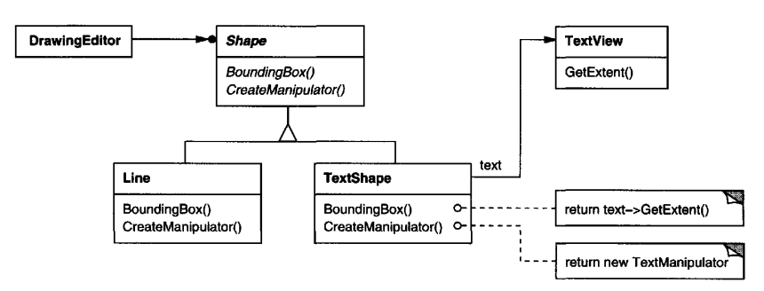
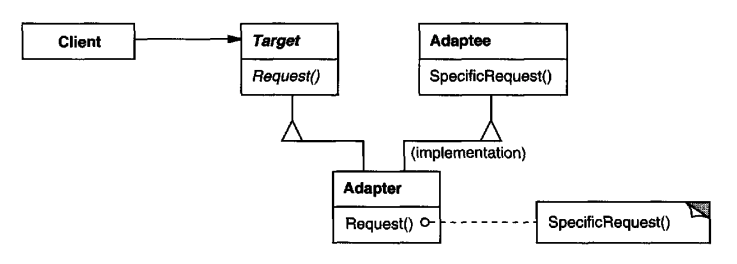
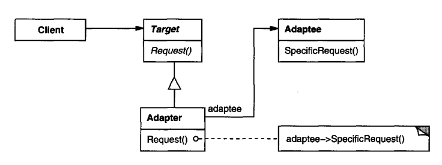
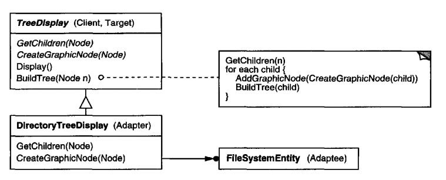
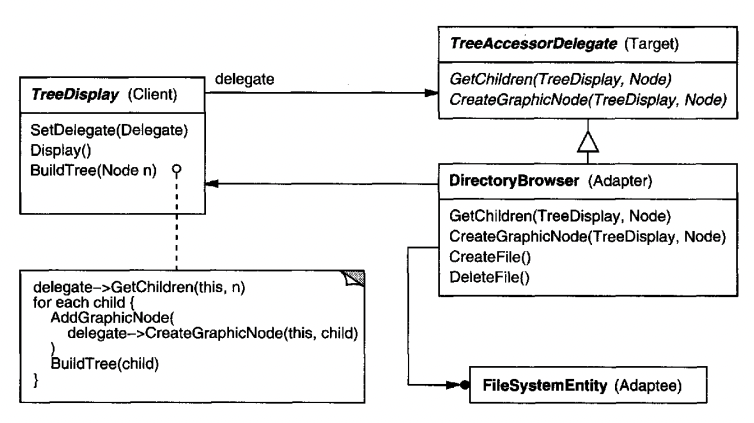

# Adapter

## Intent
Convert an interface of a class to another one, which a client expects.

## Motivation
You might have an application which is used to working with a domain-specific interface and you want to integrate into it a third-party library whose code you don't have access to.
The third-party lirary uses a different incompatible interface.

Via the Adapter pattern, you can connect the incompatible interface to the domain-specific interface the rest of your application expects.

Example - A drawing editor lets users draw & arrange graphical elements on a canvas.
The main abstraction is a class called `Shape` which knows how to draw itself.

Most of the shapes in our app implement this interface & they can be used, but there is a `TextView` shape, coming from a third-party toolkit library which allows displaying & editing text, but doesn't conform to the `Shape` interface.
Implementing this widget yourself would be hard because `TextView` is a non-trivial component.

Instead, we can define a `TextShape` class which adapts the `TextView` to the `Shape` interface.
This can be achieved by:
 * implementing `Shape` & inheriting `TextView` (class adapters)
 * composing a `TextView` and implementing `Shape` (object adapters)

Class adapters often require multiple inheritance which makes them inappropriate for most programming languages.

Object adapter example:


In the above example, the `TextManipulator` is another class defined by us which knows how to animate a shape in response to user input.

## Applicability
Use the Adapter pattern when:
 * you want to use an existing class which has an incompatible interface
 * you want to implement a reusable class which can cooperate with unforeseen classes in the future, which have incompatible interfaces
 * you want to adapt the interface of many subclasses by not subclassing each one of them. How? - adapt the interface of their parent class. This is applicable to object adapters only.

## Structure
Class Adapter:


Object Adapter:


## Participants
 * Target (Shape) - The domain-specific interface the Client requires
 * Client (DrawingEditor) - Collaborates with objects which implement Target
 * Adaptee (TextView) - An existing interface which needs to be adapted
 * Adapter (TextShape) - Adapts the interface of Adaptee to Target

## Collaborations
 * Clients call operations on the Adapter instance which are forwarded to the Adaptee

## Consequences
A class adapter:
 * adapts an Adaptee by inheriting it. Therefore, using class adapters you can't adapt other subclasses
 * allows you to override some of Adaptee's behavior

An object adapter:
 * lets an Adapter work with many Adaptees
 * can't override Adaptee's behavior

Other Concerns:
 * Pluggable adapters
 
An unsusual use-case for the Adapter pattern is to build your `Target` API with future adapters in mind. 
The general recommendation is to keep the expected interface small to allow for more & simpler adapters.

Example - a `TreeDisplay` class which is intended to visualize hierarchies can be made with future adapters in mind by using a small interface which can easily be adapted.

 * Two-way adapters - an Adapter hides the interface of the Adaptee. 
It is possible to implement the `Adapter` interface to conform to the `Adaptee` interface as well as the `Target` interface so that it can be used for both use-cases.

This, however, requires using a class adapter, which demands using multiple inheritance:


## Implementation
Some issues to keep in mind:
 1) When implementing class adapters in C++, the Adapter should inherit publicly from `Target` and privately from `Adaptee`
 2) Pluggable adapters

This can be implemented:
 * Using abstract operations


 * Using delegate objects - `TreeDisplay` uses a separate objects to which it forwards requests. This object can be substituted to change the adaptation strategy


## Sample Code
Example `Shape` interface which our app uses and an incompatible third-party `TextView` widget:
```java
public interface Shape {
  BoundingBox getBoundingBox();
  Manipulator createManipulator();
}

public class TextView {
  Point getOrigin() { return null; }
  int getWidth() { return 0; }
  int getHeight() { return 0; }
  boolean isEmpty() { return false; }
}
```

`BoundingBox` - a tuple of two points, indicating the rectangle around the shape.
`Manipulator` - object which knows how to animate the widget.

Example object adapter:
```java
public class TextShape implements Shape {
  private final TextView textView;

  public TextShape(TextView tv) {
    this.textView = tv;
  }

  @Override
  public BoundingBox getBoundingBox() {
    Point origin = textView.getOrigin();
    int width = textView.getWidth();
    int height = textView.getHeight();

    return new BoundingBox(origin, new Point(origin.x + width, origin.y + height));
  }

  @Override
  public Manipulator createManipulator() {
    return new TextManipulator(this);
  }
}
```

The only difference for the class adapter is that the class is declared as `class TextShape extends TextView implements Shape` and uses `this.getWidth` instead of `textView.getWidth` & etc.

## Related Patterns
Bridge's structure is similar to the Adapter, but has a different intent - separate an interface from its implementation so that they can vary independently.
Decorator enhances an object without changing its interface. Thus, it is more transparent to the application than an Adapter.
Proxy defines a substitute for another object without changing its interface.
