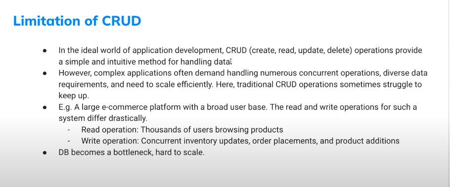
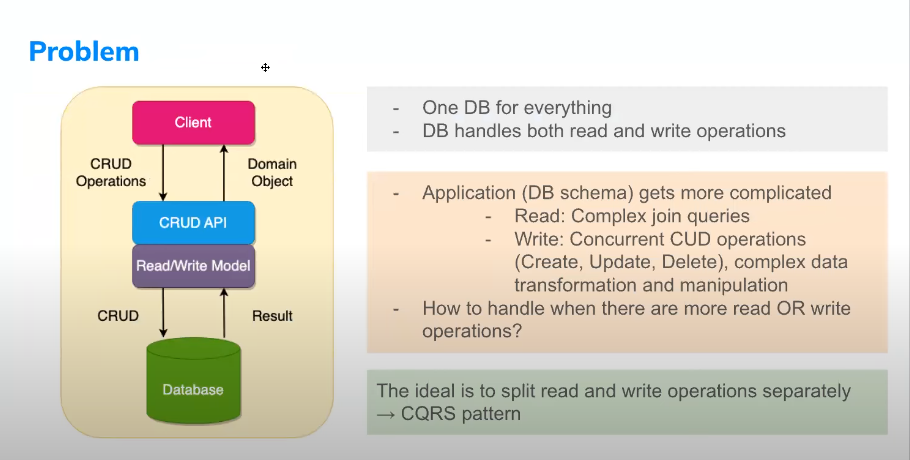
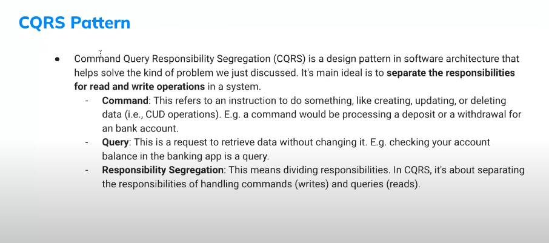
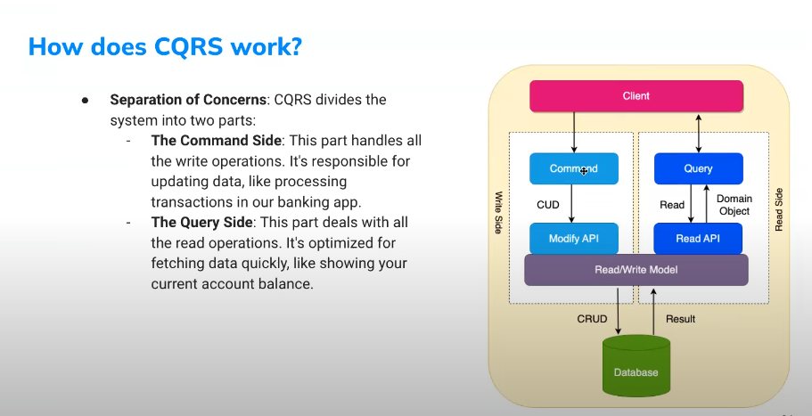
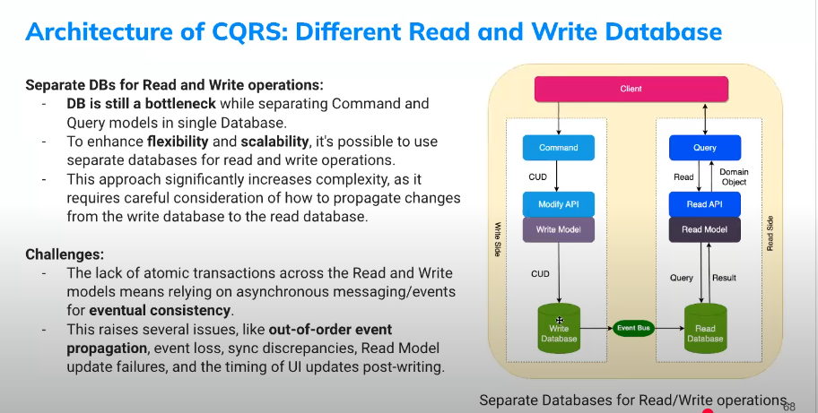
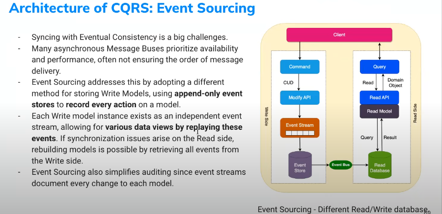
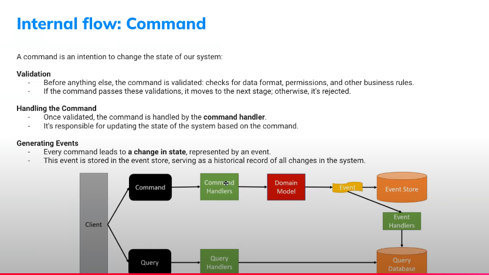
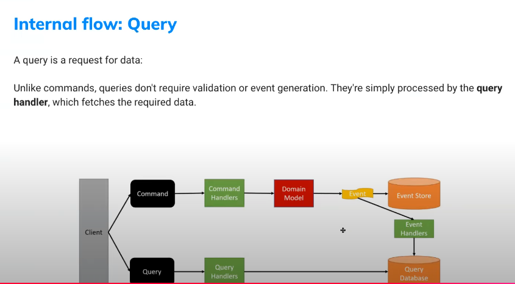
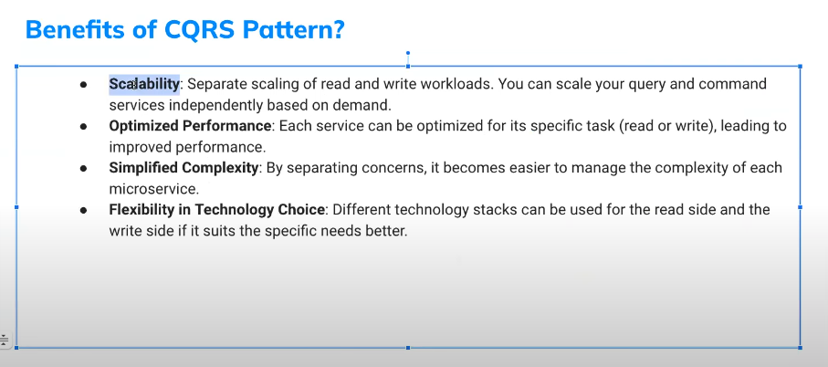

# Command and Query Responsibility Segregation

## Limit of CRUD

## Problem

## CQRS Pattern

## How it works

## Architecture

## Apply Event Sourcing

## Internal flow: write

## Internal flow: read

## Benefit

