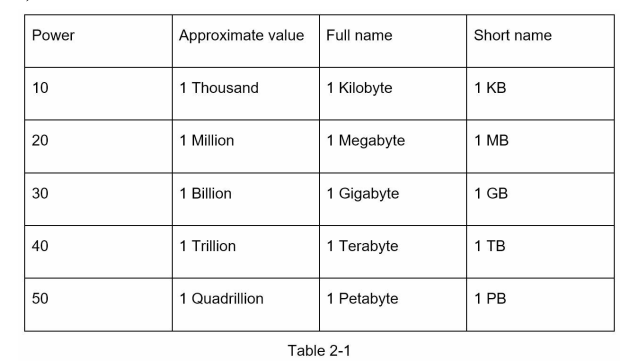
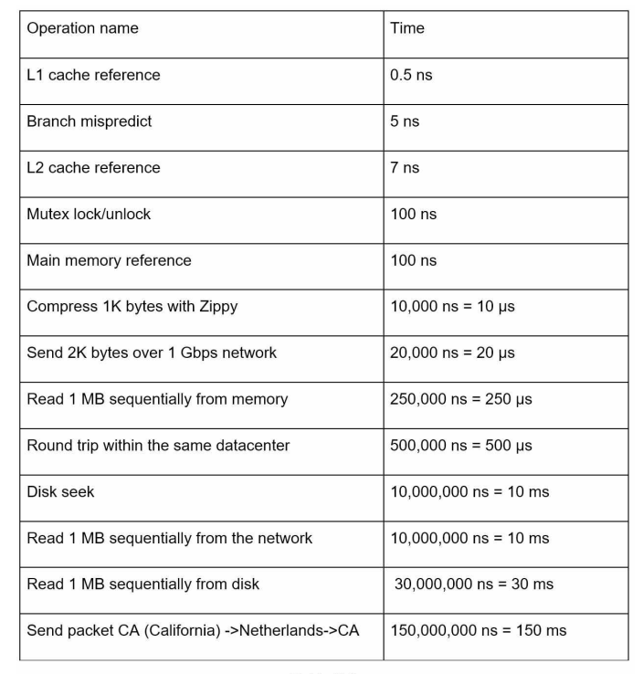
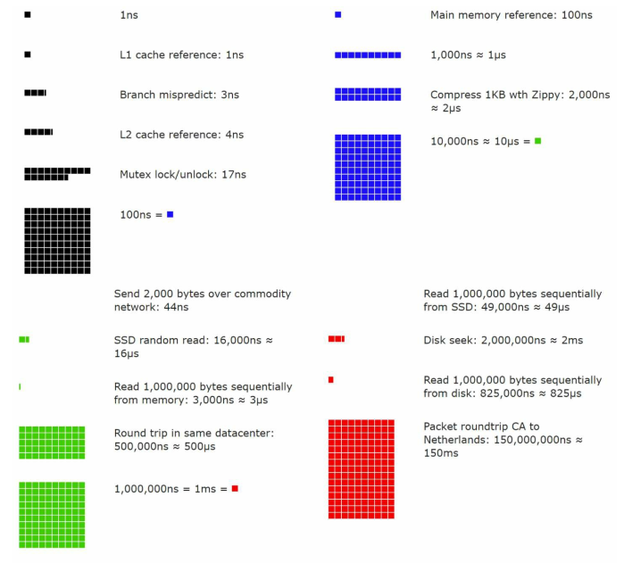
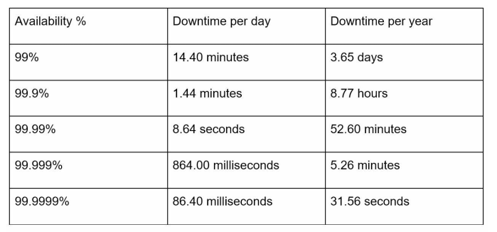

# Power of two

- Although data volume can become enormous when dealing with distributed systems,
  calculation all boils down to the basics. To obtain correct calculations, it is critical to know the data volume unit using the power of 2. A byte is a sequence of 8 bits. An ASCII character uses one byte of memory (8 bits). Below is a table explaining the data volume unit..

# Latency numbers every programmer should know

Notes

---

- ns = nanosecond, µs = microsecond, ms = millisecond
- 1 ns = 10^-9 seconds
- 1 µs= 10^-6 seconds = 1,000 ns
- 1 ms = 10^-3 seconds = 1,000 µs = 1,000,000 ns
- A Google software engineer built a tool to visualize Dr. Dean’s numbers. The tool also takes the time factor into consideration. Figures 2-1 sh
  
- By analyzing the numbers in Figure 2-1, we get the following conclusions:
  - > • Memory is fast but the disk is slow.
  - > • Avoid disk seeks if possible.
  - > • Simple compression algorithms are fast.
  - > • Compress data before sending it over the internet if possible.
  - > • Data centers are usually in different regions, and it takes time to send data between them.

# Availability numbers

- High availability is the ability of a system to be continuously operational for a desirably long period of time. High availability is measured as a percentage, with 100% means a service that has 0 downtime. Most services fall between 99% and 100%.
- A service level agreement (SLA) is a commonly used term for service providers. This is an agreement between you (the service provider) and your customer, and this agreement formally defines the level of uptime your service will deliver. Cloud providers Amazon [4], Google [5] and Microsoft [6] set their SLAs at 99.9% or above. Uptime is traditionally measured in nines. The more the nines, the better. As shown in Table 2-3, the number of nines correlate to the expected system downtime.
  

## Example: Estimate Twitter QPS and storage requirements

### Assumptions:

- 300 million monthly active users. => 300m MAU
- 50% of users use Twitter daily.
- Users post 2 tweets per day on average.
- 10% of tweets contain media.
- Data is stored for 5 years.

### Estimations:

#### Query per second (QPS) estimate:

- Daily Active User: 300 million \* 50% => 150 million (150m DAU)
- Query Per Second: 150m \* 2 (tweets per day) / 24 (hour) / 3600 (second) = ~ 3500 QPS
- Peek QPS: 2 \* QPS (~3500) = ~ 7000 QPS

### We will only estimate media storage here.

#### Average tweet size:

- teet_id: 64 bytes
- text: 140 bytes
- media: 1 MB
- => media storage: 150 million _ 2 (tweets per day) _ 10% \* 1MB = 30 TP per day
- => 5 years: 30 TB _ 365 _ 5 = ~ 55 PB

# TIPS

- **Rounding and Approximation**. It is difficult to perform complicated math operations during the interview. For example, what is the result of “99987 / 9.1”? There is no need to spend valuable time to solve complicated math problems. Precision is not expected. Use round numbers and approximation to your advantage. The division question can be simplified as follows: “100,000 / 10”.
- **Write down your assumptions**. It is a good idea to write down your assumptions to be referenced later.
- **Label your units**. When you write down “5”, does it mean 5 KB or 5 MB? You might
  confuse yourself with this. Write down the units because “5 MB” helps to remove
  ambiguity.
- **Commonly asked back-of-the-envelope estimations**: QPS, peak QPS, storage, cache,
  number of servers, etc. You can practice these calculations when preparing for an
  interview. Practice makes perfect.
