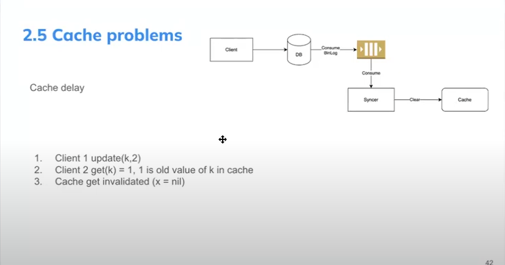

# What is cache

# What it not to cache

# Distribute cache

- at least 3 server
- `in system design, only need to draw one box -> indicate that is cluster`

# Caching strategy

## Cache-aside (Lazy load - Read-Query)

## Write-around

### with option clear-cache (Prefer => slow but correct)

- what happen when we clear-cache
  - user get from catch (miss cache)-> need to get from DB -> then update to the cache => `take one step to write to cache`

### with update-cache (incorrect but faster)

- `it make a inconsistency data because 2 step don't have atomic and place in different database`
- example
  - Client 1 write v1 to DB
  - Client 2 write v2 to DB
  - Client 2 write v2to Cache
  - Client 2 write v1to Cache
    => now in DB, value is `v2`, but in Cache is `v1`

## Use Cache Aside + Write Around is the best way

# Cache Invalidation (with active delete, need config policy in redis)

# Cache Eviction (Only need to setup policy in Redis)

# Cache Problem

## Cache Penetration

### Solution

- can prevent it from gateway, use rare-limiter

## Stale Set

## Thundering herd (Aka Cache stampede) Multi request comme

## Solution for Stale Set and Thundering herd

 

## Data inconsistency when update data (in Write Around)

### Imperfect Solution

- Binlog (file log of DB)

 

## Wrong Cache

 

 

# Trade-off

1. Cost vs Latency
   - Store x% in cache(20%)
   - TTL
2. Consistency and System Complexity
3. Date Freshness vs Latency
   - TTL
