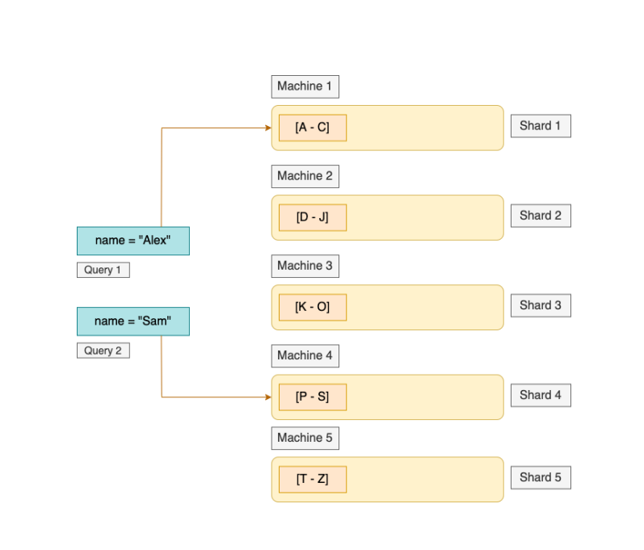
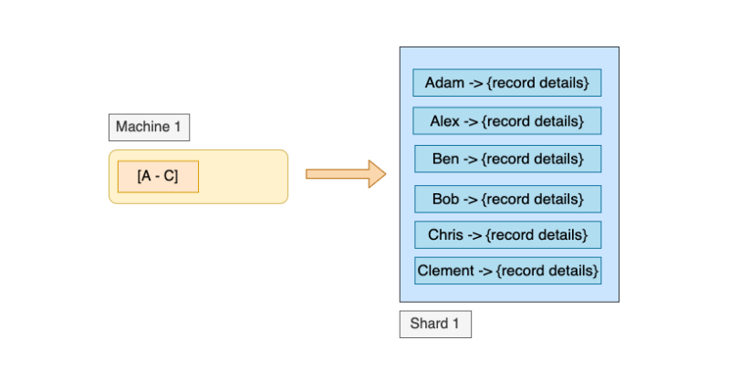

# Sharding by Range

- Example, every machine stores the student details in a certain range by their names.
  

- Every shard holds some student details. **Shard 1** holds the details of students
  having names starting from **A, B and C**. Hence if in future we need to query details
  for a student named **Alex**, we can simply send the query request to **Machine 1.**
- Hence there can be a chance that the **number of students whose names start with {A, B, C} might be equivalent to the number of students whose names start with {T, U, V, W, X, Y, Z}.**
- Moreover, within each shard we can keep the records of students **sorted by their
  names**. This will help in reducing the lookup time in a shard. This also makes the
  range queries much more efficient.
- 
   

# Hot spots in Range based Sharding

- Let’s take our previous data store of students as an example. This time the student
  records have a different Primary index. We are storing them in shards on the basis
  of the **Timestamp** when they take up the course. Let’s say the students registering
  for the course on Day-1 are being stored in the 1st shard. In this way we can have a
  distribution of 1 shard per day. Now suppose on a certain day there was a discount
  on the course and a large number of students signed up on that particular day. In
  this case, one shard will be handling a huge number of writes on that day while the
  rest of the shards sit idle.
