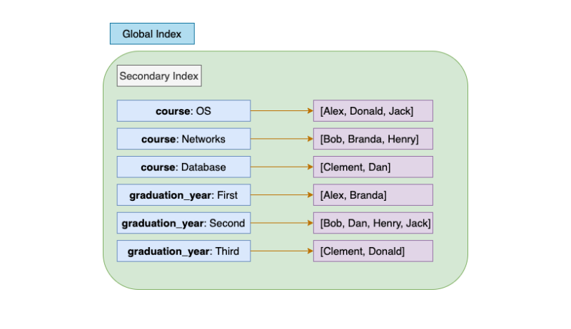
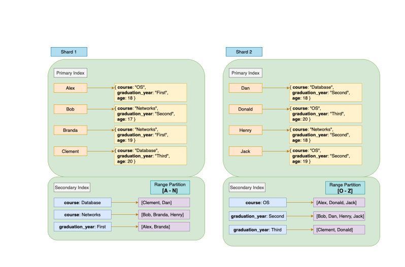
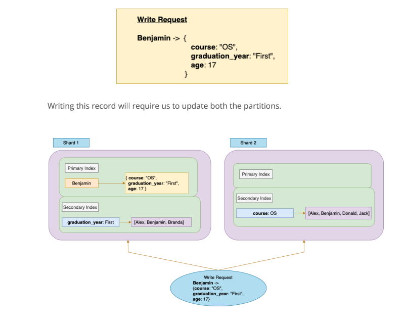

- By Global Index we meant that one secondary index will hold all the keys related to
  that index (from all the shards). We can simply query the term we are looking for
  and get all the results from a single partition.
  

- The **Global Secondary Index** looks like this. We can observe that every secondary
  index holds the values (Primary Indexes of records) from all the partitions. Hence
  we call them global. Now, this Global Index alone can be huge and must be
  partitioned.
- We can perform a range partitioning of the Global Index. The first partition can hold
  all the Secondary Indexes which start from letters **{A to N}** and the second partition
  can hold the indexes which start from letters **{O to Z}**. After partitioning the Global
  Index, our data-model will look like this.
  
- In the above data-model we partitioned the **Global Index** through index range. We
  can also perform **Hash-based** partitioning which can give more even distribution of
  the load. By **Range partitioning** we can perform Range queries efficiently.
- One advantage of **Term-partitioned** index over a **Document-partitioned** index is
  that the reads are efficient in Term-Partitioned data model. We need to find the
  partition that contains the term (Secondary Index) and query that partition.
  Whereas in a Document-partitioned scheme we need to perform a **Scatter/Gather**
  approach and combine the responses from all the partitions.
- Suppose we need to query all the students who opted for a **Networks** course. Then
  we can simply look for the partition that holds the term **“Networks”**. In our case
  which is **Partition-1**. We can further query **Partition-1** to get the keys of all the
  students who opted for **Networks** course.
  -One drawback of the **Term-partitioned** index over the Document-partitioned
  index is that the **Writes are complex and slow**. Writing a single record might involve
  changes to be made in multiple partitions. Suppose we need to write the following
  Student record to the Data-model.
  
- The **Global Secondary Index** maintained by the partitions might take some time to
  get updated once the new record is added, since the process is often
  **asynchronous.**
