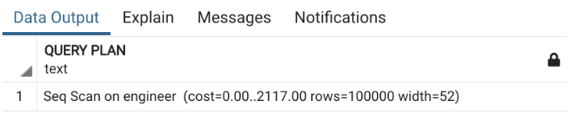
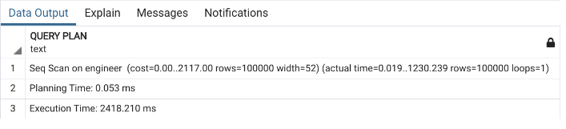
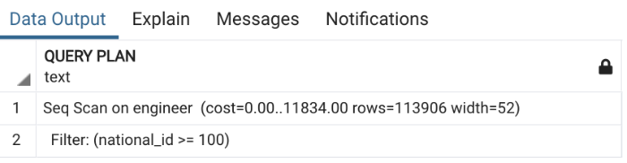
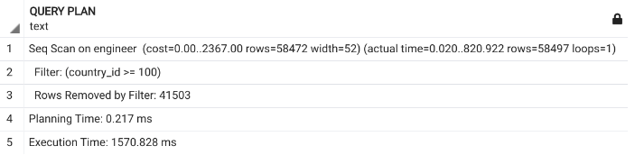
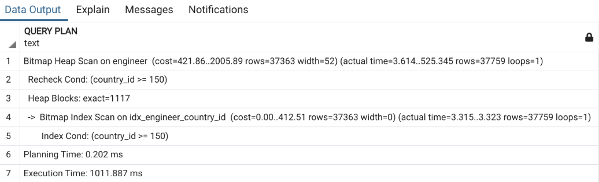

# **Performance Optimization with PostgreSQL: Indexing**

This article is part of the **Performance Optimization with PostgreSQL** series.

Since this article involves practical exercises, let's set up the environment and data first. We'll use **Docker** for quick setup.

## **1. Setting Up PostgreSQL and pgAdmin4**

```sh
docker run -d -p 5432:5432 -e POSTGRES_PASSWORD=postgres postgres
docker run -d -p 8888:80 -e PGADMIN_DEFAULT_EMAIL=admin@postgres.com -e PGADMIN_DEFAULT_PASSWORD=1 dpage/pgadmin4
```

## **2. Creating Tables**

```sql
CREATE TABLE IF NOT EXISTS country
(
    id bigserial NOT NULL,
    country_name character varying(255),
    created timestamp without time zone,
    PRIMARY KEY (id)
);

CREATE TABLE IF NOT EXISTS engineer
(
    id bigserial NOT NULL,
    first_name character varying(255),
    last_name character varying(255),
    gender smallint NOT NULL,
    country_id bigint,
    title character varying(255),
    created timestamp without time zone,
    PRIMARY KEY (id)
);
```

Insert **100k records** into the `engineer` table for testing.

---

## **3. Explain & Explain Analyze**

### **3.1. Explain**

Before optimizing a query, we need to understand what it does and which parts can be optimized. We cannot blindly add indexes or partition tables based on "folklore knowledge" and hope they will run faster.

**Explain** is a powerful tool that helps us analyze query execution steps, providing details on cost, rows, width, etc. Engineers can use these metrics to diagnose issues and apply optimizations.

## ⚠️ Caution: Using `ANALYZE` with `EXPLAIN`

The `ANALYZE` option actually **executes** the statements, not just plans them. So be **very careful** when adding this option while using `EXPLAIN`.

For DML statements (`INSERT`, `DELETE`, `UPDATE`):

- Running **only** `EXPLAIN` is safe and does not affect the data.
- Running `EXPLAIN ANALYZE` will actually execute the query—so your data might be gone! 😬

### ✅ Safe Approach

If you need to run `EXPLAIN ANALYZE` with DML statements, **use a transaction** to prevent permanent changes:

```sql
BEGIN;
EXPLAIN ANALYZE DELETE FROM engineer;
ROLLBACK;
```

To see the execution plan of a query:

```sql
EXPLAIN SELECT * FROM ENGINEER;
```



#### **Understanding the Output**

The output shows a **sequential scan** (`Seq Scan`) on the table. Some key metrics:

- **cost**: The estimated cost of executing the query, ranging from `0` to `2117`. The first number represents the startup cost, while the second is the total computational cost.
- **rows**: The estimated number of rows PostgreSQL expects to scan.
- **width**: The average row width in bytes. For instance, selecting only `gender` (a `smallint`) results in a width of **2 bytes**.

### **3.2. Explain Analyze**

To get actual execution time, we use `EXPLAIN ANALYZE`:

```sql
EXPLAIN ANALYZE SELECT * FROM ENGINEER;
```

#### **Caution When Using ANALYZE**

- `EXPLAIN` only estimates execution.
- `EXPLAIN ANALYZE` **actually runs the query**, so be careful when using it with `INSERT`, `DELETE`, or `UPDATE`.
- To safely analyze DML statements, use transactions:

```sql
BEGIN;
EXPLAIN ANALYZE DELETE FROM engineer;
ROLLBACK;
```



#### **Additional Metrics in Explain Analyze**

- **actual time**: The actual execution time.
- **loops**: The number of iterations.
- **planning time**: The time PostgreSQL spent preparing the query plan.
- **execution time**: The total time taken to execute the query.

Example with a `WHERE` condition:

```sql
EXPLAIN SELECT * FROM ENGINEER WHERE COUNTRY_ID >= 100;
```


Even with a condition, the query still performs a **sequential scan** (`Seq Scan`). We need **indexes** to optimize this.

---

## **4. Indexes**

As discussed in the previous article, indexes **prevent full table scans**, improving query performance.

Let's add an index on `country_id`:

```sql
CREATE INDEX idx_engineer_country_id ON ENGINEER(country_id);
```

After adding the index, let's test the query again:

```sql
EXPLAIN ANALYZE SELECT * FROM ENGINEER WHERE COUNTRY_ID >= 100;
```


🚨 **Surprisingly, it's still using a sequential scan!** 🚨

Let's tweak the condition:

```sql
EXPLAIN ANALYZE SELECT * FROM ENGINEER WHERE COUNTRY_ID >= 150;
```



Now, we see that the query **switches to a bitmap heap scan** (`Bitmap Heap Scan`), and execution time drops **by ~30% (from 1500ms to 1000ms)**.

#### **Why Was the Index Not Used for `>= 100`?**

For `>= 100`, there are **too many matching rows**. PostgreSQL determines that scanning the entire table is faster than scanning the index and then looking up records in the main table.

This proves that **indexes are not always beneficial**—they should be used wisely. Blindly adding indexes can degrade write performance without improving read performance.

---

## **5. Types of Indexes in PostgreSQL**

Most relational databases support three common index types:

1. **B-Tree Index**
2. **Hash Index**
3. **Bitmap Index**

PostgreSQL also offers special index types:

- **GIST** (Generalized Search Tree)
- **SP-GIST** (Space Partitioned GIST)
- **GIN** (Generalized Inverted Index)
- **BRIN** (Block Range Index)

We'll dive deeper into these index types and their use cases in a future article.

---

## **6. Key Takeaways**

✅ Use **EXPLAIN** and **EXPLAIN ANALYZE** to analyze queries and identify bottlenecks.
✅ Use **indexes** to improve query performance—but only when necessary.
✅ PostgreSQL **automatically chooses the best execution plan**, based on index availability and query conditions.
✅ Indexing **does not always speed up queries**—avoid adding indexes blindly.

Stay tuned for the next article, where we'll explore **different index types and their real-world applications**! 🚀
