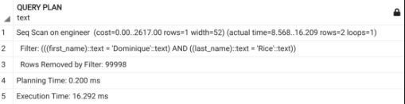
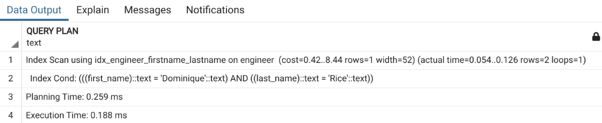

# B-Tree Index (Balanced Tree Index)

## 1) What is B-Tree Index?

Binary Tree and Binary Search Tree (BST) are well-known and widely used structures. B-Tree Index utilizes the Binary Tree structure for storage, and BST is used for searching. It has the following characteristics:

- The most common and widely used index type.
- Suitable when the column has a high number of unique values (high cardinality). For example, names, ages—among 1000 people, duplicate values are rare.
- Self-balancing when indexed column data changes.
- Complexity is based on the tree height: **O(log n)**.
- Tree nodes have direct links to each other, making them suitable for **ORDER BY** queries.

A key point about the second characteristic: Why should we use it for **high cardinality** columns? If applied to low-cardinality columns like **gender** (which has only 2-4 values), BST doesn't provide much benefit over sequential scans. It consumes additional disk space and requires two scans (one on the index table and another on disk to fetch data).

**Note:** B-Tree Index is a **Balanced Tree Index**, not a simple Binary Tree. It focuses on tree balancing and allows each node to have more than two child nodes.

## 2) How does B-Tree Index Work?

Previously, we discussed indexing multiple columns together, known as **composite index**. Many queries search based on both first and last names, or a combination of other conditions like age and address.

### Example Query:

```sql
EXPLAIN ANALYZE SELECT * FROM ENGINEER WHERE first_name = 'Dominique' AND last_name = 'Rice';
```


Without an index, this query uses **sequential scan** with filtering.

### Creating an Index:

```sql
CREATE INDEX idx_engineer_firstname_lastname ON ENGINEER(first_name, last_name);
```

Running the query again:

```sql
EXPLAIN ANALYZE SELECT * FROM ENGINEER WHERE first_name = 'Dominique' AND last_name = 'Rice';
```


Execution time improves **significantly (up to 90 times faster)**.

### Querying with `LIKE` Operator:

```sql
EXPLAIN ANALYZE SELECT * FROM ENGINEER WHERE first_name = 'Dominique' AND last_name LIKE '%a%';
```

Execution plan:

- **Step 1:** Index scan filters `first_name = Dominique`, reducing the dataset to 58 rows.
- **Step 2:** Additional filtering for `last_name LIKE '%a%'`, leaving 15 rows.
- **Result:** Query executes in less than **1 ms**.

### Query Order Matters:

```sql
EXPLAIN ANALYZE SELECT * FROM ENGINEER WHERE first_name LIKE '%v%' AND last_name = 'Parker';
```

- This query **does not use index scan** but falls back to **sequential scan**, causing a performance drop.
- Reason: B-Tree indexes store values in an **ordered** manner (first by `first_name`, then by `last_name`).
- Searching by `last_name` first and applying `LIKE` on `first_name` prevents efficient index usage.

### Effective Usage of B-Tree Index:

- **Match Full Value:** Used for exact matches with `=`.
- **Match Column Prefix:** Works when filtering on the **leftmost column** of a composite index.
- **Match Range of Full Values:** Supports queries with `IN`, `>`, `<`, `>=`, `<=`.

### Key Considerations:

- **Ineffective for `LIKE '%%'` searches**—Indexing won’t improve performance, but insert/update speed may slow down.
- **Composite index requires leftmost column match** for maximum efficiency.

---

# Bitmap Index

## 1) What is Bitmap Index?

A common interview question:

> "Should we index columns with **low cardinality** (few unique values), such as gender?"

Many say "no" because indexing small-value columns doesn’t significantly improve search speed. But let’s analyze further:

- **Indexing still performs sequential scans**, but on an index table rather than the main table.
- If a column has only **2 values (e.g., gender = Male/Female)**, indexing reduces search space **only by half**—complexity remains **O(N)**.
- Real-world indexing depends on whether queries frequently use the column in conditions.

### Query Analysis:

```sql
EXPLAIN ANALYZE SELECT * FROM Engineer WHERE gender = 2;
```

- **Without an index:** Uses **sequential scan**.
- **Cost:** `0..2367`, execution time `0.019..339 ms`.

### Adding an Index:

```sql
CREATE INDEX idx_engineer_gender ON ENGINEER(gender);
```

- **With an index:**
  - **Cost drops from 2367 to 1712**, but actual execution time doesn’t improve much.
  - Query plan changes to **Bitmap Index Scan**.

## 2) How Bitmap Index Works

PostgreSQL **automatically chooses** the best index type based on column properties. For **low cardinality** columns, it selects **Bitmap Index** instead of B-Tree Index.

### Difference Between B-Tree and Bitmap Index:

- **B-Tree Index** maps values to **row IDs**.
- **Bitmap Index** maps values to **bit patterns**.

Example:

- **Gender column (3 values: Male, Female, Unknown)** → Encoded as bits **0, 1, 2**.
- **Bitmap Index stores these bit patterns** instead of direct row references.

### Characteristics of Bitmap Index:

- **Best for low-cardinality columns** (few unique values).
- **Stores bits instead of row IDs**, reducing storage space.
- **Effective for full-value matches.**
- **Can combine with other indexes** for `OR` and `AND` conditions.

### Limitations:

- **Needs rebuilding if values change** (unlike B-Tree, which just re-balances).
- **PostgreSQL stores Bitmap Index in memory**, so it **must be rebuilt after restart**.
- **To avoid this issue, use a composite index** with another column.

### PostgreSQL Optimization Strategy:

PostgreSQL dynamically selects the best index type and can **switch between index types** for optimal performance. However, **switching incurs a high cost**, so careful index design is crucial.

---

### Conclusion:

- **B-Tree Index**: Best for high-cardinality columns and ordered searches.
- **Bitmap Index**: Best for low-cardinality columns and combining multiple conditions.
- **PostgreSQL optimizes queries dynamically**, but understanding index behavior helps design efficient queries.
