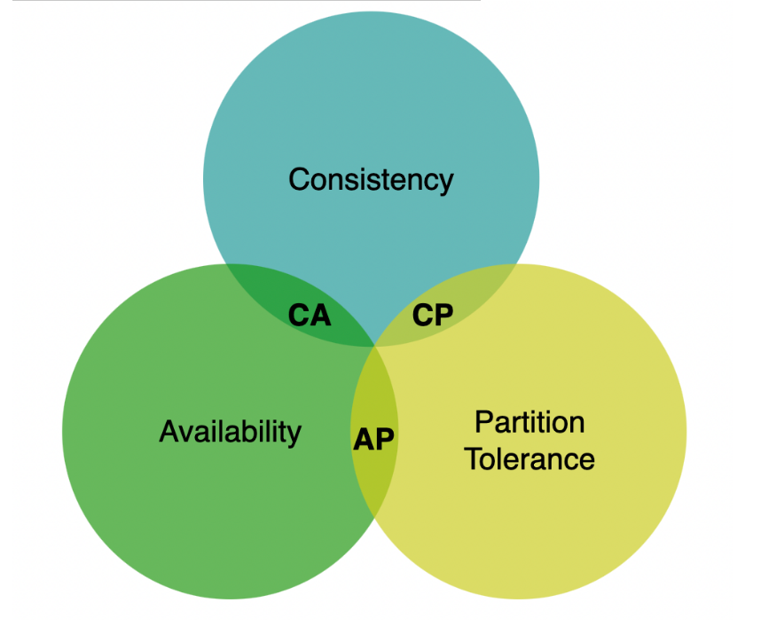
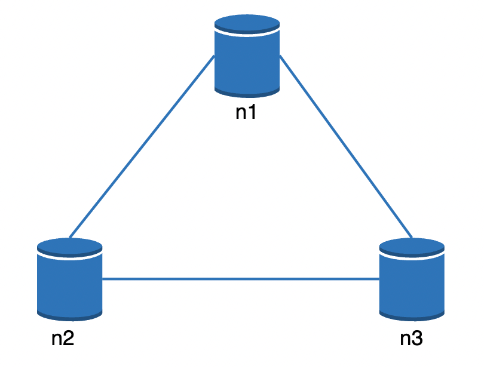
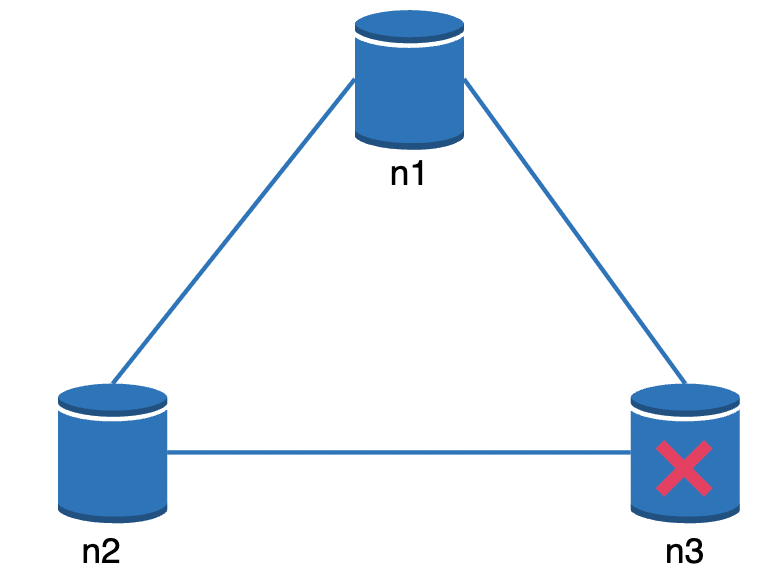

# Design a Key-Value Store

Key-value stores are a type of non-relational databases.  

- Each unique identifier is stored as a key with a value associated to it.
- Keys must be unique and can be plain text or hashes.
- Performance-wise, short keys work better.  

We're now about to design a key-value store which supports:

- put(key, value) - insert value associated to key
- get(key) - get value associated to key

# Understand the problem and establish design scope

There's always a trade-off to be made between read/write and memory usage. Another trade-off is between consistency and availability.  
Here are the characteristics we're striving to achieve:  

- Key-value pair size is small - 10kb
- We need to be able to store a lot of data.
- High availability - system responds quickly even during failures.
- High scalability - system can be scaled to support large data sets.
- Automatic scaling - addition/deletion of servers should happen automatically based on traffic.
- Tunable consistency.
- Low latency.

# Single server key-value store

Single server key-value stores are easy to develop.  
We can just maintain an in-memory hash map which stores the key-value pairs.  
Memory however, can be a bottleneck, as we can't fit everything in-memory. Here are our options to scale:  

- Data compression
- Store only frequently used data in-memory. The rest store on disk.  

Even with these optimizations, a single server can quickly reach its capacity. 

# Distributed key-value store

- A distributed key-value store consists of a distributed hash table, which distributes keys across many nodes.

- When developing a distributed data store, we need to factor in the CAP theorem

## CAP Theorem

This theorem states that a data store can't provide **more than two** of the following guarantees - consistency, availability, partition tolerance;  

- **Consistency** - all clients see the same data at the same time, no matter which node they're connected to.
- **Availability** - all clients get a response, regardless of which node they connect to.
- **Partition tolerance** - A network partition means that not all nodes within the cluster can communicate. Partition tolerance means that the system is operational even in such circumstances.
  

A distributed system which **supports consistency and availability cannot exist in the real world as network failures are inevitable**.  
Example distributed data store in an ideal situation:  

In the real world, a network partition can occur which hinders communication with eg node 3:  

- If we favor **consistency over availability**, **all write operations need to be blocked when the above scenario occurs**.
- If we favor **availability on the other hand**, **the system continues accepting reads and writes, risking some clients receiving stale data. When node 3 is back online, it will be re-synced with the latest data**.  
  What you choose is something you need to clarify with the interviewer. There are different trade-offs with each option.

# System components
