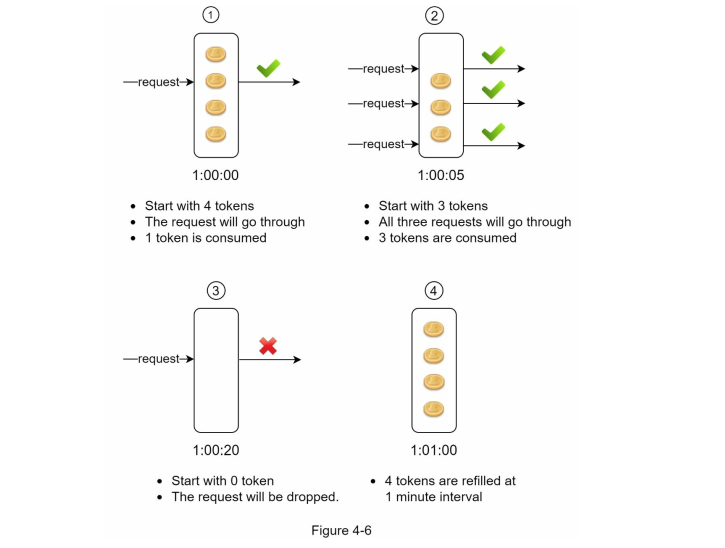
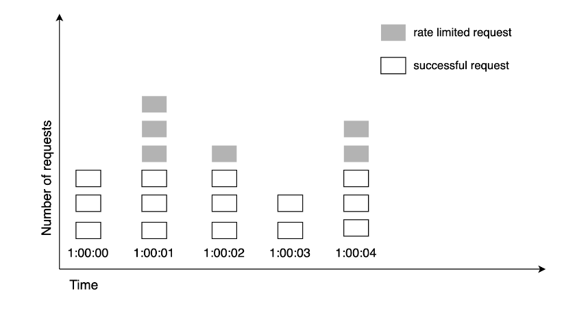
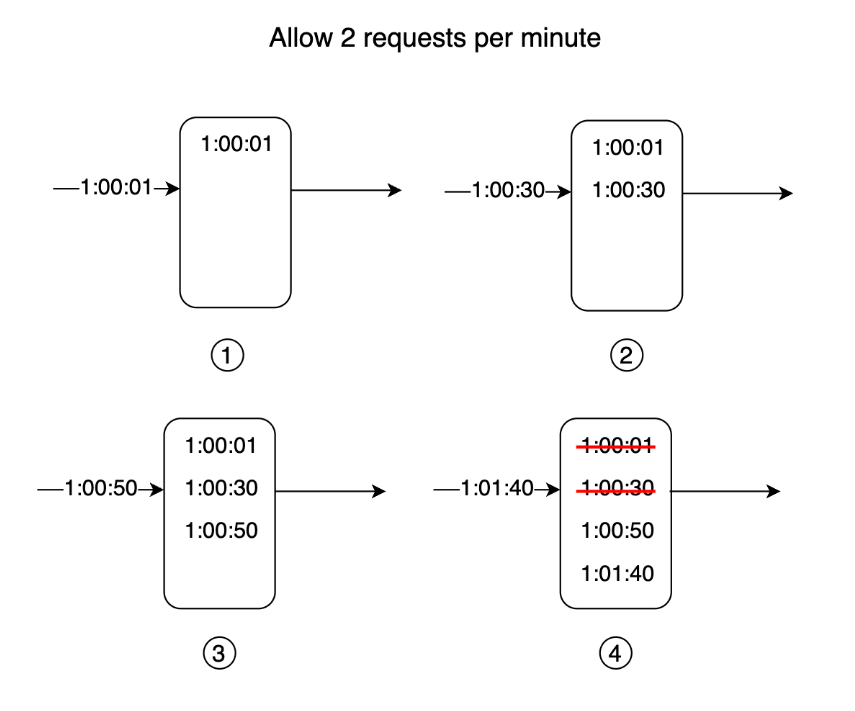
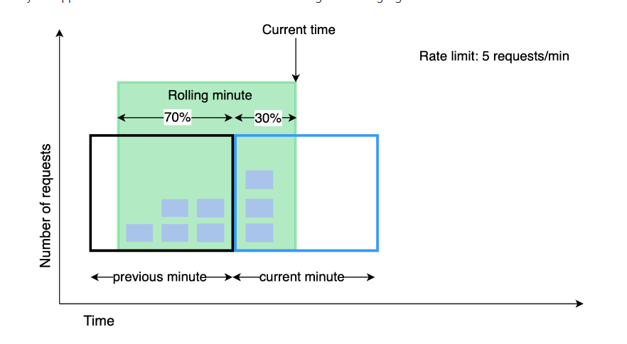
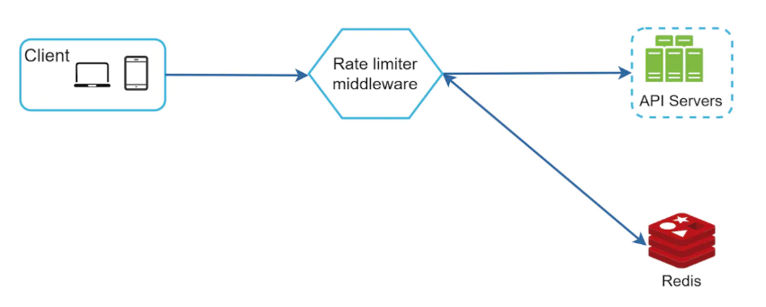
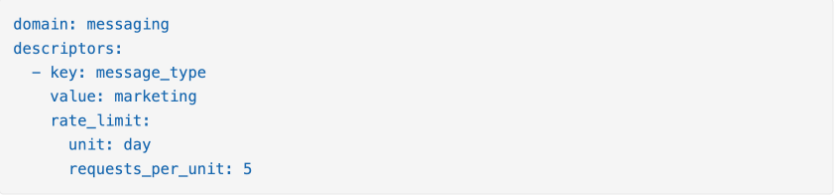
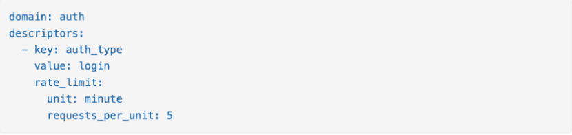
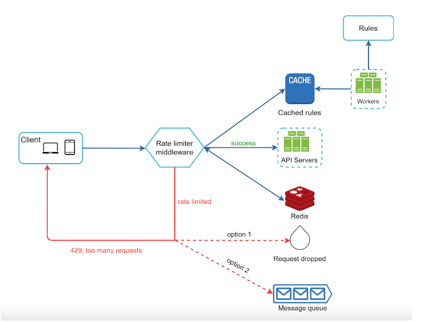
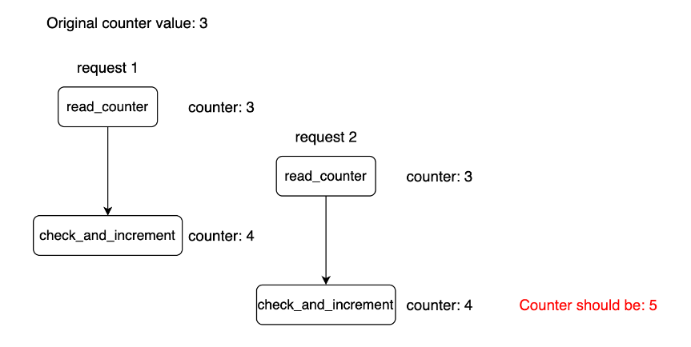

# Step 1 - Understand the problem and establish design scope

- **Candidate**: What kind of rate limiter are we going to design? Is it a client-side rate limiter or server-side API rate limiter?
- **Interviewer**: Great question. We focus on the server-side API rate limiter.
- **Candidate**: Does the rate limiter throttle API requests based on IP, the user ID, or other properties?
- **Interviewer**: The rate limiter should be flexible enough to support different sets of throttle rules.
- **Candidate**: What is the scale of the system? Is it built for a startup or a big company with a large user base?
- **Interviewer**: The system must be able to handle a large number of requests.
- **Candidate**: Will the system work in a distributed environment?
- **Interviewer**: Yes.
- **Candidate**: Is the rate limiter a separate service or should it be implemented in application code?
- **Interviewer**: It is a design decision up to you.
- **Candidate**: Do we need to inform users who are throttled?
- **Interviewer**: Yes.

# Requirements

Here is a summary of the requirements for the system: <br>

- Accurately limit excessive requests.
- Low latency. The rate limiter should not slow down HTTP response time.
- Use as little memory as possible.
- Distributed rate limiting. The rate limiter can be shared across multiple servers or
  processes.
- Exception handling. Show clear exceptions to users when their requests are throttled.
- High fault tolerance. If there are any problems with the rate limiter (for example, a cache server goes offline), it does not affect the entire system.

# Step 2 - Propose high-level design and get buy-in

## Where to put the rate limiter?

- Client side (no recommend)
- Server side (can be put in middleware, vv)

### Guideline

- While designing a rate limiter, an important question to ask ourselves is: where should the rater limiter be implemented, on the server-side or in a gateway? There is no absolute answer.It depends on your company’s current technology stack, engineering resources, priorities,goals, etc. Here are a few general guidelines:
  - Evaluate your current technology stack, such as programming language, cache service,
    etc. Make sure your current programming language is efficient to implement rate limiting
    on the server-side.
  - Identify the rate limiting algorithm that fits your business needs. When you implement
    everything on the server-side, you have full control of the algorithm. However, your
    choice might be limited if you use a third-party gateway.
  - If you have already used microservice architecture and included an API gateway in the
    design to perform authentication, IP whitelisting, etc., you may add a rate limiter to the API gateway.
  - Building your own rate limiting service takes time. If you do not have enough
    engineerin

## Algorithms for rate limiting

### Token bucket algorithm

- A token bucket is a container that has pre-defined capacity. Tokens are put in the bucket
  at preset rates periodically. Once the bucket is full, no more tokens are added. The re-filler puts 2 tokens into the bucket every second. Once the bucket is full, extra tokens will overflow.
- Each request consumes one token. When a request arrives, we check if there are enough
  tokens in the bucket. Figure 4-5 explains how it works.
  - If there are enough tokens, we take one token out for each request, and the request
    goes through.
  - If there are not enough tokens, the request is dropped.
    
- The token bucket algorithm takes two parameters:
  - **Bucket size**: the maximum number of tokens allowed in the bucket
  - **Refill rate**: number of tokens put into the bucket every second

#### How It Works:

- Imagine a bucket that holds tokens.

- The bucket has a maximum capacity of tokens.

- Tokens are added to the bucket at a fixed rate (e.g., 10 tokens per second).

- When a request arrives, it must obtain a token from the bucket to proceed.

- If there are enough tokens, the request is allowed and tokens are removed.

- If there aren't enough tokens, the request is dropped.

#### How many bucket we need

- It is usually necessary to have different buckets for different API endpoints.
  - if a user is allowed to make 1 post per second, add 150 friends per day, and like 5 posts per second, 3 buckets are required for each user.
  - If we need to throttle requests based on IP addresses, each IP address requires a bucket.
  - If the system allows a maximum of 10,000 requests per second, it makes sense to have a global bucket shared by all requests.

#### Pros:

- The algorithm is easy to implement.
- Memory efficient.
- Token bucket allows a burst of traffic for short periods. A request can go through as long as there are tokens left.

#### Cons:

- Two parameters in the algorithm are bucket size and token refill rate.
- Does not handle sudden bursts of requests well; excess requests are immediately dropped.
- Slightly more complex to implement compared to Token Bucket.

### Leaking bucket algorithm

#### How it works

- The leaking bucket algorithm is similar to the token bucket except that requests are processed at a fixed rate. It is usually implemented with a first-in-first-out (FIFO) queue. The algorithm works as follows:
  - When a request arrives, the system checks if the queue is full. If it is not full, the request
    is added to the queue.
  - Otherwise, the request is dropped.
  - Requests are pulled from the queue and processed at regular intervals.
- 
- Leaking bucket algorithm takes the following two parameters:
  - **Bucket size**: it is equal to the queue size. The queue holds the requests to be processed at a fixed rate.
  - **Outflow rate**: it defines how many requests can be processed at a fixed rate, usually in seconds.
- **Shopify, an ecommerce company**, uses leaky buckets for rate-limiting

### Fixed window counter algorithm

#### How it work

- Time is divided in fix windows with a counter for each one
- Each request increments the counter
- Once the counter reaches the threshold, subsequent requests in that window are dropped
  
- One major problem with this approach is that a burst of traffic in the edges can allow more requests than allowed to pass through:
  

#### Pros:

- Memory efficient
- Easy to understand
- Resetting available quota at the end of a unit of time fits certain use cases

#### Cons:

- Spike in traffic could cause more requests than allowed to go through a given time window

### Sliding window log algorithm

#### How it work

- Algorithm keeps track of request timestamps. Timestamp data is usually kept in a cache, such as Redis sorted set.
- When a request comes in, remove outdated timestamps.
- Add timestamp of the new request in the log.
- If the log size is same or lower than threshold, request is allowed, otherwise, it is rejected.
- Note that the 3rd request in this example is rejected, but timestamp is still recorded in the log:
  

#### Pros:

- Rate limiting accuracy is very high

#### Cons:

- Memory footprint is very high

### Sliding window counter algorithm

- A hybrid approach which combines the fixed window + sliding window log algorithms.

#### How it work

- Maintain a counter for each time window. Increment for given time window on each request.
- Derive sliding window counter = prev*window * prev*window_overlap + curr_window * curr_window_overlap (see screenshot above)
- If counter exceeds threshold, request is rejected, otherwise it is accepted.
  

#### Pros:

- Smooths out spikes in traffic as rate is based on average rate of previous window
- Memory efficient

#### Cons:

- Not very accurate rate limiting, as it's based on overlaps. But experiments show that only ~0.003% of requests are inaccurately accepted.

### High-level architecture



### How it works:

- Client sends request to rate limiting middleware
- Rate limiter fetches counter from corresponding bucket & checks if request is to be let through
- If request is let through, it reaches the API servers

# Step 3 - Design deep dive

What wasn't answered in the high-level design: <br>

- How are rate limiting rules created?
- How to handle rate-limited requests?

### Rate limiting rules

Example rate limiting rules, used by Lyft for 5 marketing messages per day: <br>

Another example \w max login attempts in a minute: <br>


### Exceeding the rate limit

When a request is rate limited, a **429 (too many requests) error code is returned**. <br>
In some cases, the rate-limited requests can be enqueued for future processing. <br>

We could also include some additional HTTP headers to provide additional metadata info to clients:<br>

```
X-Ratelimit-Remaining: The remaining number of allowed requests within the window.
X-Ratelimit-Limit: It indicates how many calls the client can make per time window.
X-Ratelimit-Retry-After: The number of seconds to wait until you can make a request again without being throttled.
```

### Detailed design



- Rules are stored on disk, workers populate them periodically in an in-memory cache.
- Rate limiting middleware intercepts client requests.
- Middleware loads the rules from the cache. It also fetches counters from the redis cache.
- If request is allowed, it proceeds to API servers. If not, a 429 HTTP status code is returned. Then, request is either dropped or enqueued.

## Rate limiter in a distributed environment

How will we scale the rate limited beyond a single server? <br>
There are several challenges to consider: <br>

- Race condition
- Synchronization <br>
  In case of race conditions, the counter might not be updated correctly when mutated by multiple instances:
   <br>
  Locks are a typical way to solve this issue, but they are costly. Alternatively, one could use **Lua scripts or Redis sorted sets**, which solve the race conditions.

## Solution

- One possible solution is to **use Sticky Session that allows a client to send traffic to the same rate limiter**. This solution is not advisable because this design option is neither scalable nor flexible.
- A better approach is to use centralized data stores like Redis
  - The two main problems with this approach are:
    - **increased latency** making requests to the data store which is a trade-off we are making,
    - **race conditions**.

## Race Conditions

- One of the most extensive problems with a centralized data store is the potential for race conditions in high concurrency request patterns. This issue happens when you use a naïve "**GET-then-SET**" approach, wherein you retrieve the current rate limit counter, increment it, and then push it back to the datastore. This model's problem is that additional requests can come through in the time it takes to perform a full cycle of read-increment-store, each attempting to store the increment counter with an invalid (lower) counter value. This allows a consumer to send a very high rate of requests to bypass rate limiting controls. <br>
- One way to avoid this problem is to put a "**LOCK**" around the key in question, preventing any other processes from accessing or writing to the counter. A lock would quickly become a significant performance bottleneck and does not scale well, mainly when using remote servers like Redis as the backing datastore
- **A better approach is to use a "SET-then-GET" mindset**, relying on atomic operators that implement locks in a very performant fashion, allowing you to quickly increment and check counter values without letting the atomic operations get in the way.

## Performance optimization

- Multi-data center setup - so that users interact with instances geographically close to them.
- Use eventual consistency as a synchronization model to avoid excessive locking.

## Monitoring

To do so, we need to track: <br>

- If the rate limiting algorithm is effective
- If the rate limiting rules are effective <br>
- If too many requests are dropped, we might have to tune some of the rules or the algorithm parameters.

# Step 4 - Wrap up

We discussed a bunch of rate-limiting algorithms: <br>

- Token bucket - good for supporting traffic bursts.
- Leaking bucket - good for ensuring consistent inbound request flow to downstream services
- Fixed window - good for specific use-cases where you want time divided in explicit windows
- Sliding window log - good when you want high rate-limiting accuracy at the expense of memory footprint.
- Sliding window counter - good when you don't want 100% accuracy with a very low memory footprint. <br>

Additional talking points if time permits: <br>

- Hard vs. soft rate limiting

  - Hard - requests cannot exceed the specified threshold
  - Soft - requests can exceed threshold for some limited time <br>

- Rate limiting at different layers - L7 (application) vs L3 (network)
- Client-side measures to avoid being rate limited:
  - Client-side cache to avoid excessive calls
  - Understand limit and avoid sending too many requests in a small time frame
  - Gracefully handle exceptions due to being rate limited
  - Add sufficient back-off and retry logic
