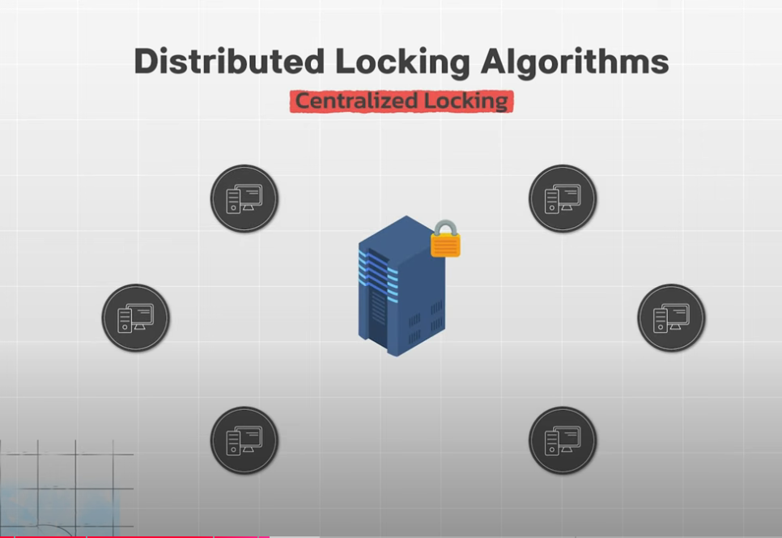
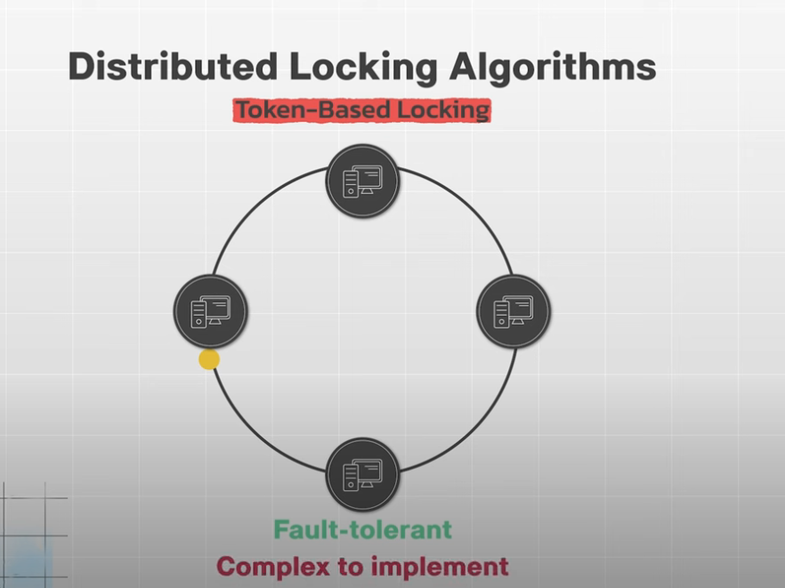
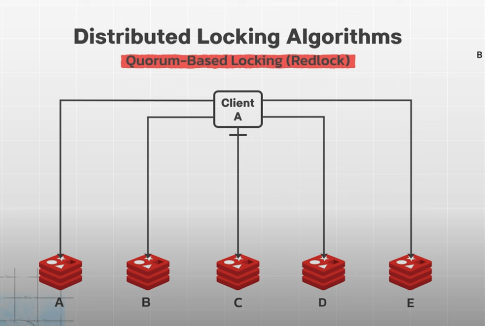
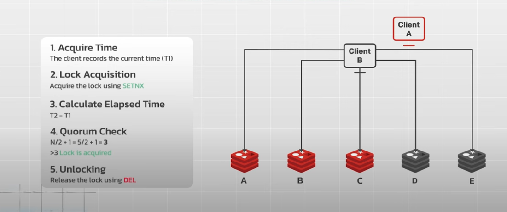
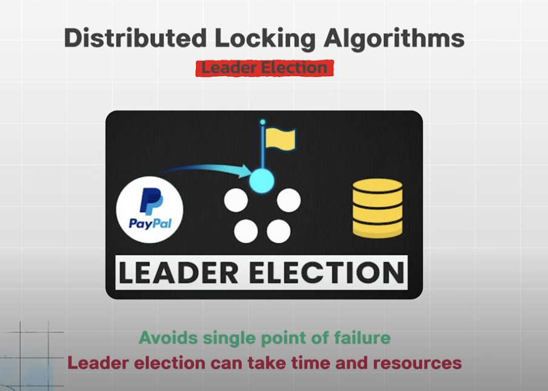

# Ideal

## Mutual Exclusion

- Only one node can hold the lock at a time

## Fault Tolerance

- Lock should not available when not fails

## Performance

- Acquiring and releasing lock should be efficient

## Fairness

- Nodes should have a fair chance of acquiring the lock

 

## Centralized Locking

- Simple to implement
- Single point of failure

## Token-Base Locking

- Fault-tolerant
- Complex to implement

## Quorum-Base locking <RedLock>

- High fault tolerance and availability
- More complex, potential for issue

## Leader Electric

- Avoid single point of failure
- Leader Electric can take time and resources
