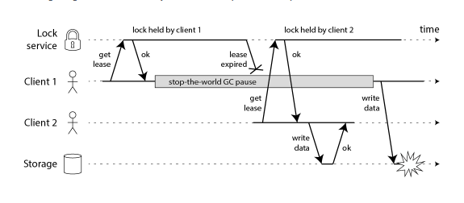
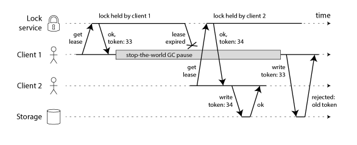

## Basic

- If you use a **single Redis instance**, of course you will drop some locks if the power suddenly goes out on your Redis node, or something else goes wrong. But if you’re only using the locks as an efficiency optimization, and the crashes don’t happen too often, that’s no big deal. This “no big deal” scenario is where Redis shines. At least if you’re relying on a single Redis instance, it is clear to everyone who looks at the system that the locks are approximate, and only to be used for non-critical purposes.
- On the other hand, the Redlock algorithm, with its 5 replicas and majority voting, looks at first glance as though it is suitable for situations in which your locking is important for correctness. I will argue in the following sections that it is not suitable for that purpose. For the rest of this article we will assume that your locks are important for correctness, and that it is a serious bug if two different nodes concurrently believe that they are holding the same lock.

# Protecting a resource with a lock

- Let’s leave the particulars of Redlock aside for a moment, and discuss how a distributed lock is used in general (independent of the particular locking algorithm used). It’s important to remember that a lock in a distributed system is not like a mutex in a multi-threaded application. It’s a more complicated beast, due to the problem that different nodes and the network can all fail independently in various ways.
- For example, say you have an application in which a client needs to update a file in shared storage (e.g. HDFS or S3). A client first acquires the lock, then reads the file, makes some changes, writes the modified file back, and finally releases the lock. The lock prevents two clients from performing this read-modify-write cycle concurrently, which would result in lost updates. The code might look something like this:

```
// THIS CODE IS BROKEN
function writeData(filename, data) {
    var lock = lockService.acquireLock(filename);
    if (!lock) {
        throw 'Failed to acquire lock';
    }

    try {
        var updated = updateContents(file, data);
        storage.writeFile(filename, updated);
    } finally {
}
```

- Unfortunately, even if you have a perfect lock service, the code above is broken. The following diagram shows how you can end up with corrupted data:



- In this example, the client that acquired the lock is paused for an extended period of time while holding the lock – for example because the garbage collector (GC) kicked in. The lock has a timeout (i.e. it is a lease), which is always a good idea (otherwise a crashed client could end up holding a lock forever and never releasing it). However, if the GC pause lasts longer than the lease expiry period, and the client doesn’t realise that it has expired, it may go ahead and make some unsafe change.

- This bug is not theoretical: HBase used to have this problem [3,4]. Normally, GC pauses are quite short, but “stop-the-world” GC pauses have sometimes been known to last for several minutes [5] – certainly long enough for a lease to expire. Even so-called “concurrent” garbage collectors like the HotSpot JVM’s CMS cannot fully run in parallel with the application code – even they need to stop the world from time to time [6].

- You cannot fix this problem by inserting a check on the lock expiry just before writing back to storage. Remember that GC can pause a running thread at any point, including the point that is maximally inconvenient for you (between the last check and the write operation).

- And if you’re feeling smug because your programming language runtime doesn’t have long GC pauses, there are many other reasons why your process might get paused. Maybe your process tried to read an address that is not yet loaded into memory, so it gets a page fault and is paused until the page is loaded from disk. Maybe your disk is actually EBS, and so reading a variable unwittingly turned into a synchronous network request over Amazon’s congested network. Maybe there are many other processes contending for CPU, and you hit a black node in your scheduler tree. Maybe someone accidentally sent SIGSTOP to the process. Whatever. Your processes will get paused.

- If you still don’t believe me about process pauses, then consider instead that the file-writing request may get delayed in the network before reaching the storage service. Packet networks such as Ethernet and IP may delay packets arbitrarily, and they do [7]: in a famous incident at GitHub, packets were delayed in the network for approximately 90 seconds [8]. This means that an application process may send a write request, and it may reach the storage server a minute later when the lease has already expired.

- Even in well-managed networks, this kind of thing can happen. You simply cannot make any assumptions about timing, which is why the code above is fundamentally unsafe, no matter what lock service you use.

# Fencing token

- The fix for this problem is actually pretty simple: you need to include a fencing token with every write request to the storage service. In this context, a fencing token is simply a number that increases (e.g. incremented by the lock service) every time a client acquires the lock. This is illustrated in the following diagram:
  

- Client 1 acquires the lease and gets a token of 33, but then it goes into a long pause and the lease expires. Client 2 acquires the lease, gets a token of 34 (the number always increases), and then sends its write to the storage service, including the token of 34. Later, client 1 comes back to life and sends its write to the storage service, including its token value 33. However, the storage server remembers that it has already processed a write with a higher token number (34), and so it rejects the request with token 33.

- Note this requires the storage server to take an active role in checking tokens, and rejecting any writes on which the token has gone backwards. But this is not particularly hard, once you know the trick. And provided that the lock service generates strictly monotonically increasing tokens, this makes the lock safe. For example, if you are using ZooKeeper as lock service, you can use the zxid or the znode version number as fencing token, and you’re in good shape [3].

- However, this leads us to the first big problem with Redlock: it does not have any facility for generating fencing tokens. The algorithm does not produce any number that is guaranteed to increase every time a client acquires a lock. This means that even if the algorithm were otherwise perfect, it would not be safe to use, because you cannot prevent the race condition between clients in the case where one client is paused or its packets are delayed.

- And it’s not obvious to me how one would change the Redlock algorithm to start generating fencing tokens. The unique random value it uses does not provide the required monotonicity. Simply keeping a counter on one Redis node would not be sufficient, because that node may fail. Keeping counters on several nodes would mean they would go out of sync. It’s likely that you would need a consensus algorithm just to generate the fencing tokens. (If only incrementing a counter was simple.)

# Using time to solve consensus

- The fact that Redlock fails to generate fencing tokens should already be sufficient reason not to use it in situations where correctness depends on the lock. But there are some further problems that are worth discussing.

- In the academic literature, the most practical system model for this kind of algorithm is the asynchronous model with unreliable failure detectors [9]. In plain English, this means that the algorithms make no assumptions about timing: processes may pause for arbitrary lengths of time, packets may be arbitrarily delayed in the network, and clocks may be arbitrarily wrong – and the algorithm is nevertheless expected to do the right thing. Given what we discussed above, these are very reasonable assumptions.

- The only purpose for which algorithms may use clocks is to generate timeouts, to avoid waiting forever if a node is down. But timeouts do not have to be accurate: just because a request times out, that doesn’t mean that the other node is definitely down – it could just as well be that there is a large delay in the network, or that your local clock is wrong. When used as a failure detector, timeouts are just a guess that something is wrong. (If they could, distributed algorithms would do without clocks entirely, but then consensus becomes impossible [10]. Acquiring a lock is like a compare-and-set operation, which requires consensus [11].)

- Note that Redis uses gettimeofday, not a monotonic clock, to determine the expiry of keys. The man page for gettimeofday explicitly says that the time it returns is subject to discontinuous jumps in system time – that is, it might suddenly jump forwards by a few minutes, or even jump back in time (e.g. if the clock is stepped by NTP because it differs from a NTP server by too much, or if the clock is manually adjusted by an administrator). Thus, if the system clock is doing weird things, it could easily happen that the expiry of a key in Redis is much faster or much slower than expected.

- For algorithms in the asynchronous model this is not a big problem: these algorithms generally ensure that their safety properties always hold, without making any timing assumptions [12]. Only liveness properties depend on timeouts or some other failure detector. In plain English, this means that even if the timings in the system are all over the place (processes pausing, networks delaying, clocks jumping forwards and backwards), the performance of an algorithm might go to hell, but the algorithm will never make an incorrect decision.

- However, Redlock is not like this. Its safety depends on a lot of timing assumptions: it assumes that all Redis nodes hold keys for approximately the right length of time before expiring; that the network delay is small compared to the expiry duration; and that process pauses are much shorter than the expiry duration.

# Breaking Redlock with bad timings

- Let’s look at some examples to demonstrate Redlock’s reliance on timing assumptions. Say the system has five Redis nodes (A, B, C, D and E), and two clients (1 and 2). What happens if a clock on one of the Redis nodes jumps forward?

```
1.Client 1 acquires lock on nodes A, B, C. Due to a network issue, D and E cannot be reached.
2.The clock on node C jumps forward, causing the lock to expire.
3.Client 2 acquires lock on nodes C, D, E. Due to a network issue, A and B cannot be reached.
4.Clients 1 and 2 now both believe they hold the lock.
```

- A similar issue could happen if C crashes before persisting the lock to disk, and immediately restarts. For this reason, the Redlock documentation recommends delaying restarts of crashed nodes for at least the time-to-live of the longest-lived lock. But this restart delay again relies on a reasonably accurate measurement of time, and would fail if the clock jump
- Okay, so maybe you think that a clock jump is unrealistic, because you’re very confident in having correctly configured NTP to only ever slew the clock. In that case, let’s look at an example of how a process pause may cause the algorithm to fail:

```
1.Client 1 requests lock on nodes A, B, C, D, E.
2.While the responses to client 1 are in flight, client 1 goes into stop-the-world GC.
3.Locks expire on all Redis nodes.
4.Client 2 acquires lock on nodes A, B, C, D, E.
5.Client 1 finishes GC, and receives the responses from Redis nodes indicating that it 6.6.successfully acquired the lock (they were held in client 1’s kernel network buffers while the process was paused).
6.Clients 1 and 2 now both believe they hold the lock.

-Note that even though Redis is written in C, and thus doesn’t have GC, that doesn’t help us here: any system in which the clients may experience a GC pause has this problem. You can only make this safe by preventing client 1 from performing any operations under the lock after client 2 has acquired the lock, for example using the fencing approach above.

-A long network delay can produce the same effect as the process pause. It perhaps depends on your TCP user timeout – if you make the timeout significantly shorter than the Redis TTL, perhaps the delayed network packets would be ignored, but we’d have to look in detail at the TCP implementation to be sure. Also, with the timeout we’re back down to accuracy of time measurement again!
```

# The synchrony assumptions of Redlock

- These examples show that Redlock works correctly only if you assume a synchronous system model – that is, a system with the following properties:These examples show that Redlock works correctly only if you assume a synchronous system model – that is, a system with the following properties:

  > - bounded network delay (you can guarantee that packets always arrive within some guaranteed maximum delay),
  > - bounded process pauses (in other words, hard real-time constraints, which you typically only > find in car airbag systems and suchlike), and
  > - bounded clock error (cross your fingers that you don’t get your time from a bad NTP server).

- Note that a synchronous model does not mean exactly synchronised clocks: it means you are assuming a known, fixed upper bound on network delay, pauses and clock drift [12]. Redlock assumes that delays, pauses and drift are all small relative to the time-to-live of a lock; if the timing issues become as large as the time-to-live, the algorithm fails.

- In a reasonably well-behaved datacenter environment, the timing assumptions will be satisfied most of the time – this is known as a partially synchronous system [12]. But is that good enough? As soon as those timing assumptions are broken, Redlock may violate its safety properties, e.g. granting a lease to one client before another has expired. If you’re depending on your lock for correctness, “most of the time” is not enough – you need it to always be correct.

- There is plenty of evidence that it is not safe to assume a synchronous system model for most practical system environments [7,8]. Keep reminding yourself of the GitHub incident with the 90-second packet delay. It is unlikely that Redlock would survive a Jepsen test.

- On the other hand, a consensus algorithm designed for a partially synchronous system model (or asynchronous model with failure detector) actually has a chance of working. Raft, Viewstamped Replication, Zab and Paxos all fall in this category. Such an algorithm must let go of all timing assumptions. That’s hard: it’s so tempting to assume networks, processes and clocks are more reliable than they really are. But in the messy reality of distributed systems, you have to be very careful with your assumptions.

# Conclusion

- I think the Redlock algorithm is a poor choice because it is “neither fish nor fowl”: it is unnecessarily heavyweight and expensive for efficiency-optimization locks, but it is not sufficiently safe for situations in which correctness depends on the lock.
- In particular, the algorithm makes dangerous assumptions about timing and system clocks (essentially assuming a synchronous system with bounded network delay and bounded execution time for operations), and it violates safety properties if those assumptions are not met. Moreover, it lacks a facility for generating fencing tokens (which protect a system against long delays in the network or in paused processes).
- **If you need locks only on a best-effort basis (as an efficiency optimization, not for correctness), I would recommend sticking with the straightforward single-node locking algorithm for Redis (conditional set-if-not-exists to obtain a lock, atomic delete-if-value-matches to release a lock), and documenting very clearly in your code that the locks are only approximate and may occasionally fail. Don’t bother with setting up a cluster of five Redis nodes.**
- **On the other hand, if you need locks for correctness, please don’t use Redlock. Instead, please use a proper consensus system such as ZooKeeper, probably via one of the Curator recipes that implements a lock. (At the very least, use a database with reasonable transactional guarantees.) And please enforce use of fencing tokens on all resource accesses under the lock.**
