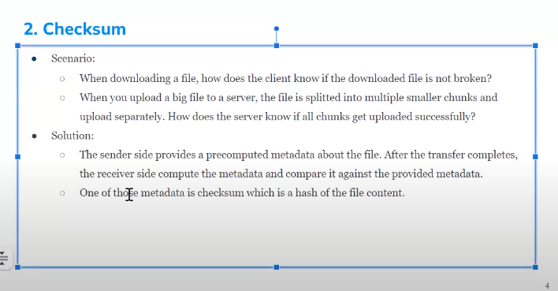
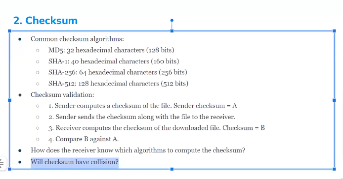
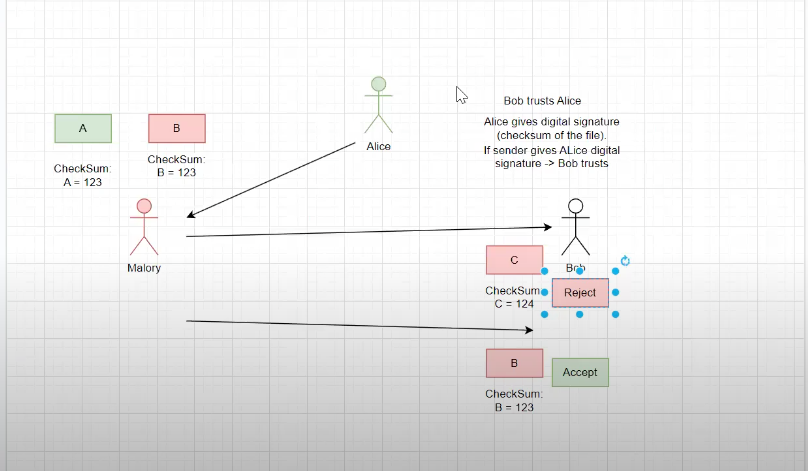

# Checksum

- use hash to compare
- same input will make a same output

 

- mitigate by use algorithm with more bits or spit smaller chunk

## how it to be attacked

 

[collision attack](https://en.wikipedia.org/wiki/Collision_attack)
