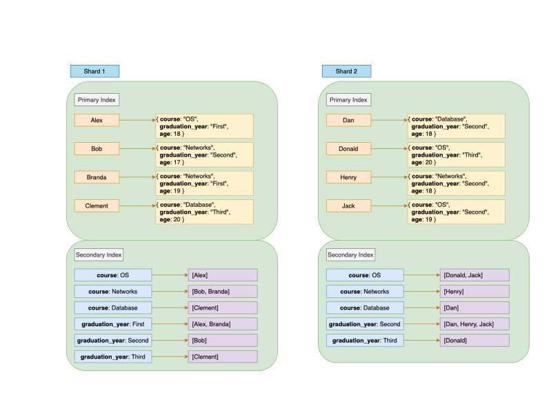
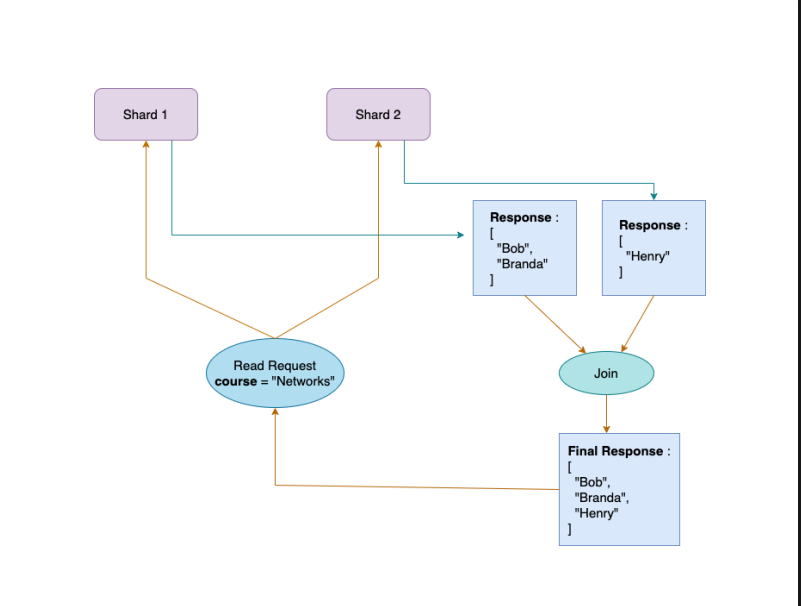

# Sharing by Document

- In this partitioning scheme every partition is completely independent. Each
  partition maintains its own set of secondary indexes. So whenever we need to write
  a record we only need to update the content of the partition/shard that deals with
  the Primary Index of the record we are writing.
- Let’s take the previous data-model (the data-model we used in Part-1) of Student
  details. The Primary Index was the Name of the students. Now apart from the name
  of the students, we also need to search the records on the basis of the Course
  taken up by the students and the Graduation Year of the students. Hence our
  current data-model has Primary Index as name and Secondary Index as Course
  and Graduation Year.

- Since every partition maintains their own secondary indexes we can also call them
  as Local Indexes or Local Secondary Indexes. Now our data-store will look like
  this.
  

- In the above data-model we can observe that every Shard has maintained its own
  secondary indexes. Example: Both **Shard-1** and **Shard-2** have course: **Networks** as
  a part of their secondary index. A particular **Secondary Index** of each shard holds
  the primary indexes of those records which are present in that particular shard and
  are also associated with that secondary index.

- Querying or Reading from a **Document-Partitioned** secondary index can be
  complex and require some extra processing. Suppose we want all the records of
  students who signed up for Course: **Networks**, then we will be required to query all
  the shards present in the system. When we get the individual responses from every
  shard then we combine them and return the final response. This process of
  querying a partitioned database is known as **Scatter/Gather** approach.
  

- Writing to the Document-Partitioned indexes is fairly simple. Since every
  shard/partition maintains its own local secondary indexes, hence writing a record
  will require changes in a **single partition only**. The local secondary indexes
  maintained by the partition responsible for storing the new record will only be
  updated.
