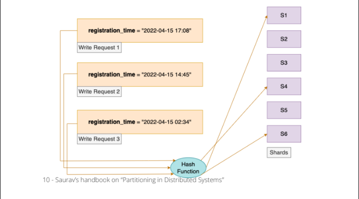

# Sharing by Hash

- Now the Hash function will evenly and randomly distribute the records to the
  shards. In our previous access pattern we stored the records of students signing up
  on one day on a particular shard. Now with Hashing in picture the students
  registering up on the same day will be sent to different shards. Since the
  registration time is used as a Primary Index here, the primary index value is passed
  through the hash function and the converted hashed value is further sent to the
  shard. Although the date of registration is the same, the registration timestamp is
  different for all the write requests and hence different hash values will be
  generated by the hash function. This will avoid the existence of Hot-Spots in our
  architecture.
  
- There is one major drawback of distributing the records by Hash of key. We lose the
  **ability to perform efficient Range-based queries**. Earlier the records which were
  stored adjacent to each other are now distributed across the shards. In this
  situation our range query might be **sent to multiple shards out there**. Then we will
  further need to **join the responses from all the shards to build the final response.**
