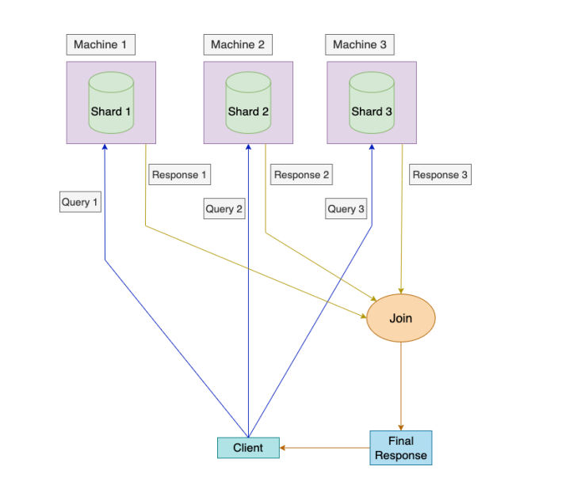

# Partitioning

- We all must have heard of Sharding or Partitioning of databases earlier as well.
  Even if you haven’t, I will try to cover it from basics in this edition plus we will
  discover some interesting Partitioning schemes implemented by the Distributed
  Systems to partition their huge database. We will cover this topic in two editions.
  Sharding is the process of breaking up the data into partitions. This process is also
  known as Partitioning. The main idea behind sharding is to scale our systems. We
  can assume that each piece of data is located at exactly one shard or partition. So,
  every Shard behaves as an independent database of its own.
- Suppose we have a large Database having an enormous amount of data. Obviously
  we can’t store the entire data in a single server or machine. What we can do is to
  split the large data into smaller chunks known as Shards or Partitions and store
  them in independent machines. Since, now we have multiple machines holding
  different partitions of data, all these machines can execute queries related to them
  independently and in parallel. This can help in scaling the query throughput.We all must have heard of Sharding or Partitioning of databases earlier as well.
  Even if you haven’t, I will try to cover it from basics in this edition plus we will
  discover some interesting Partitioning schemes implemented by the Distributed
  Systems to partition their huge database. We will cover this topic in two editions.
  Sharding is the process of breaking up the data into partitions. This process is also
  known as Partitioning. The main idea behind sharding is to scale our systems. We
  can assume that each piece of data is located at exactly one shard or partition. So,
  every Shard behaves as an independent database of its own.
- Suppose we have a large Database having an enormous amount of data. Obviously
  we can’t store the entire data in a single server or machine. What we can do is to
  split the large data into smaller chunks known as Shards or Partitions and store
  them in independent machines. Since, now we have multiple machines holding
  different partitions of data, all these machines can execute queries related to them
  independently and in parallel. This can help in scaling the query throughput.

