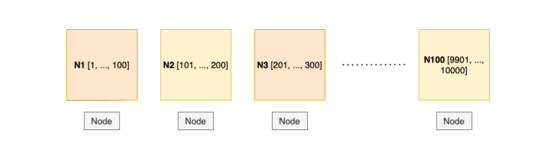
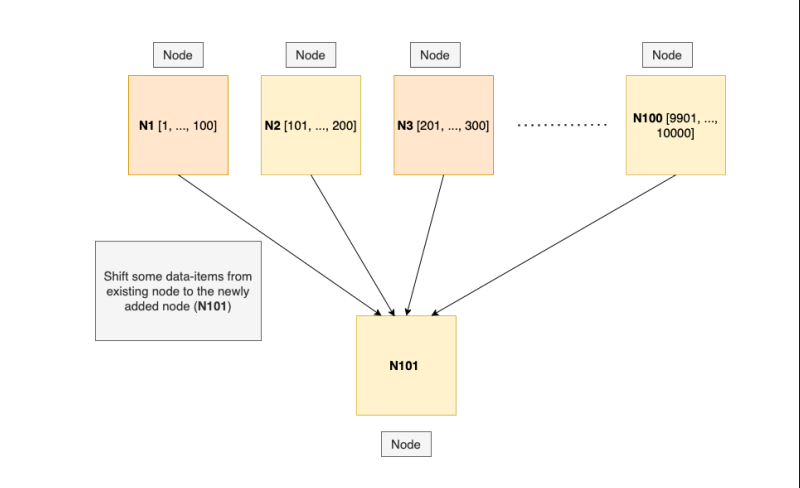
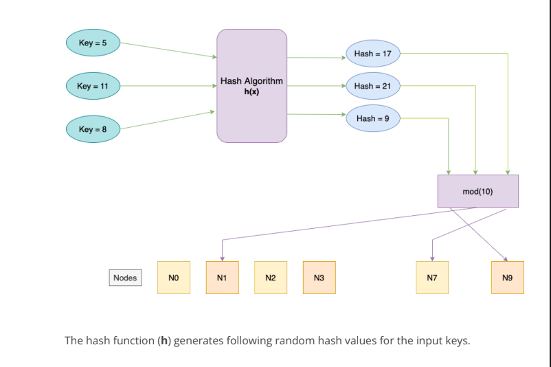
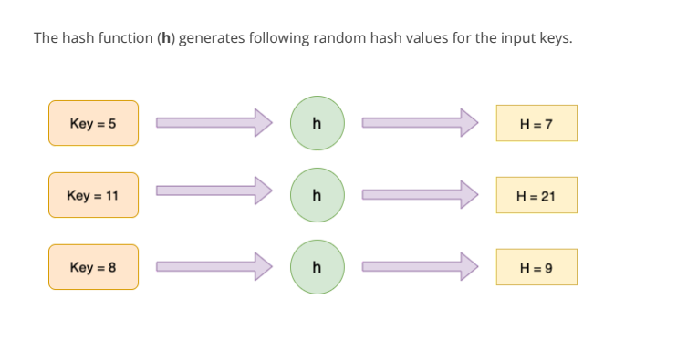
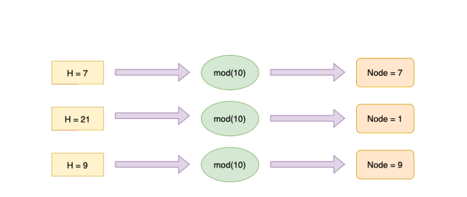
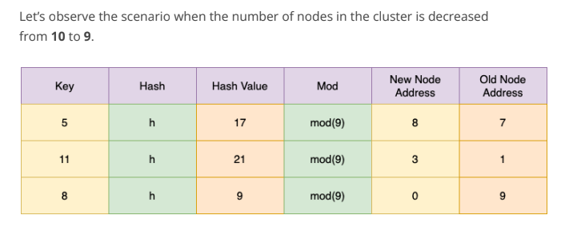

In our previous editions we discussed Partitioning and multiple Partitioning
schemes as well. A single database is partitioned into multiple nodes and every
data-item of the database is present in at least one of the nodes. Until things are
running smoothly this scheme looks good. But things might change in a database
or among the nodes/machines holding them.

- What if the size of the database starts growing fast and hence we need to
  add more disks to store the data.
- What if the load on the system increases and we need to add an extra
  machine to scale our system.
- What if an existing machine/node
  All of the above changes will require the existing data-items to move across the
  nodes. This process of moving a data-item from one node to another is called
  **Rebalancing**.

Let’s take a fairly simple example to understand this. Suppose we have a database
holding about **10,000 data** items which are partitioned over **100 nodes** such that
every node holds about **100 data-items**. The current architecture would look like
this.

 

## Scenario 1

Now imagine one of our nodes says **Node-37** crashes due to some hardware
failure. Ideally we would want all the data-items present in the Node 37 to be still
available to the users. In order to do so we need to immediately re-distribute the
data-items present in that node (failed node) to the rest of the available (healthy)
nodes.

In the above node we can see that data items with Ids **3601 to 3700** need to be
shifted to other available nodes. We could try distributing these data-items to the
existing node in such a way that the amount of data-items held by every node is
almost even. We are aiming for an even distribution of data-items across the
available nodes. There are multiple schemes to perform this rebalancing which we
will discuss in the upcoming sections.

 

## Scenario 2

Suppose the number of users of our system exceeded and now we are planning to
add one more node/machine to our cluster to distribute the incoming queries.
Since our queries throughput increased we are planning to scale our system. We
had **100 nodes** previously and now added an extra node **Node-101** to the existing
cluster. Now we also need to put some data-items from the existing nodes to the
newly added node.

We looked at two different scenarios where in one of them we removed an existing
node while in the other we added a new node into the existing cluster of nodes.
During the rebalancing process these are three requirements which are needed to
be fulfilled.

- <ins>**Requirement 1**</ins>: **After rebalancing, the load (data-items present in the nodes, write and read requests) must be evenly shared among the existing nodes in the cluster.**
- <ins>**Requirement 2**</ins>: **2: While rebalancing only those data-items which are required to be shifted across the nodes should be moved. This saves network and disk I/O load. Remember in the Scenario-1, we moved only the data-items present in the crashed node to the other healthy nodes.**
- <ins>**Requirement 3**</ins>: **During the rebalancing the database must be available i.e. it should continue to accept reads and writes.**

 

# Strategies for Rebalancing

## Performing Hash-Modulo (Should be avoided)

- Under this strategy we partition by the Hash of a key. We use a **Hashing Algorithm**
  that generates random hash values after taking an input as a number. After that we
  modulo the resultant hash-value with the total number of nodes present in the
  cluster to randomly assign it to one of them. This method although distributes the
  data-item evenly across the existing cluster of nodes but still this method should be
  avoided. We will discuss its drawbacks ahead.
- Suppose we have 10 nodes present in a cluster. We also have a Hashing Algorithm
  ‘h’ that can generate random hash values by taking a number as an input. The
  entire hash-modulo strategy looks like this.
  
  
  

- So far this scheme looks good since it’s able to distribute the incoming keys to the
  nodes evenly. Now, what would happen if we perform rebalancing by increasing or
  decreasing the number of nodes in the cluster.
  

- In both the above cases the new address for almost all the keys are different from
  the earlier node’s address. Even though we added or removed one node from the
  cluster it led to the transfer of almost all the keys to different nodes.
