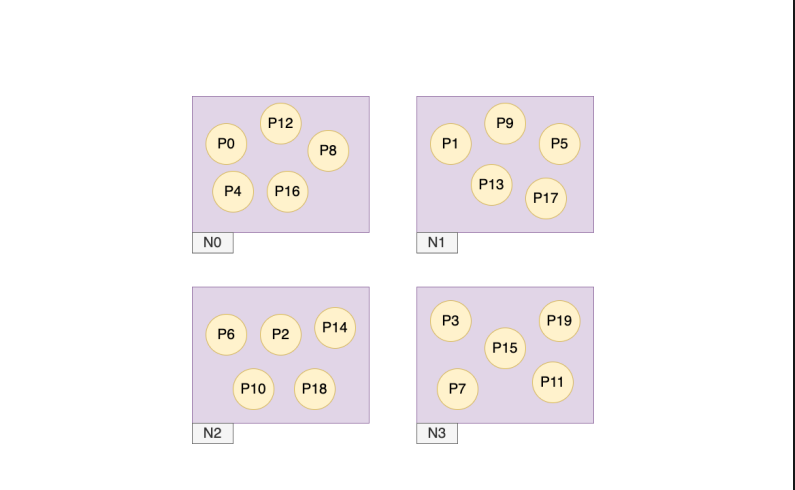
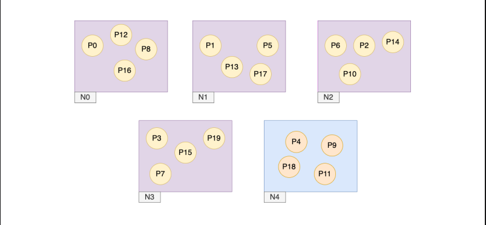
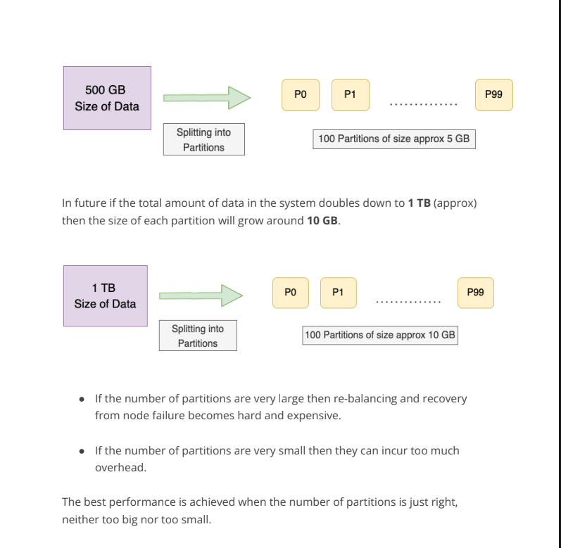
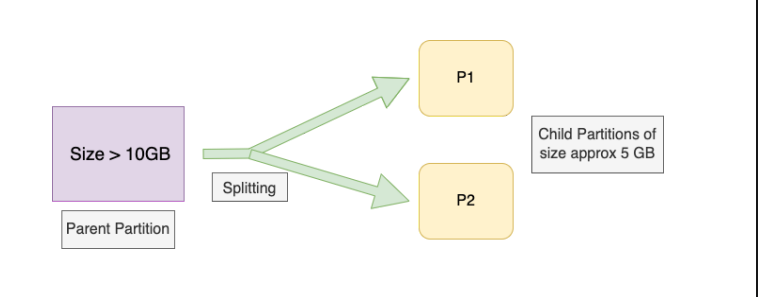

# Fixed Partitioning

- Suppose our database has **N nodes**, then we can split our database into **10N**
  partitions and further assign **10 partitions** to every single node.
- In this configuration the number of partitions remains constant and the assignment
  of keys to the partition also remains the same. The only thing that changes is the
  assignment of partitions to the nodes.
- Let’s take a look at this strategy by an example. Suppose our database initially had **4**
  Nodes {**N0, N1, N2, N3** }. The database has been split into **20 partitions** { P0, P1, ..., P19 } which will be fixed throughout. Hence the initial configuration looks
  somewhat like this.
  

- Now, a new node **N4** is introduced in our system. This new introduction will cause
  multiple existing partitions to be re-assigned to this new node. This will cause some
  change and our new configuration will look like this.
  

   

### Nodes with variable Hardware Performance

- This scheme allows the system to utilise the nodes according to their hardware
  capacity. Suppose node N1 has a higher hardware performance than N2 then we
  can assign more partitions to node N1 as compared to N2. More powerful nodes
  can take a greater share of load.

### Choosing the right number of Partitions

- Since in this scheme the number of partitions is fixed at the start and can not be
  changed afterwards. This puts a pressure on choosing a correct number of
  partitions initially.
- As the number of partitions is fixed hence, as the total amount of data grows the
  size of the partitions grows proportionally. Hence, it's difficult to choose the right
  number of partitions initially when the total size of the data in the system tends to
  be highly variable.
- 

# Dynamic Partitioning

## Splitting and Merging the Partitions

- Many databases maintain a threshold value which if a partition’s size exceeds then
  that partition splits into two. HBase has a threshold value of 10 GB. Suppose a
  partition exceeds the size of 10 GB then it is further split into two partitions of
  approx. 5 GB each. After splitting, one of the halves can be transferred to another
  node in order to balance the load.
  
  
