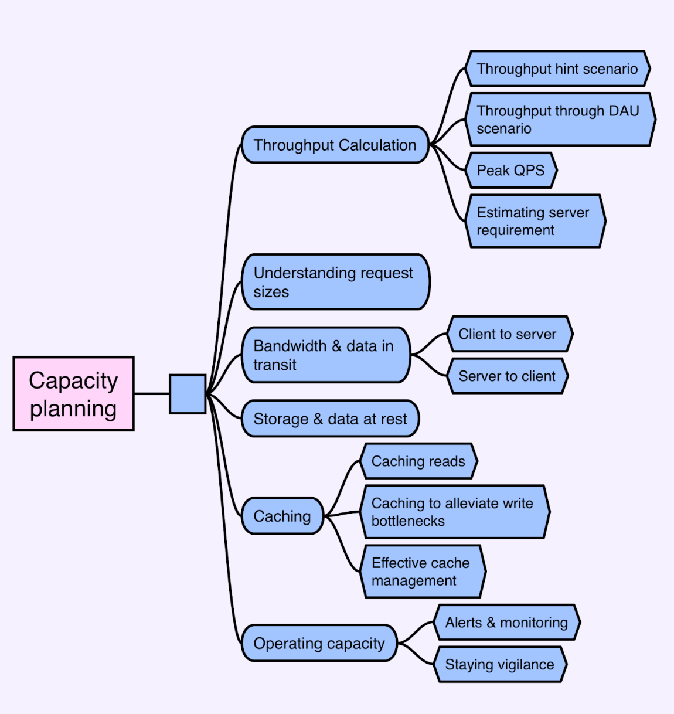

# Capacity Planning



# Throughput Calculation

## Throughput hint scenario

- Let's consider Example 1 - Temperature sensors for a monitoring system. The system needs to measure temperature changes across a county using about 10 million sensors. These sensors report changes every 5 seconds. Analysts use the system to forecast the weather using a dashboard that displays reports.
- From these requirements, we can infer a few things about the system’s capacity. We can estimate what the throughput is as follows
- In the extreme case, if **all sensors** are synchronized, we’d have **10 million queries per second (QPS)**. However, this is an unlikely edge case.
- Assuming each request from a **sensor to server lasts 200ms**, a more realistic average would be **2 million QPS**.

## Throughput through DAU scenario

- Sometimes, throughput isn’t evident in the requirements. Let's look at **Example 2 - Social Media News Feed**:
- The system allows users to post text, images, and videos on their profile timeline, which is organized chronologically. Users can follow others and see relevant posts from those they follow on their timeline.
- To inform capacity planning, we could ask:

```
- How many daily active users does this system have?

- What is the expected user base growth in 2-5 years?
```

- Then, calculate the throughput based on the feature requirements. If the most relevant posts appear in the timeline on the home page, all daily active users likely interact with it. Assume each user interacts with it a certain number of times per day (e.g., 10 times), it means **5 billion page views per day, or roughly 60k QPS**.

```
500M users @ 10x pageviews/user = 5B timeline pageviews/day
5B pageviews / 86400 seconds (1 day = 24 * 60 * 60) = ~57.8k QPS
Round up to 60k QPS
```

- Profile visits would likely be less frequent than homepage visits. If we assume that each user visits two profile pages per day, that results in an average QPS of about 12k.

```
Simplest way to calculate: 20% of 60k (previous example) = 12k QPS

Or, to expand:

500M users @ 2x pageviews/user = 1B profile pageviews/day
1B pageviews / 86400 seconds (1 day = 24 * 60 * 60) = ~11.5k QPS
Round up to 12k
```

- For posts, let’s assume that on average, only 10% of the daily active users post once per day. **This would mean an average QPS of approximately 6k.**

```
Simplest way to calculate: 10% of 60k (previous example) = 6k QPS

Or, to expand:

500M users * 10% = 50M new posts/day
50M new posts / 86400 seconds (1 day = 24 * 60 * 60) = ~5.7k QPS
Round up to 6k
```

# Peak QPS

- Calculating peak QPS is important as it often dictates the capacity requirement of the design. **Peak QPS refers to the highest rate at which a system will be expected to handle queries, often occurring during times of high usage or even traffic spikes. This can be much higher than the average rate**.
- **One common method to determine peak QPS is through historical data analysis**. This involves tracking the number of queries that the infrastructure handles over a specific timeframe, like days, weeks, or even months, and then choosing the highest value. This method relies on the availability of data and the system’s historical performance.
- Overprovisioning the infrastructure or utilizing autoscaling features can also help handle peak QPS. These strategies allow the system to increase its capacity temporarily to deal with unexpected surges in traffic. However, they come with their own costs and need careful cost-benefit analysis.
- Peak QPS could also be influenced by business requirements or predictable usage patterns. For instance:

  > Event-driven Peaks: A major product launch or marketing event might attract a surge of users signing up or using the system within a brief window. Predicting and preparing for these events can help maintain service quality during high demand.

  > Time-driven Peaks: Some systems may experience predictable daily or weekly fluctuations in usage. For instance, a business-oriented application may see significantly higher traffic during working hours compared to late evenings or early mornings.

- To estimate peak QPS, we often make calculations based on expected distribution characteristics. For example, **we might assume that 80% of visits per day occur within 20% of the time (a variant of the Pareto Principle)**. We add some buffer capacity to handle unexpected surges and provide a smooth user experience.

</br>

In Example 2 - Social Media News Feed, if we anticipate that 80% of pageviews for timelines occur within an 8-hour time span, we’d calculate the peak QPS for this period to be around 138k. However, this is just a starting point - it’s always a good practice to overprovision initially, monitor the data, and then adjust based on the actual usage patterns.

```
500M users @ 10x page views / user = 5B timeline pageviews/day

80% of pageviews = 4B timeline pageviews
Per hour over a period of 8 hours = 4B page views / 8 hours = 500M / hour

Average Peak QPS = 500M / 3600 (60 minutes in seconds) = 138k
```

# Estimating server requirement

- With the estimated throughput and response time, we can estimate the number of servers needed to run the application.

```
2M QPS, 200ms avg response time per request
Each instance has 32 workers
Each worker can handle 5 (QPS) queries per second (200ms*5)
Each instance can handle then 160 (32 * 5) QPS
2M (average QPS) / 160 = 12.5k instances
```

# Understanding request sizes

- Assessing request sizes is crucial for determining bandwidth and storage requirements. In system design, we often need to accommodate a variety of request types that can significantly impact the load on our system. These could be as simple as GET requests retrieving data or as complex as POST requests that involve large multimedia files.
- While initial requirements might not include specific request sizes, we can make informed assumptions based on the system’s functionality and the nature of data it handles
- When it comes to estimating request sizes, different types of systems will naturally have different expectations. Let’s consider the two examples we’ve been discussing: Temperature Sensors and Social Media News Feed.
- For a system like Example 1 - Temperature Sensors, the data sent may be relatively small. Assuming data is sent in JSON format, we can estimate the size of each field. The temperature is reported as a float (4 bytes), the sensor ID is a UUID (16 bytes), and we have three additional 4-byte fields. Accounting for the JSON format, the total request body size is less than 100 bytes. Including HTTP headers (typically between 200 to 400 bytes), we can conservatively estimate each request size to be around 0.5KB. This is quite small. However, even such small data requests can add up when dealing with millions of sensors, making this an important consideration.
- For a system like Example 2 - Social Media News Feed, we’re dealing with diverse content types - text, images, and videos. While text posts might only be a few KB, images files could be several hundred KB, and video files could be several MB. In these scenarios, an average request size needs to consider the distribution and size of various content types.
- Let’s make a conservative estimate of a text-only post being about 1KB, which includes a user ID (UUID) and a free-form string with 250 characters on average. For images and videos, let’s assume that for every 10 posts, there are three images (average size of 300KB after compression), and one is a video (averaging at 1MB). We can fold all these media types into an average to simplify our calculations. This leaves us with an average request size of around 200KB per post

```
For 10 posts:
- Every post has 1KB (text) = 10KB
- Three have an image = 300KB * 3 = 900KB
- One has a video = 1000KB

~191KB, round up to 200KB
```

# Considerations for Request Sizing

Understanding request sizes is just part of the equation. We must also consider factors like data format, serialization/deserialization, and the impact of these on bandwidth and processing needs.

> **Data Format**. The format of data being sent can significantly impact the bandwidth required. **More verbose data formats, like XML, can consume more bandwidth compared to less verbose formats like JSON. Even among similar formats, options like Binary JSON (BSON) can be more efficient**.

> **Serialization/Deserialization**: Transforming data into a format that can be easily transmitted or stored (serialization) and then reverting it back to its original form (deserialization) can require significant resources. Different methods have different costs and benefits. For instance, **Protobuf is faster than JSON for serialization and deserialization, but JSON is more human-readable and easier to debug**.

> **Compression**: Implementing data compression can effectively reduce request size and conserve bandwidth. While it does come with additional processing overhead, the trade-off may be acceptable or even beneficial, especially for larger payloads.

> **Network Protocols**: The choice of network protocol (HTTP/1.1, HTTP/2, gRPC, etc.) can also affect the overall size of a request due to differences in headers, the ability to compress headers, and other factors.

# Client to server (ingress)

- In Example 1 - Temperature sensors, the data sent by the sensors to the application is known as ingress: incoming data to the application's network. Suppose each sensor request is 0.5KB and the average QPS is 400k, our average ingress bandwidth is approximately 200MB/second. We can simplify the discussion by leaving out the read path for dashboards, etc., as it probably won’t significantly impact capacity.
- An interesting aspect to consider is how often we need to send data to the servers. It’s possible that not all data requires immediate transmission. For example, a temperature sensor might only need to report data when a significant temperature change occurs. By storing the temperature state locally on the sensor and transmitting it only upon changes, we could potentially reduce the capacity load and costs.
- However, it’s important to set a limit for the maximum time a sensor can go without reporting to the server. This ensures that any malfunctioning or offline sensors are promptly identified.

# Server to client (egress)

- When considering a system like Example 2 - Social Networking News Feed, posting content would equate to ingress traffic. Based on our previous estimates, suppose each post is 1KB and we’ve got an average of 6k QPS, our ingress bandwidth is about 6MB/second.
- The egress, or the data transmitted from the server to client, can be complex. Suppose our system paginates every 20 posts, and the server renders raw file versions each time. In this scenario, our average egress bandwidth would be very high at ~250GB/second:

```
500M users @ 10x pageviews/user = 5B timeline pageviews/day
Average post request size: 200KB
Assuming every time timelines are rendered the server sends everything to the client.

20 posts * 200 KB = 4MB
5B pageviews * 4MB = 20PB
20PB / 86400 (1 day = 24 * 60 * 60) = ~231GB/s

Round up to ~250GB/s
```

- But there are optimization strategies to reduce this egress traffic.For example:
- **Trimming the content**: We can reduce the data load by not sending the full text of the post content by default. This could reduce the text size by half.

- **Image optimization**: Low-quality image placeholders can be sent initially, and high-quality images can be progressively loaded based on user interactions and viewport visibility.

- **Video optimization**: Autoplay for videos can be turned off, with only a thumbnail loaded by default. The full video can be streamed on demand, significantly reducing the initial data load.
