# S3-like Object Storage

In this chapter, we'll be designing an object storage service, similar to Amazon S3.<br>
Storage systems fall into three broad categories: <br>

- Block storage
- File storage
- Object storage

File storage is built on top of block storage. It provides a higher level of abstraction, making it easier to manage folders and files. <br>

Object storage sacrifices performance for high durability, vast scale and low cost. It targets "cold" data and is mainly used for archival and backup. There is no hierarchical directory structure, all data is stored as objects in a flat structure. It is relatively slow compared to other storage types. Most cloud providers have an object storage offering - Amazon S3, Google GCS, etc. <br>
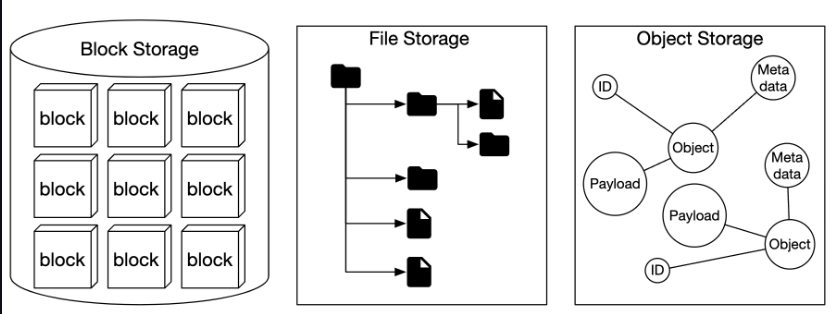 <br>
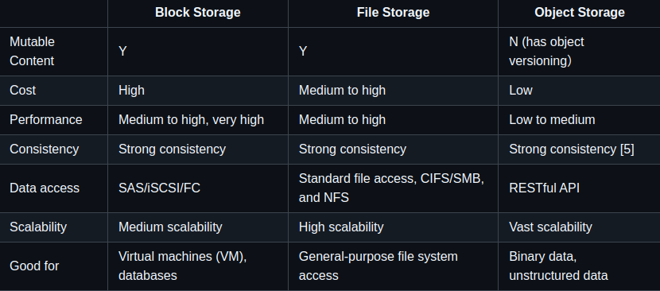

Some terminology, related to object storage: <br>

- Bucket - logical container for objects. Name is globally unique.
- Object - An individual piece of data, stored in a bucket. Contains object data and metadata.
- Versioning - A feature keeping multiple variants of an object in the same bucket.
- Uniform Resource Identifier (URI) - each resource is uniquely identified by a URI.
- Service-level Agreement (SLA) - contract between service provider and client.

Amazon S3 Standard-Infrequent Access storage class SLAs: <br>

- Durability of 99.999999999% across multiple Availability Zones
- Data is resilient in the event of entire Availability Zone being destroyed
- Designed for 99.9% availability

# Step 1 - Understand the Problem and Establish Design Scope

- C: Which features should be included?
- I: Bucket creation, Object upload/download, versioning, Listing objects in a bucket
- C: What is the typical data size?
- I: We need to store both massive objects and small objects efficiently
- C: How much data do we store in a year?
- I: 100 petabytes
- C: Can we assume 6 nines of data durbility (99.9999%) and service availability of 4 nines (99.99%)?
- I: Yes, sounds reasonable

## Non-functional requirements

- 100 PB of data
- 6 nines of data durability
- 4 nines of service availability
- Storage efficiency. Reduce storage cost while maintaining high reliability and performance

## Back-of-the-envelope estimation

Object storage is likely to have bottlenecks in disk capacity or IO per second (IOPS). <br>
Assumptions: <br>

- we have 20% small (less than 1mb), 60% mid-size (1-64mb) and 20% large objects (greater than 64mb),
- One hard disk (SATA, 7200rpm) is capable of doing 100-150 random seeks per second (100-150 IOPS)

Given the assumptions, we can estimate the total number of objects the system can persist. <br>

- Let's use median size per object type to simplify calculation - 0.5mb for small, 32mb for medium, 200mb for large.
- Given 100PB of storage (10^11 MB) and 40% of storage usage results in 0.68bil objects
- If we assume metadata is 1kb, then we need 0.68tb space to store metadata info

# Step 2 - Propose High-Level Design and Get Buy-In

Let's explore some interesting properties of object storage before diving into the design: <br>

- Object immutability - objects in object storage are immutable (not the case in other storage systems). We may delete them or replace them, but no update.
- Key-value store - an object URI is its key and we can get its contents by making an HTTP call
- Write once, read many times - data access pattern is writing once and reading many times. According to some Linkedin research, 95% of operations are reads
- Support both small and large objects

Design philosophy of object storage is similar to UNIX - when we save a file, it creates the filename in a data structure, called inode and file data is stored in different disk locations. The inode contains a list of file block pointers, which point to different locations on disk. <br>

When accessing a file, we first fetch its metadata from the inode, prior to fetching the file contents. <br>

Object storage works similarly - metadata store is used for file information, but contents are stored on disk: <br>
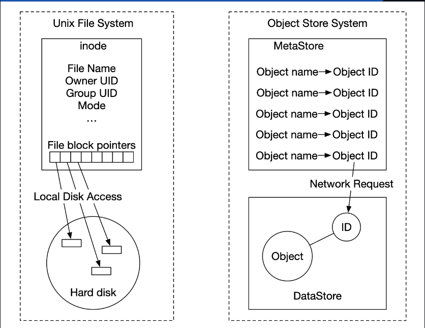

By separating metadata from file contents, we can scale the different stores independently: <br>
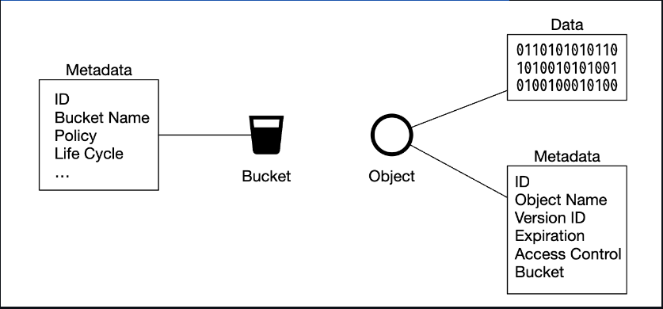

## High-level design

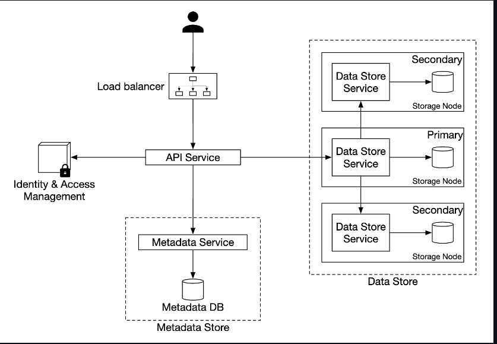

- Load balancer - distributes API requests across service replicas
- API service - Stateless server, orchestrating calls to metadata and object store, as well as IAM service.
- Identity and access management (IAM) - central place for auth, authz, access control.
- Data store - stores and retrieves actual data. Operations are based on object ID (UUID).
- Metadata store - stores object metadata

## Uploading an object

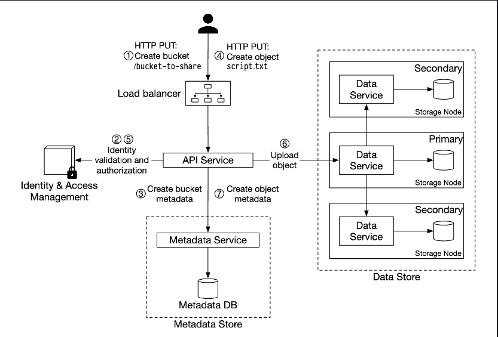

- Create a bucket named "bucket-to-share" via HTTP PUT request
- API service calls IAM to ensure user is authorized and has write permissions
- API service calls metadata store to create a bucket entry. Once created, success response is returned.
- After bucket is created, HTTP PUT is sent to create an object named "script.txt"
- API service verifies user identity and ensures user has write permissions
- Once validation passes, object payload is sent via HTTP PUT to the data store. Data store persists it and returns a UUID.
- API service calls metadata store to create a new entry with object_id, bucket_id and bucket_name, among other metadata.

Example object upload request: <br>

```
PUT /bucket-to-share/script.txt HTTP/1.1
Host: foo.s3example.org
Date: Sun, 12 Sept 2021 17:51:00 GMT
Authorization: authorization string
Content-Type: text/plain
Content-Length: 4567
x-amz-meta-author: Alex

[4567 bytes of object data]
```

## Downloading an object

Buckets have no directory hierarchy, buy we can create a logical hierarchy by concatenating bucket name and object name to simulate a folder structure. <br>

Example GET request for fetching an object: <br>

```
GET /bucket-to-share/script.txt HTTP/1.1
Host: foo.s3example.org
Date: Sun, 12 Sept 2021 18:30:01 GMT
Authorization: authorization string
```

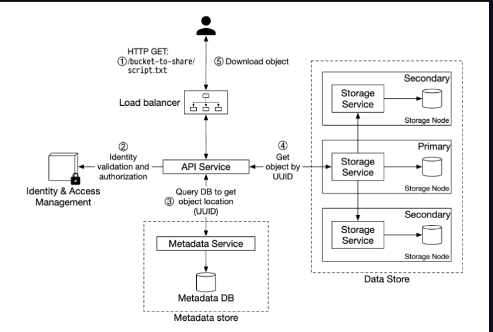

- Client sends an HTTP GET request to the load balancer, ie GET /bucket-to-share/script.txt
- API service queries IAM to verify the user has correct permissions to read the bucket
- Once validated, UUID of object is retrieved from metadata store
- Object payload is retrieved from data store based on UUID and returned to the client

# Step 3 - Design Deep Dive

## Data store

Here's how the API service interacts with the data store: <br>
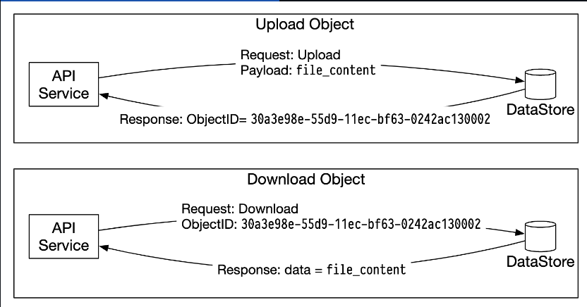

The data store's main components: <br>
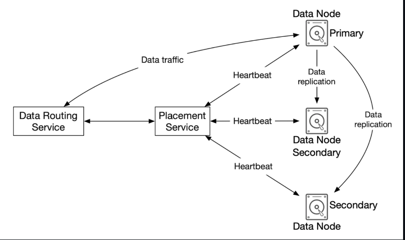

The data routing service provides a RESTful or gRPC API to access the data node cluster. It is a stateless service, which scales by adding more servers. <br>

It's main responsibilities are: <br>

- querying the placement service to get the best data node to store data
- reading data from data nodes and returning it to the API service
- Writing data to data nodes

The placement service determines which data nodes should store an object. It maintains a virtual cluster map, which determines the physical topology of a cluster. <br>


- The service also sends heartbeats to all data nodes to determine if they should be removed from the virtual cluster.

- Since this is a critical service, it is recommended to maintain a cluster of 5 or 7 replicas, synchronized via Paxos or Raft consensus algorithms. Eg a 7 node cluster can tolerate 3 nodes failing.

- Data nodes store the actual object data. Reliability and durability is ensured by replicating data to multiple data nodes.

- Each data node has a daemon running, which sends heartbeats to the placement service.

The heartbeat includes: <br>

- How many disk drives (HDD or SSD) does the data node manage?
- How much data is stored on each drive?

## Data persistence flow

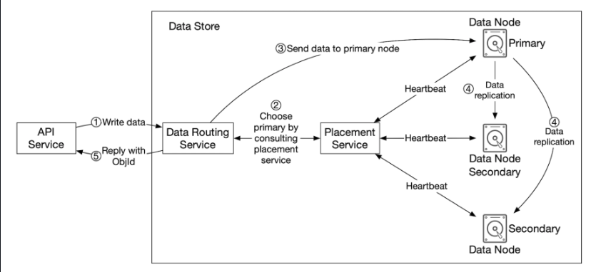

- API service forwards the object data to data store
- Data routing service sends the data to the primary data node
- Primary data node saves the data locally and replicates it to two secondary data nodes. Response is sent after successful replication.
- The UUID of the object is returned to the API service.

### Caveats

- Given an object UUID, it's replication group is deterministically chosen by using consistent hashing
- In step 4, the primary data node replicates the object data before returning a response. This favors strong consistency over higher latency.
  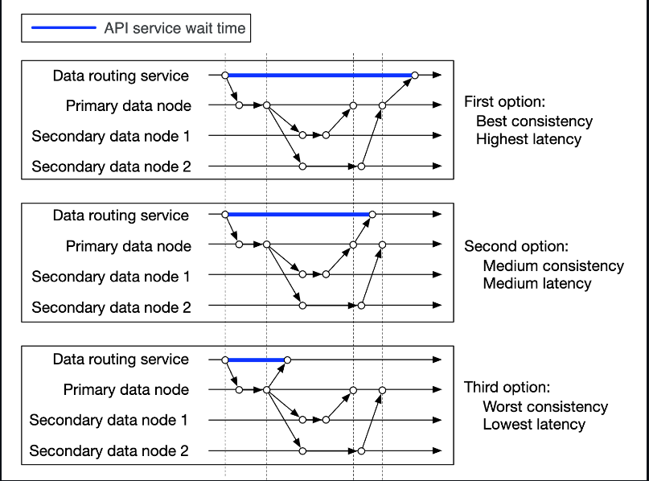

### How data is organized

One simple approach to managing data is to store each object in a separate file. <br>
This works, but is not performant with many small files in a file system: <br>

- Data blocks on HDD are wasted, because every file uses the whole block size. Typical block size is 4kb.
- Many files means many inodes. Operating systems don't deal well with too many inodes and there is also a max inode limit.

These issues can be addressed by merging many small files into bigger ones via a write-ahead log (WAL). Once the file reaches its capacity (typically a few GB), a new file is created: <br>
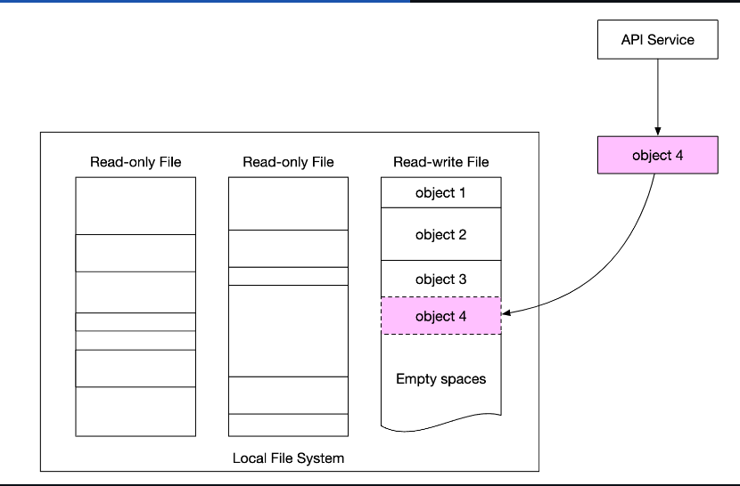

The downside of this approach is that write access to the file needs to be serialized. Multiple cores accessing the same file must wait for each other. To fix this, we can confine files to specific cores to avoid lock contention. <br>

### Object lookup

To support storing multiple objects in the same file, we need to maintain a table, which tells the data node <br>

- object_id
- filename where object is stored
- file_offset where object starts
- object_size

We can deploy this table in a file-based db like RocksDB or a traditional relational database. Since the access pattern is low write+high read, a relational database works better. <br>
How should we deploy it? We could deploy the db and scale it separately in a cluster, accessed by all data nodes. <br>

Downsides <br>

- we'd need to aggressively scale the cluster to serve all requests
- there's additional network latency between data node and db cluster

An alternative is to take advantage of the fact that data nodes are only interested to data related to them, so we can deploy the relational db within the data node itself. <br>

SQLite is a good option as it's a lightweight file-based relational database. <br>

### Updated data persistence flow

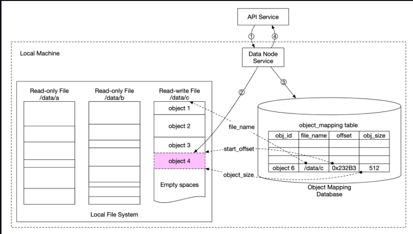

- API Service sends a request to save a new object
- Data node service appends the new object at the end of a file, named "/data/c"
- A new record for the object is inserted into the object mapping table

### Durability

Data durability is an important requirement in our design. In order to achieve 6 nines of durability, every failure case needs to be properly examined. <br>

First problem to address is hardware failures. We can achieve that by replicating data nodes to minimize probability of failure. But in addition to that, we also ought to replicate across different failure domains (cross-rack, cross-dc, separate networks, etc). A critical event can cause multiple hardware failures within the same domain: <br>
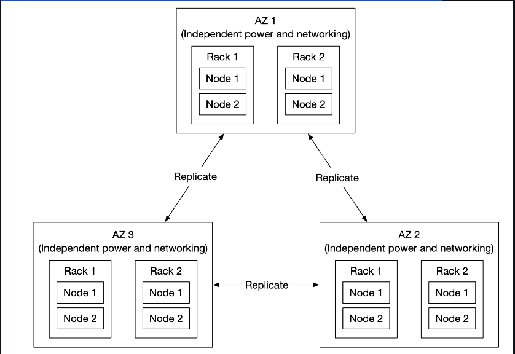

Assuming annual failure rate of a typical HDD is 0.81%, making three copies gives us 6 nines of durability. <br>

Replicating the data nodes like that grants us the durability we want, but we could also leverage erasure coding to reduce storage costs. <br>

Erasure coding enables us to use parity bits, which allow us to reconstruct lost bits in the event of a failure: <br>
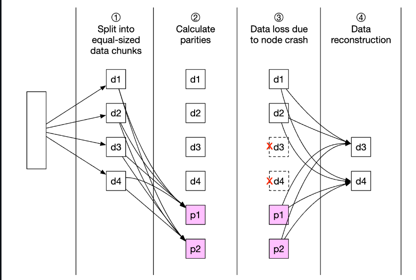

Imagine those bits are data nodes. If two of them go down, they can be recovered using the remaining four ones. <br>

There are different erasure coding schemes. In our case, we could use 8+4 erasure coding, split across different failure domains to maximize reliability: <br>
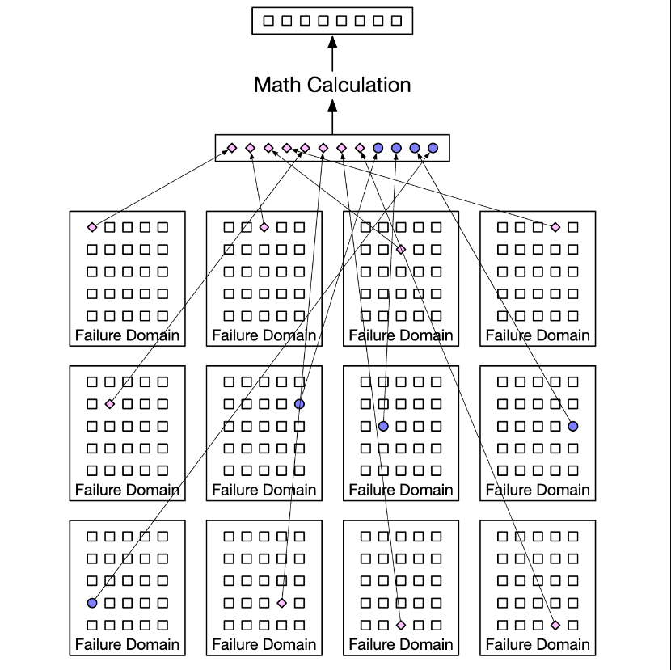

Erasure coding enables us to achieve a much lower storage cost (50% improvement) at the expense of access speed due to the data routing service having to collect data from multiple locations: <br>

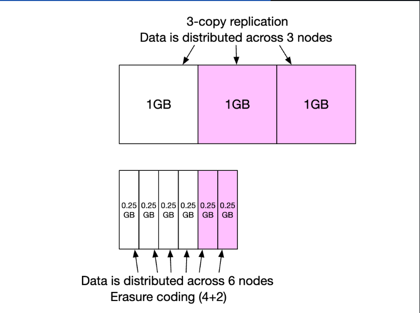

Other caveats: <br>

- Replication requires 200% storage overhead (in case of 3 replicas) vs. 50% via erasure coding
- Erasure coding gives us 11 nines of durability vs 6 nines via replication
- Erasure coding requires more computation to calculate and store parities

In sum, replication is more useful for latency-sensitive applications, whereas erasure coding is attractive for storage cost efficiency and durability. Erasure coding is also much harder to implement. <br>

### Correctness verification

- If a disk fails entirely, then the failure is easy to detect. This is less straightforward in the event part of the disk memory gets corrupted.

- To detect this, we can use checksums - a hash of the file contents, which can be used to verify the file's integrity.

- In our case, we'll store checksums for each file and each object:
  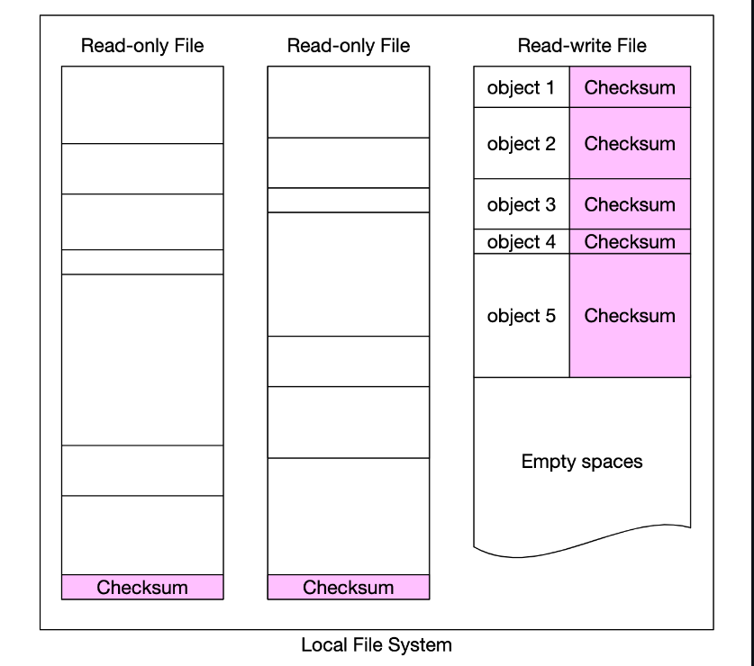

In the case of erasure coding (8+4), we'll need to fetch each of the 8 pieces of data separately and verify each of their checksums. <br>

### Metadata data model

Table schemas: <br>
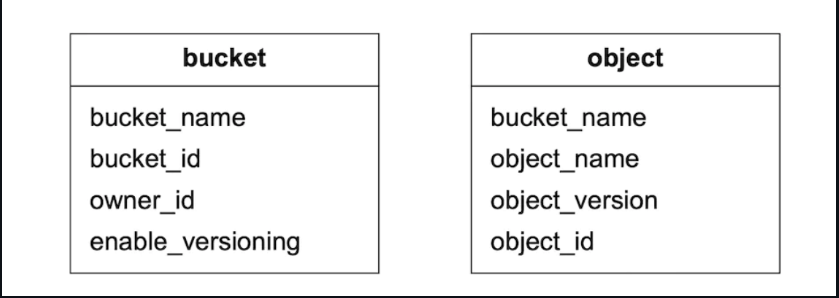

Queries we need to support: <br>

- Find an object ID by name
- Insert/delete object based on name
- List objects in a bucket sharing the same prefix

There is usually a limit on the number of buckets a user can create, hence, the size of the buckets table is small and can fit into a single db server. But we still need to scale the server for read throughput. <br>

The object table will probably not fit into a single database server, though. Hence, we can scale the table via sharding: <br>

- Sharding by bucket_id will lead to hotspot issues as a bucket can have billions of objects
- Sharding by bucket_id makes the load more evenly distributed, but our queries will be slow
- We choose sharding by hash(bucket_name, object_name) since most queries are based on the object/bucket name.

Even with this sharding scheme, though, listing objects in a bucket will be slow. <br>

### Listing objects in a bucket

In a single database, listing an object based on its prefix (looks like a directory) works like this: <br>

`SELECT * FROM object WHERE bucket_id = "123" AND object_name LIKE `abc/%``
This is challenging to fulfill when the database is sharded. To achieve it, we can run the query on every shard and aggregate the results in-memory. This makes pagination challenging though, since different shards contain a different result size and we need to maintain separate limit/offset for each. <br>

We can leverage the fact that typically object stores are not optimized for listing objects, so we can sacrifice listing performance. We can also create a denormalized table for listing objects, sharded by bucket ID. That would make our listing query sufficiently fast as it's isolated to a single database instance. <br>

### Object versioning

Versioning works by having another object_version column which is of type TIMEUUID, enabling us to sort records based on it. <br>

Each new version produces a new object_id: <br>
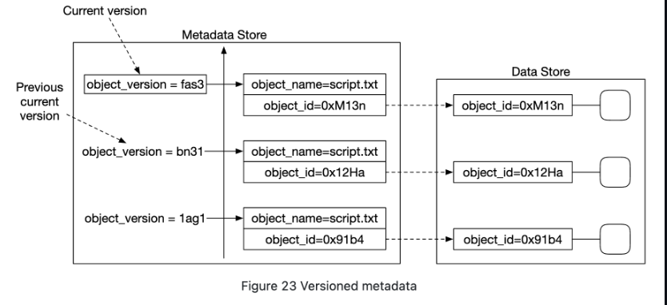

Deleting an object creates a new version with a special object_id indicating that the object was deleted. Queries for it return 404: <br>
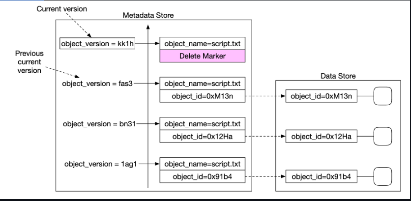

### Optimizing uploads of large files

Uploading large files can be optimized by using multipart uploads - splitting a big file into several chunks, uploaded independently: <br>
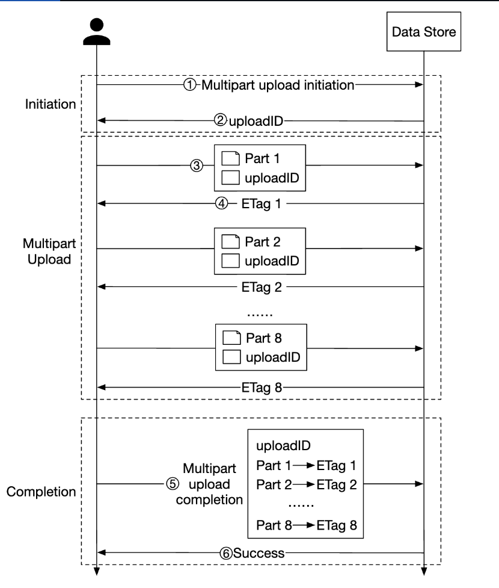

- Client calls service to initiate a multipart upload
- Data store returns an upload ID which uniquely identifies the upload
- Client splits the large file into several chunks, uploaded independently using the upload id
- When a chunk is uploaded, the data store returns an etag, which is a md5 checksum, identifying that upload chunk
- After all parts are uploaded, client sends a complete multipart upload request, which includes upload_id, part numbers and all etags
- Data store reassembles the object from its parts. The process can take a few minutes. After that, success response is returned to the client.

### Garbage collection

Garbage collection is the process of reclaiming storage space, which is no longer used. There are a few ways data becomes garbage: <br>

- lazy object deletion - object is marked as deleted without actually getting deleted
- orphan data - eg an upload failed mid-flight and old parts need to be deleted
- corrupted data - data which failed checksum verification

The garbage collector is also responsible for reclaiming unused space in replicas. With replication, data is deleted from both primaries and replicas. With erasure coding (8+4), data is deleted from all 12 nodes. <br>

To facilitate the deletion, we'll use a process called compaction: <br>

- Garbage collector copies objects which are not deleted from "data/b" to "data/d"
  object_mapping table is updated once copying is complete using a database transaction
- To avoid making too many small files, compaction is done on files which grow beyond a certain threshold
  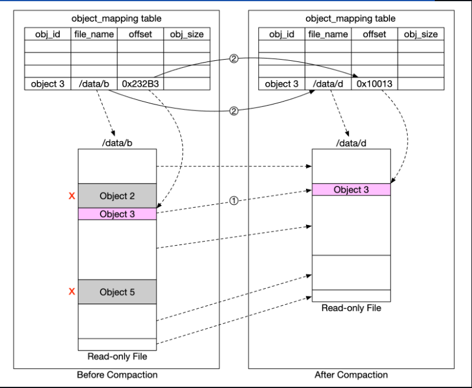

# Step 4 - Wrap Up

- Designing an S3-like object storage
- Comparing differences between object, block and file storages
- Covered uploading, downloading, listing, versioning of objects in a bucket
- Deep dived in the design - data store and metadata store, replication and erasure coding, multipart uploads, sharding
