# Ad Click Event Aggregation

Digital advertising is a big industry with the rise of Facebook, YouTube, TikTok, etc.  

Hence, tracking ad click events is important. In this chapter, we explore how to design an ad click event aggregation system at Facebook/Google scale.  

Digital advertising has a process called real-time bidding (RTB), where digital advertising inventory is bought and sold:  
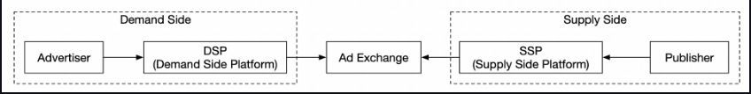

Speed of RTB is important as it usually occurs within a second. Data accuracy is also very important as it impacts how much money advertisers pay.  
ased on ad click event aggregations, advertisers can make decisions such as adjust target audience and keywords.  

# Step 1 - Understand the Problem and Establish Design Scope

- C: What is the format of the input data?
- I: 1bil ad clicks per day and 2mil ads in total. Number of ad-click events grows 30% year-over-year.
- C: What are some of the most important queries our system needs to support?
- I: Top queries to take into consideration:
  - Return number of click events for ad X in last Y minutes
  - Return top 100 most clicked ads in the past 1min. Both parameters should be configurable. Aggregation occurs every minute.
  - Support data filtering by ip, user_id, country for the above queries
- C: Do we need to worry about edge cases? Some of the ones I can think of:
  - There might be events that arrive later than expected
  - There might be duplicate events
  - Different parts of the system might be down, so we need to consider system recovery
- I: That's a good list, take those into consideration
- C: What is the latency requirement?
- I: A few minutes of e2e latency for ad click aggregation. For RTB, it is less than a second. It is ok to have that latency for ad click aggregation as those are usually used for billing and reporting.

## Functional requirements

- Aggregate the number of clicks of ad_id in the last Y minutes
- Return top 100 most clicked ad_id every minute
- Support aggregation filtering by different attributes
- Dataset volume is at Facebook or Google scale

## Non-functional requirements

- Correctness of the aggregation result is important as it's used for RTB and ads billing
- Properly handle delayed or duplicate events
- Robustness - system should be resilient to partial failures
- Latency - a few minutes of e2e latency at most

## Back-of-the-envelope estimation

- 1bil DAU
- Assuming user clicks 1 ad per day -> 1bil ad clicks per day
- Ad click QPS = 10,000
- Peak QPS is 5 times the number = 50,000
- A single ad click occupies 0.1KB storage. Daily storage requirement is 100gb
- Monthly storage = 3tb

# Step 2 - Propose High-Level Design and Get Buy-In

In this section, we discuss query API design, data model and high-level design.  

## Query API Design

The API is a contract between the client and the server. In our case, the client is the dashboard user - data scientist/analyst, advertiser, etc.  
Here's our functional requirements:  

- Aggregate the number of clicks of ad_id in the last Y minutes
- Return top N most clicked ad_id in the last M minutes
- Support aggregation filtering by different attributes

We need two endpoints to achieve those requirements. Filtering can be done via query parameters on one of them.  

### Aggregate number of clicks of ad_id in the last M minutes:  

`GET /v1/ads/{:ad_id}/aggregated_count`
Query parameters:  

- `from` - start minute. Default is now - 1 min
- `to` - end minute. Default is now
- `filter` - identifier for different filtering strategies. Eg 001 means "non-US clicks".

Response:  

- `ad_id` - ad identifier
- `count` - aggregated count between start and end minutes

### Return top N most clicked ad_ids in the last M minutes

`GET /v1/ads/popular_ads`
Query parameters:  

- count - top N most clicked ads
- window - aggregation window size in minutes
- filter - identifier for different filtering strategies

Response:  

- `list of ad_ids`

## Data model

In our system, we have raw and aggregated data.  
Raw data looks like this:  
`[AdClickEvent] ad001, 2021-01-01 00:00:01, user 1, 207.148.22.22, USA`

Here's an example in a structured format:  
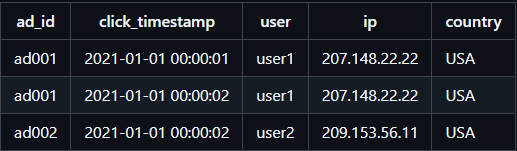

Here's the aggregated version:  
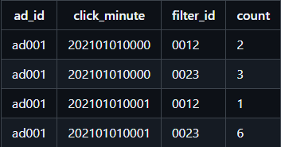

The `filter_id` helps us achieve our filtering requirements  
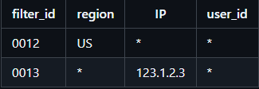

To support quickly returning top N most clicked ads in the last M minutes, we'll also maintain this structure:  
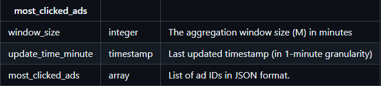

What are some pros and cons between storing raw data and storing aggregated data?  

- Raw data enables using the full data set and supports data filtering and recalculation
- On the other hand, aggregated data allows us to have a smaller data set and a faster query
- Raw data means having a larger data store and a slower query
- Aggregated data, however, is derived data, hence there is some data loss.

In our design, we'll use a combination of both approaches:  

- It's a good idea to keep the raw data around for debugging. If there is some bug in aggregation, we can discover the bug and backfill.
- Aggregated data should be stored as well for faster query performance.
- Raw data can be stored in cold storage to avoid extra storage costs.

When it comes to the database, there are several factors to take into consideration:  

- What does the data look like? Is it relational, document or blob?
- Is the workload read-heavy, write-heavy or both?
- Are transactions needed?
- Do the queries rely on OLAP functions like SUM and COUNT?

For the raw data, we can see that the average QPS is 10k and peak QPS is 50k, so the system is write-heavy. On the other hand, read traffic is low as raw data is mostly used as backup if anything goes wrong.  

Relational databases can do the job, but it can be challenging to scale the writes. Alternatively, we can use Cassandra or InfluxDB which have better native support for heavy write loads.  

Another option is to use Amazon S3 with a columnar data format like ORC, Parquet or AVRO. Since this setup is unfamiliar, we'll stick to Cassandra.  

For aggregated data, the workload is both read and write heavy as aggregated data is constantly queried for dashboards and alerts. It is also write-heavy as data is aggregated and written every minute by the aggregation service. Hence, we'll use the same data store (Cassandra) here as well.  

# High-level design

Here's how our system looks like:  
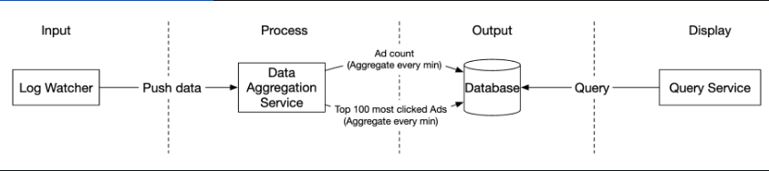

Data flows as an unbounded data stream on both inputs and outputs.  
In order to avoid having a synchronous sink, where a consumer crashing can cause the whole system to stall, we'll leverage asynchronous processing using message queues (Kafka) to decouple consumers and producers.  
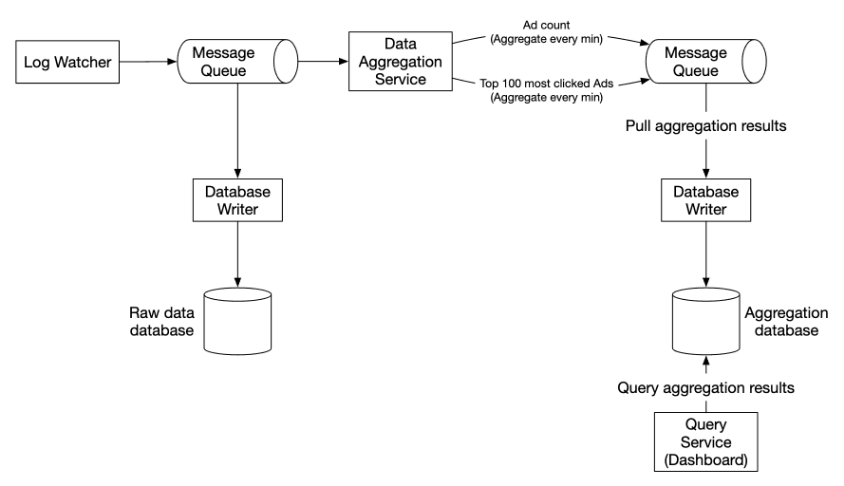

The first message queue stores ad click event data:  

The second message queue contains ad click counts, aggregated per-minute:  

As well as top N clicked ads aggregated per minute:  

The second message queue is there in order to achieve end to end exactly-once atomic commit semantics:  
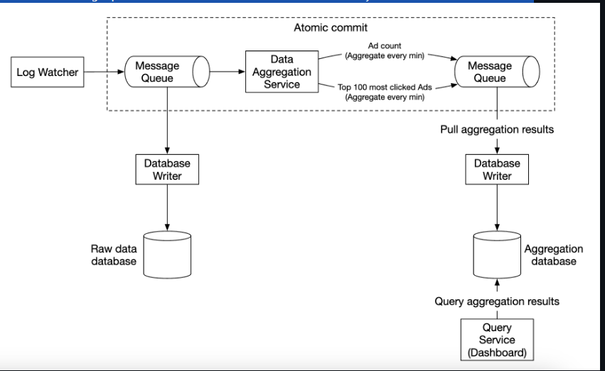

For the aggregation service, using the MapReduce framework is a good option:  
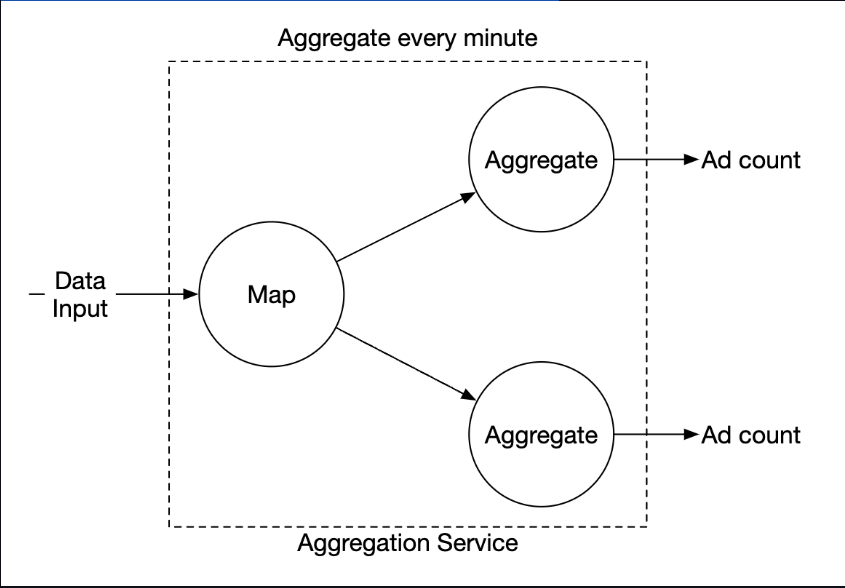
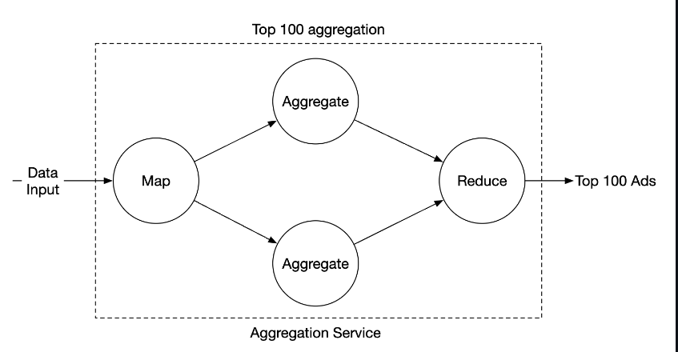

Each node is responsible for one single task and it sends the processing result to the downstream node.  

The map node is responsible for reading from the data source, then filtering and transforming the data.  

For example, the map node can allocate data across different aggregation nodes based on the ad_id:  
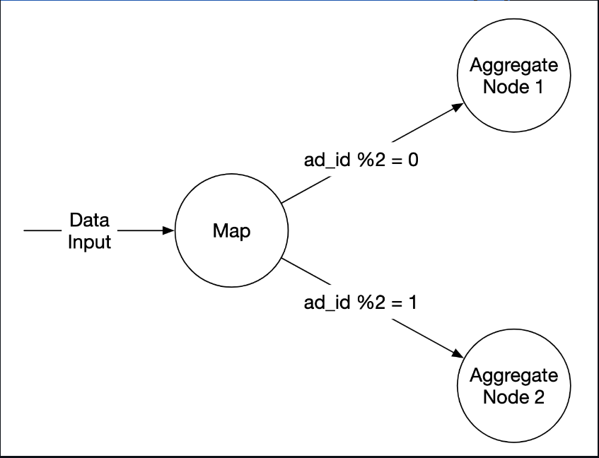
Alternatively, we can distribute ads across Kafka partitions and let the aggregation nodes subscribe directly within a consumer group. However, the mapping node enables us to sanitize or transform the data before subsequent processing.  

Another reason might be that we don't have control over how data is produced, so events related to the same ad_id might go on different partitions.  

The aggregate node counts ad click events by ad_id in-memory every minute.  

The reduce node collects aggregated results from aggregate node and produces the final result:  
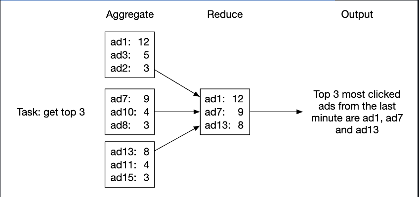

This DAG model uses the MapReduce paradigm. It takes big data and leverages parallel distributed computing to turn it into regular-sized data.  
In the DAG model, intermediate data is stored in-memory and different nodes communicate with each other using TCP or shared memory  
Let's explore how this model can now help us to achieve our various use-cases.  

### Use-case 1 - aggregate the number of clicks:

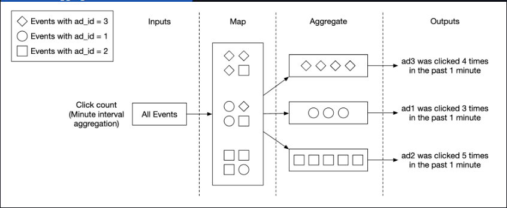

- Ads are partitioned using `ad_id % 3`

### Use-case 2 - return top N most clicked ads:

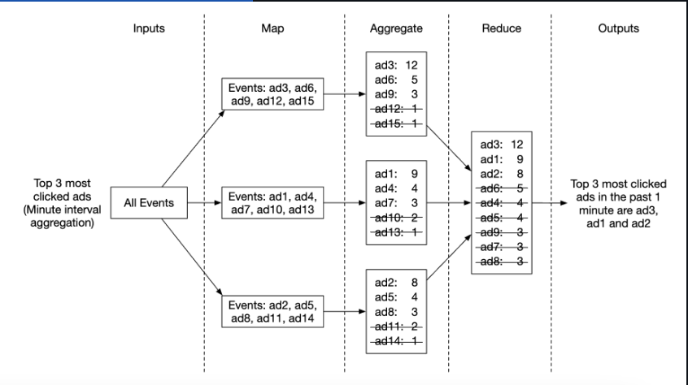

- In this case, we're aggregating the top 3 ads, but this can be extended to top N ads easily
- Each node maintains a heap data structure for fast retrieval of top N ads

### Use-case 3 - data filtering: To support fast data filtering, we can predefine filtering criterias and pre-aggregate based on it:

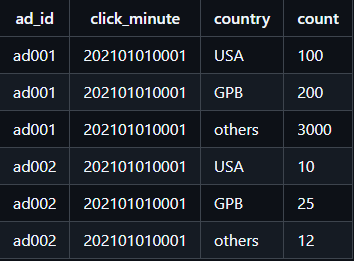

This technique is called the star schema and is widely used in data warehouses. The filtering fields are called dimensions.  
This approach has the following benefits:  

- Simple to undertand and build
- Current aggregation service can be reused to create more dimensions in the star schema.
- Accessing data based on filtering criteria is fast as results are pre-calculated

A limitation of this approach is that it creates many more buckets and records, especially when we have lots of filtering criterias  

# Step 3 - Design Deep Dive

Let's dive deeper into some of the more interesting topics.  

## Streaming vs. Batching

The high-level architecture we proposed is a type of stream processing system. Here's a comparison between three types of systems:  

|                         | Services (Online system)      | Batch system (offline system)                          | Streaming system (near real-time system)    |
| ----------------------- | ----------------------------- | ------------------------------------------------------ | ------------------------------------------- |
| Responsiveness          | Respond to the client quickly | No response to the client needed                       | No response to the client needed            |
| Input                   | User requests                 | Bounded input with finite size. A large amount of data | Input has no boundary (infinite streams)    |
| Output                  | Responses to clients          | Materialized views, aggregated metrics, etc.           | Materialized views, aggregated metrics, etc |
| Performance measurement | Availability, latency         | Throughput                                             | Throughput, latency                         |
| Example                 | Online shopping               | MapReduce                                              | Flink                                       |

In our design, we used a mixture of batching and streaming.  

A system which contains two processing paths - batch and streaming, simultaneously, this architecture is called lambda. A disadvantage is that you have two processing paths with two different codebases to maintain.  

Kappa is an alternative architecture, which combines batch and stream processing in one processing path. The key idea is to use a single stream processing engine  

Lambda architecture:  
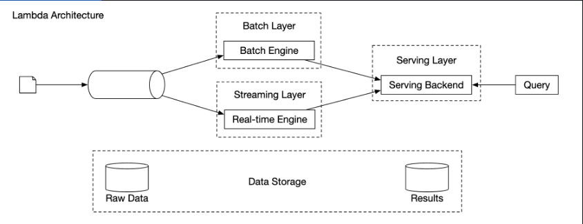

Kappa architecture:  
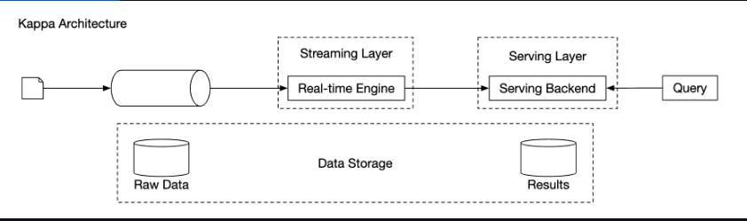

Our high-level design uses Kappa architecture as reprocessing of historical data also goes through the aggregation service.  

Whenever we have to recalculate aggregated data due to eg a major bug in aggregation logic, we can recalculate the aggregation from the raw data we store.  

- Recalculation service retrieves data from raw storage. This is a batch job.
- Retrieved data is sent to a dedicated aggregation service, so that the real-time processing aggregation service is not impacted.
- Aggregated results are sent to the second message queue, after which we update the results in the aggregation database.
  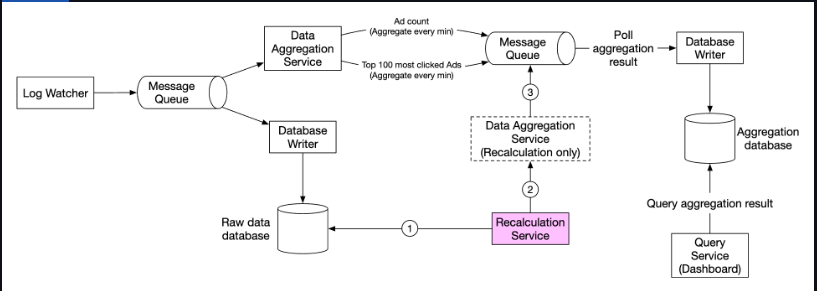

## Time

We need a timestamp to perform aggregation. It can be generated in two places:  

- event time - when ad click occurs
- Processing time - system time when the server processes the event

Due to the usage of async processing (message queues) and network delays, there can be significant difference between event time and processing time.  

- If we use processing time, aggregation results can be inaccurate
- If we use event time, we have to deal with delayed events

There is no perfect solution, we need to consider trade-offs  

|                 | Pros                                  | Cons                                                                                 |
| --------------- | ------------------------------------- | ------------------------------------------------------------------------------------ |
| Event time      | Aggregation results are more accurate | Clients might have the wrong time or timestamp might be generated by malicious users |
| Processing time | Server timestamp is more reliable     | The timestamp is not accurate if event is late                                       |

Since data accuracy is important, we'll use the event time for aggregation.  
To mitigate the issue of delayed events, a technique called "watermark" can be leveraged.  

In the example below, event 2 misses the window where it needs to be aggregated:  
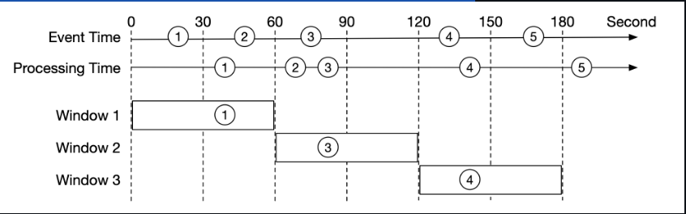

However, if we purposefully extend the aggregation window, we can reduce the likelihood of missed events. The extended part of a window is called a "watermark":  
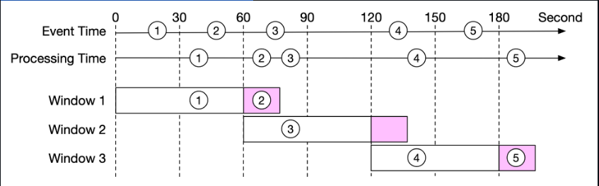

- Short watermark increases likelihood of missed events, but reduces latency
- Longer watermark reduces likelihood of missed events, but increases latency

There is always likelihood of missed events, regardless of the watermark's size. But there is no use in optimizing for such low-probability events.  

We can instead resolve such inconsistencies by doing end-of-day reconciliation.  

## Aggregation window

There are four types of window functions:  

- Tumbling (fixed) window
- Hopping window
- Sliding window
- Session window

In our design, we leverage a tumbling window for ad click aggregations:m  
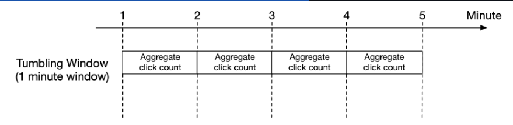

As well as a sliding window for the top N clicked ads in M minutes aggregation:  
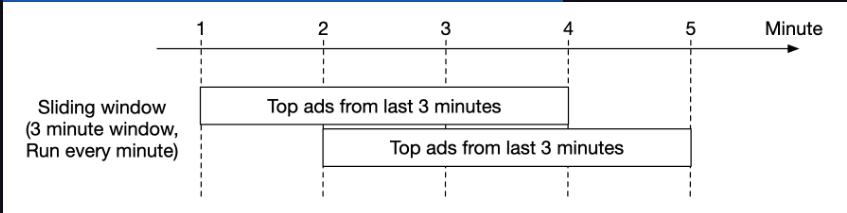

## Delivery guarantees

Since the data we're aggregating is going to be used for billing, data accuracy is a priority.  
Hence, we need to discuss:  

- How to avoid processing duplicate events
- How to ensure all events are processed

There are three delivery guarantees we can use - at-most-once, at-least-once and exactly once.  

In most circumstances, at-least-once is sufficient when a small amount of duplicates is acceptable. This is not the case for our system, though, as a difference in small percent can result in millions of dollars of discrepancy. Hence, we'll need to use exactly-once delivery semantics.  

## Data deduplication

One of the most common data quality issues is duplicated data.  

It can come from a wide range of sources:  

- Client-side - a client might resend the same event multiple times. Duplicated events sent with malicious intent are best handled by a risk engine.
- Server outage - An aggregation service node goes down in the middle of aggregation and the upstream service hasn't received an acknowledgment so event is resent.

Here's an example of data duplication occurring due to failure to acknowledge an event on the last hop:  
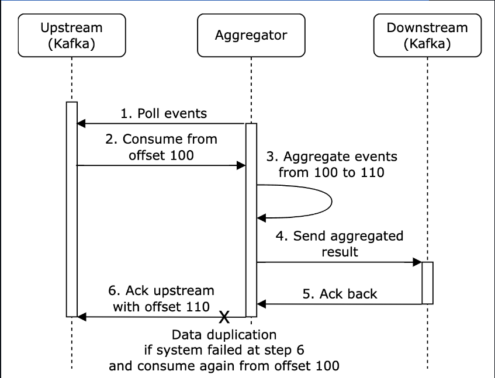

In this example, offset 100 will be processed and sent downstream multiple times.  
One option to try and mitigate this is to store the last seen offset in HDFS/S3, but this risks the result never reaching downstream:  
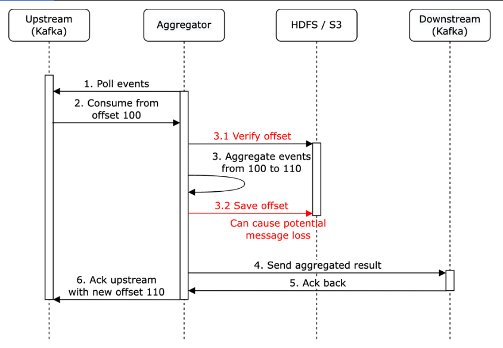

Finally, we can store the offset while interacting with downstream atomically. To achieve this, we need to implement a distributed transaction:  
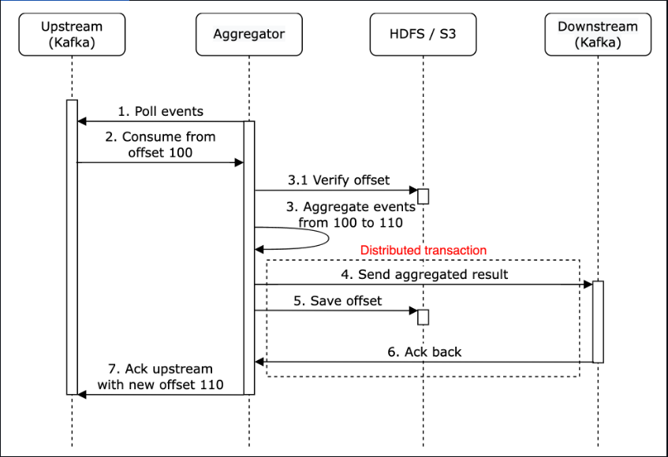

_Personal side-note_: Alternatively, if the downstream system handles the aggregation result idempotently, there is no need for a distributed transaction.  

## Scale the systemScale the system

Let's discuss how we scale the system as it grows.  
We have three independent components - message queue, aggregation service and database. Since they are decoupled, we can scale them independently.  

### How do we scale the message queue:  

- We don't put a limit on producers, so they can be scaled easily
- Consumers can be scaled by assigning them to consumer groups and increasing the number of consumers.
- For this to work, we also need to ensure there are enough partitions created preemptively
- Also, consumer rebalancing can take a while when there are thousands of consumers so it is recommended to do it off peak hours
- We could also consider partitioning the topic by geography, eg topic_na, topic_eu, etc.
  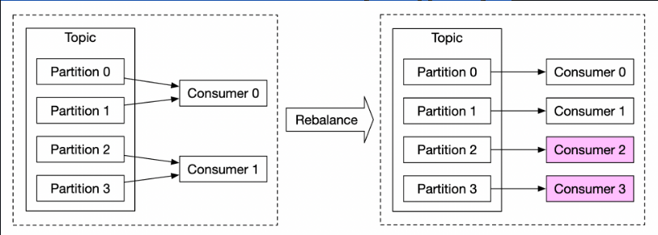

### How do we scale the aggregation service:

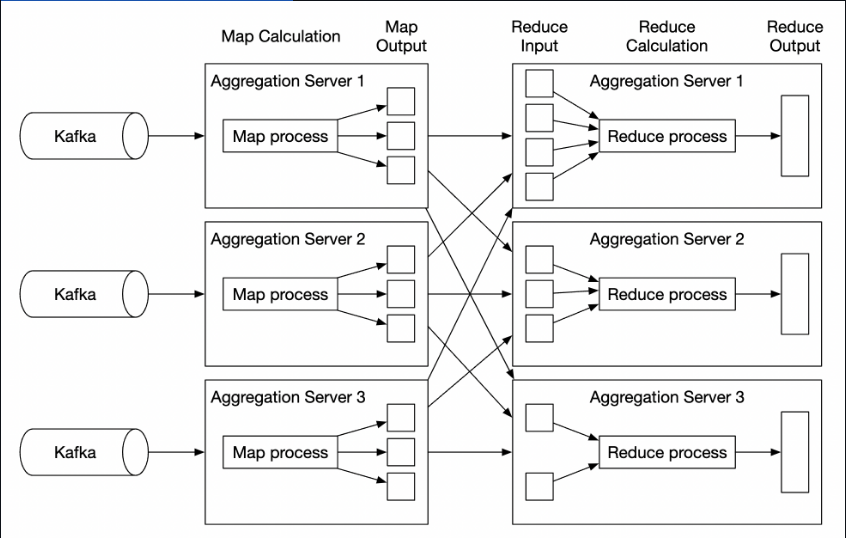

- The map-reduce nodes can easily be scaled by adding more nodes
- The throughput of the aggregation service can be scaled by by utilising multi-threading
- Alternatively, we can leverage resource providers such as Apache YARN to utilize multi-processing
- Option 1 is easier, but option 2 is more widely used in practice as it's more scalable
  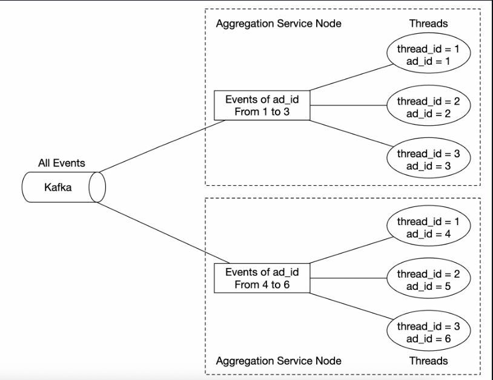

### How do we scale the database:

- If we use Cassandra, it natively supports horizontal scaling utilizing consistent hashing
- If a new node is added to the cluster, data automatically gets rebalanced across all (virtual) nodes
- With this approach, no manual (re)sharding is required
  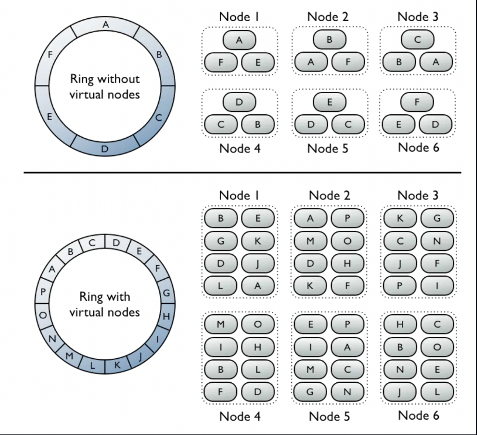

Another scalability issue to consider is the hotspot issue - what if an ad is more popular and gets more attention than others?  
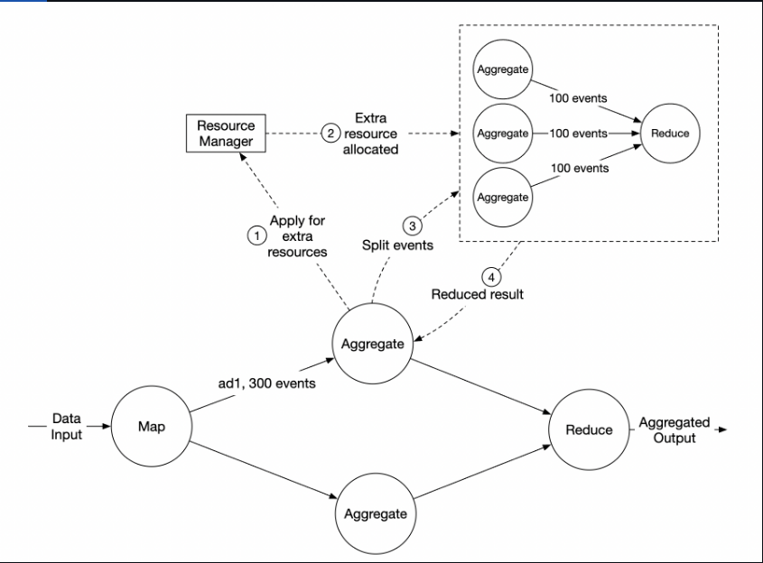

- In the above example, aggregation service nodes can apply for extra resources via the resource manager
- The resource manager allocates more resources, so the original node isn't overloaded
- The original node splits the events into 3 groups and each of the aggregation nodes handles 100 events
- Result is written back to the original aggregation node

Alternative, more sophisticated ways to handle the hotspot problem:  

- Global-Local Aggregation
- Split Distinct Aggregation

## Fault Tolerance

Within the aggregation nodes, we are processing data in-memory. If a node goes down, the processed data is lost.  
We can leverage consumer offsets in kafka to continue from where we left off once another node picks up the slack. However, there is additional intermediary state we need to maintain, as we're aggregating the top N ads in M minutes.  
We can make snapshots at a particular minute for the on-going aggregation:  
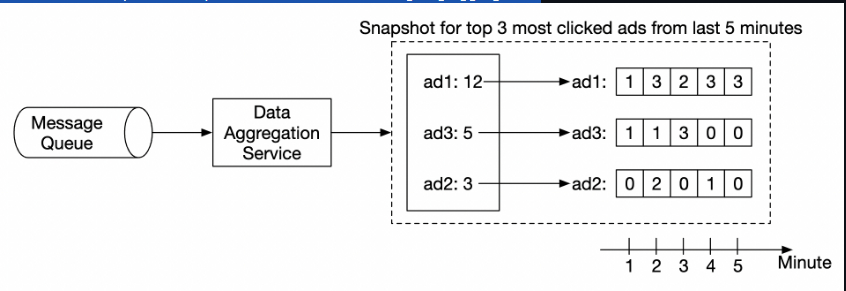

If a node goes down, the new node can read the latest committed consumer offset, as well as the latest snapshot to continue the job:  
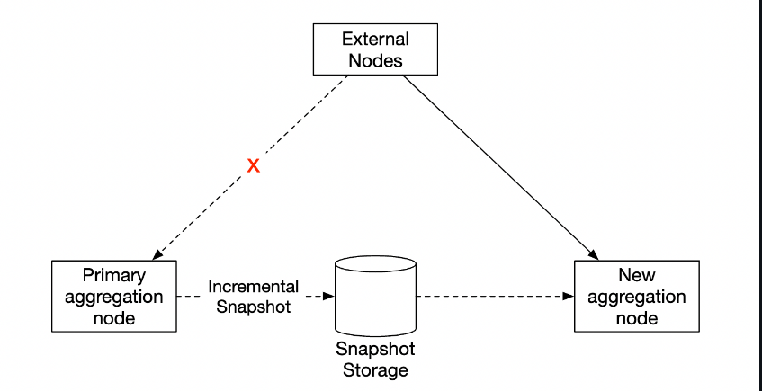

## Data monitoring and correctness

As the data we're aggregating is critical as it's used for billing, it is very important to have rigorous monitoring in place in order to ensure correctness.  

Some metrics we might want to monitor:  

- Latency - Timestamps of different events can be tracked in order to understand the e2e latency of the system
- Message queue size - If there is a sudden increase in queue size, we need to add more aggregation nodes. As Kafka is implemented via a distributed commit log, we need to keep track of records-lag metrics instead.
- System resources on aggregation nodes - CPU, disk, JVM, etc.

We also need to implement a reconciliation flow which is a batch job, running at the end of the day. It calculates the aggregated results from the raw data and compares them against the actual data stored in the aggregation database:  
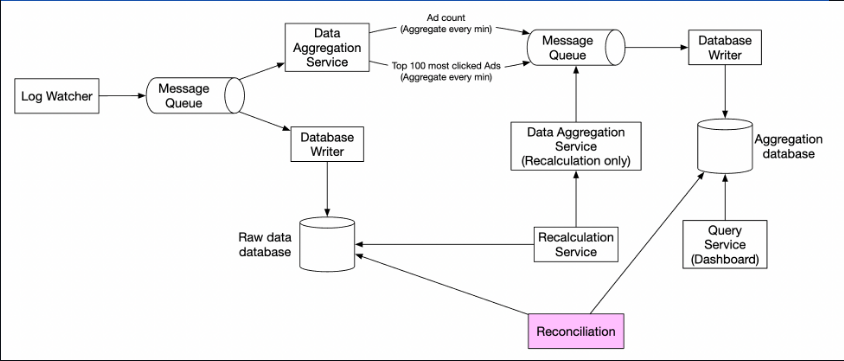

## Alternative design

In a generalist system design interview, you are not expected to know the internals of specialized software used in big data processing.  

Explaining the thought process and discussing trade-offs is more important than knowing specific tools, which is why the chapter covers a generic solution.  

An alternative design, which leverages off-the-shelf tooling, is to store ad click data in Hive with an ElasticSearch layer on top built for faster queries.  

Aggregation is typically done in OLAP databases such as ClickHouse or Druid.  
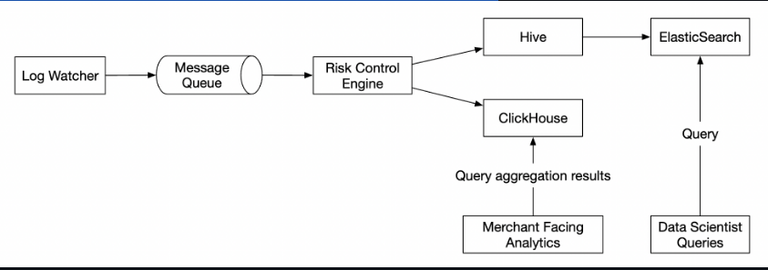

# Step 4 - Wrap up

Things we covered:  

- Data model and API Design
- Using MapReduce to aggregate ad click events
- Scaling the message queue, aggregation service and database
- Mitigating the hotspot issue
- Monitoring the system continuously
- Using reconciliation to ensure correctness
- Fault tolerance

The ad click event aggregation is a typical big data processing system.  
