# What is hashing?

- The classic hashing approach uses a hash function to generate a pseudo-random number, which is then divided by the size of the memory space to transform the random identifier into a position within the available space. Something that looks like the following:
  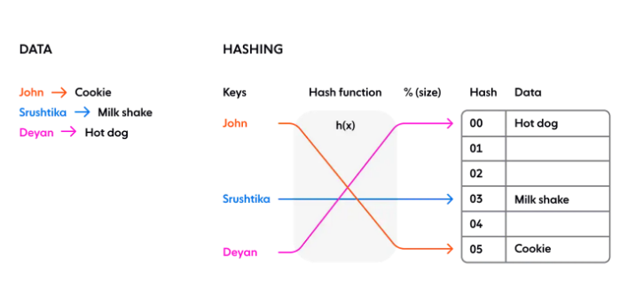

# Why use hashing?

Using a hash function ensures that resources required by computer programs are efficiently stored in memory, and that in-memory data structures are loaded evenly to make information retrieval more efficient.

# Hashing in a distributed system

In a scenario where various programs, computers, or users request resources from multiple server nodes, we need a mechanism to map requests evenly to available server nodes, thus ensuring that the load is balanced for consistent performance.  
In the classic hashing method, we always assume that:  

- The number of memory locations is known
- This number never changes  

It’s common for a cluster to scale up and down, and there are always unexpected failures in a distributed system. We cannot guarantee that the number of server nodes will remain the same. What if one of them fails? With a naive hashing approach, we need to rehash every single key as the new mapping is dependent on the number of nodes and memory locations
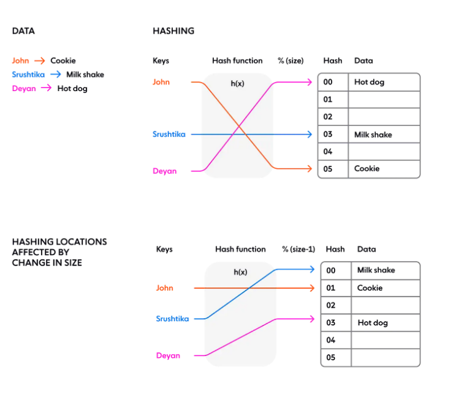
The problem in a distributed system with simple rehashing —moving the placement of every key — is that state is stored on each node. A small change in the cluster size could result in a reshuffle of all the data in the cluster. As the cluster size grows, this becomes unsustainable because the amount of work required for each hash change grows linearly with cluster size.

# What is consistent hashing?

- It represents the resource requestors (which I shall refer to as ‘requests’) and **the server nodes in a virtual ring structure known as a hashring**.
- The number of locations is no longer fixed, but the ring is considered to have an infinite number of points, and the server nodes can be placed at random locations on this ring. (Of course, choosing this random number again can be done using a hash function, but the second step of dividing it by the number of available locations is skipped as it is no longer a finite number).
- The requests, that is, the users, computers or serverless programs, which are analogous to keys in the classic hashing approach, are also placed on the same ring using the same hash function.
  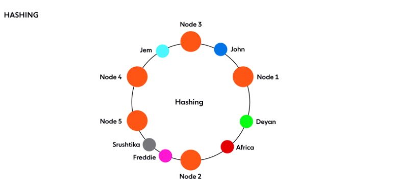
- How is the decision about which request will be served by which server node made? If we assume the ring is ordered so that clockwise traversal of the ring corresponds to increasing order of location addresses, each request can be served by the server node that first appears in this clockwise traversal.
- That is, the first server node with an address greater than that of the request gets to serve it. If the address of the request is higher than the highest addressed node, it is served by the server node with the lowest address, as the traversal through the ring goes in a circle (illustrated below):

# Hash server

Using the same hash function for the requests, we map the servers based on server IP or name onto the hash ring:
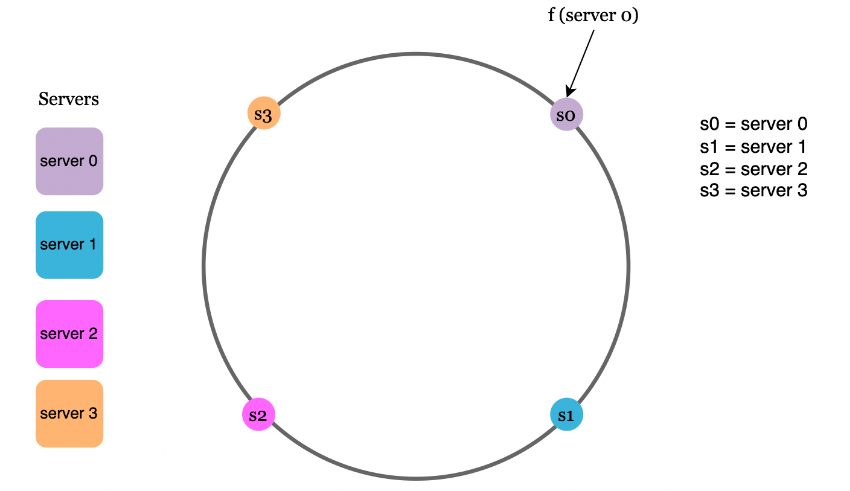

# Hash keys

The hashes of the requests also get resolved somewhere along the hash ring. Notice that we're not using the modulo operator in this case:
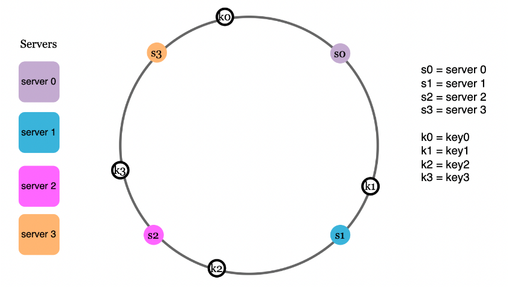

# Server lookup

- Now, to determine which server is going to serve each request, we **go clockwise from the request's hash until we reach the first server hash**:
  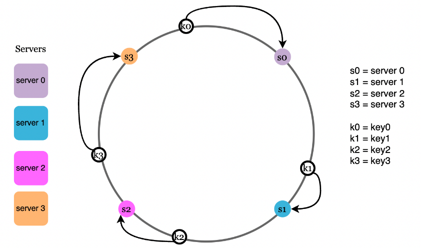

# Add a server

- Via this approach, adding a new server causes only one of the requests to get **remapped to a new server**:
  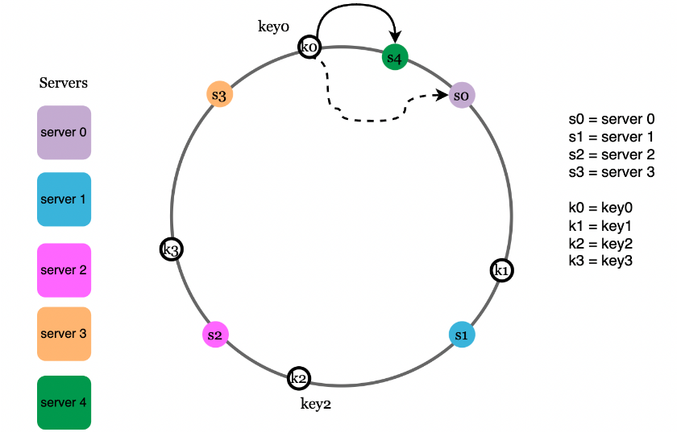

# Remove a server

- Likewise, removing a server causes only a single request to get remapped:
  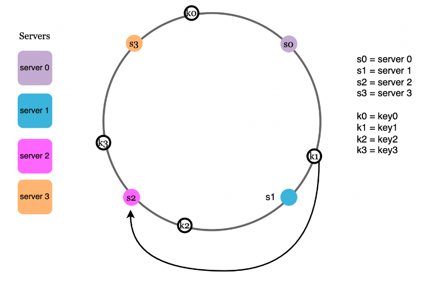

# Two issues in the basic approach

- The first problem with this approach is that hash partitions can be uneven across servers
  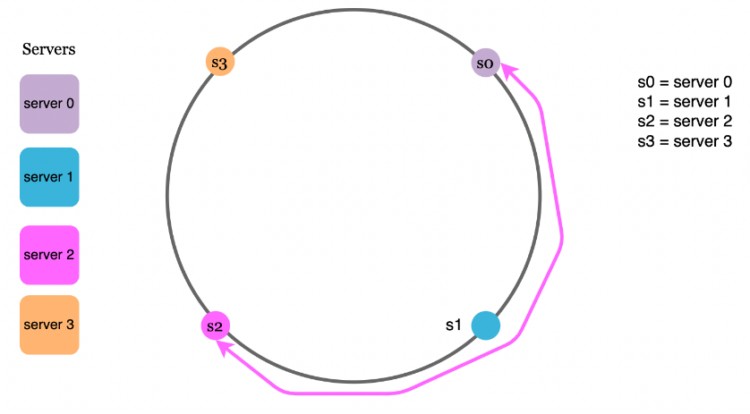
- The second problem derives from the first - it is possible that requests are unevenly distributed across servers:
  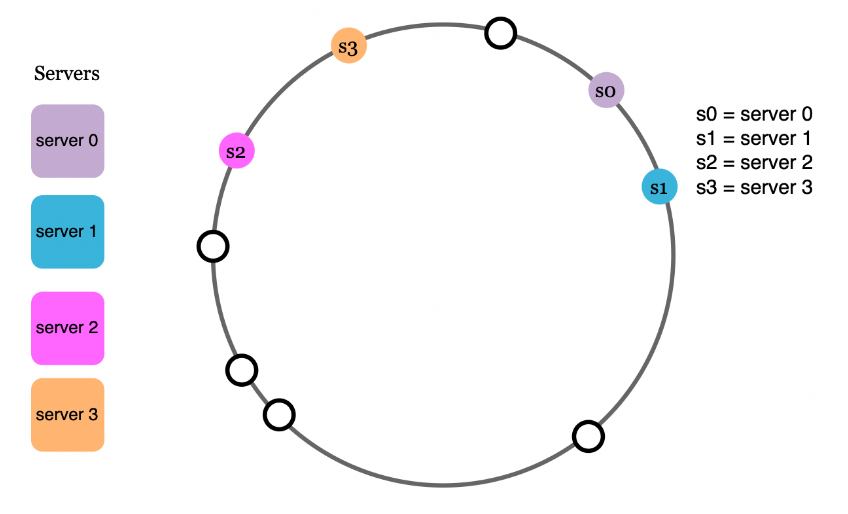

# Virtual nodes

- To solve this issue, we can map a servers on the hash ring multiple times, creating virtual nodes and assigning multiple partitions to the same server:
  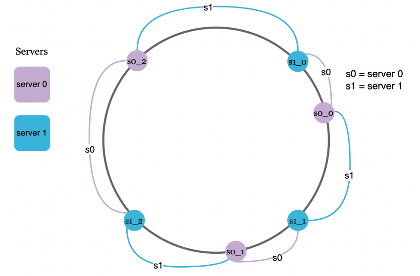
  Now, a request is mapped to the closest virtual node on the hash ring:
  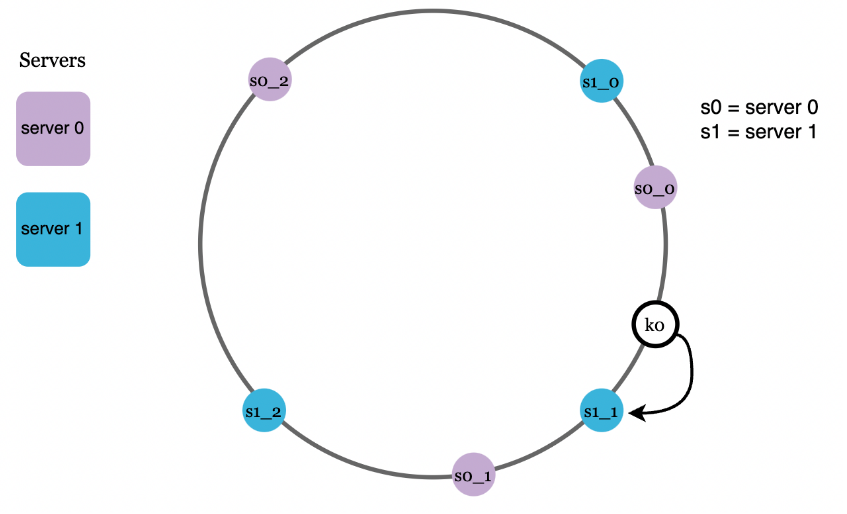

# Wrap up

Benefits of consistent hashing:  

- Very low number of keys are distributed in a re-balancing event
- Easy to scale horizontally as data is uniformly distributed
- Hotspot issue is mitigated by uniformly distributing data, related to eg a celebrity, which is often accessed
