# Google Maps

We'll design a simple version of Google Maps. <br>
Some facts about google maps: <br>

- Started in 2005
- Provides various services - satellite imagery, street maps, real-time traffic conditions, route planning
- By 2021, had 1bil daily active users, 99% coverage of the world, 25mil updates daily of real-time location info

# Step 1 - Understand the Problem and Establish Design Scope

Sample Q&A between candidate and interviewer: <br>

- C: How many daily active users are we dealing with?
- I: 1bil DAU
- C: What features should we focus on?
- I: Location update, navigation, ETA, map rendering
- C: How large is road data? Do we have access to it?
- I: We obtained road data from various sources, it's TBs of raw data
- C: Should we take traffic conditions into consideration?
- I: Yes, we should for accurate time estimations
- C: How about different travel modes - by foot, biking, driving?
- I: We should support those
- C: How about multi-stop directions?
- I: Let's not focus on that for scope of interview
- C: Business places and photos?
- I: Good question, but no need to consider those

We'll focus on three key features - user location update, navigation service including ETA, map rendering. <br>

## Non-functional requirements.

- Accuracy - user shouldn't get wrong directions
- Smooth navigation - Users should experience smooth map rendering
- Data and battery usage - Client should use as little data and battery as possible. - Important for mobile devices.
- General availability and scalability requirements

## Map 101

Before jumping into the design, there are some map-related concepts we should understand. <br>

### Positioning system

World is a sphere, rotating on its axis. Positiions are defined by latitude (how far north/south you are) and longitude (how far east/west you are):
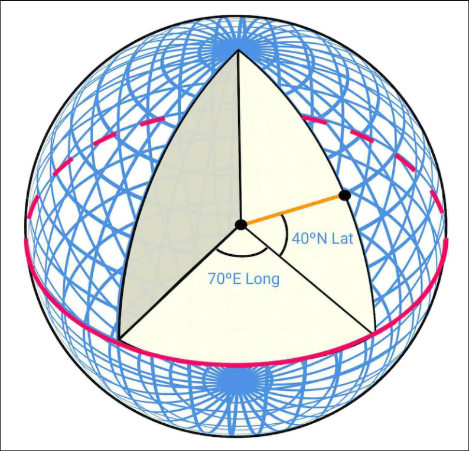

### Going from 3D to 2D

The process of translating points from 3D to 2D plane is called "map projection". <br>
There are different ways to do it and each comes with its pros and cons. Almost all distort the actual geometry. <br>
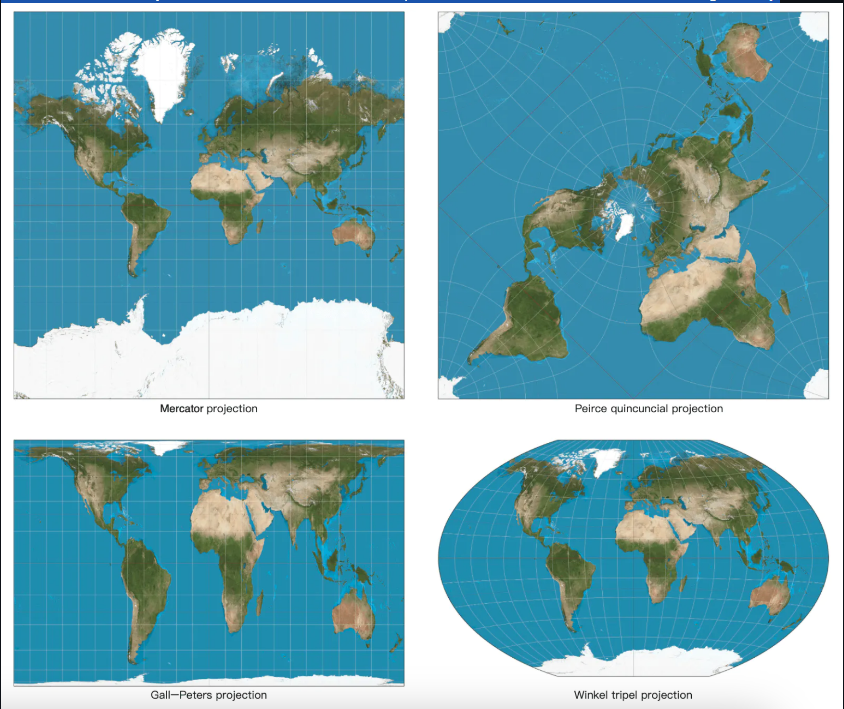

Google maps selected a modified version of Mercator projection called "Web Mercator". <br>

### Geocoding

Geocoding is the process of converting addresses to geographic coordinates. <br>
The reverse process is called "reverse geocoding". <br>
One way to achieve this is to use interpolation - leveraging data from different sources (eg GIS-es) where street network is mapped to geo coordinate space. <br>

### Geohashing

Geohashing is an encoding system which encodes a geographic area into a string of letters and digits. <br>
It depicts the world as a flattened surface and recursively sub-divides it into four quadrants: <br>
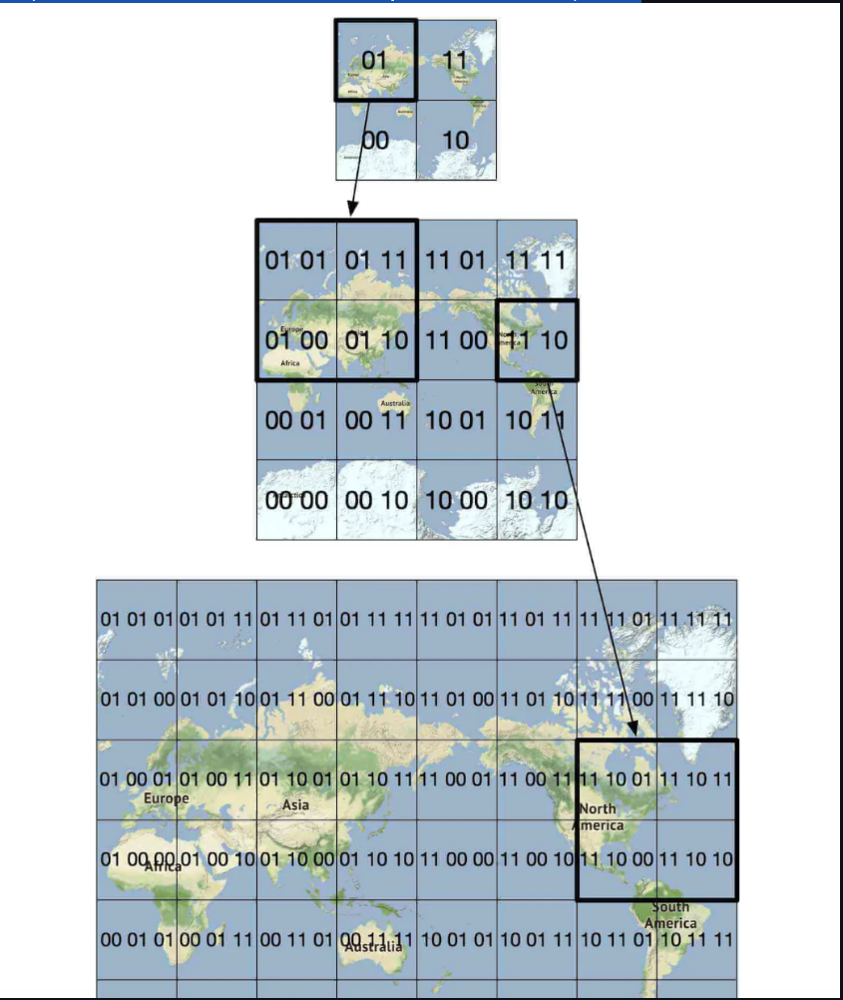

### Map rendering

Map rendering happens via tiling. Instead of rendering entire map as one big custom image, world is broken up into smaller tiles. <br>

Client only downloads relevant tiles and renders them like stitching together a mosaic. <br>

There are different tiles for different zoom levels. Client chooses appropriate tiles based on the client's zoom level. <br>

Eg, zooming out the entire world would download only a single 256x256 tile, representing the whole world. <br>

### Road data processing for navigation algorithms

In most routing algorithms, intersections are represented as nodes and roads are represented as edges: <br>
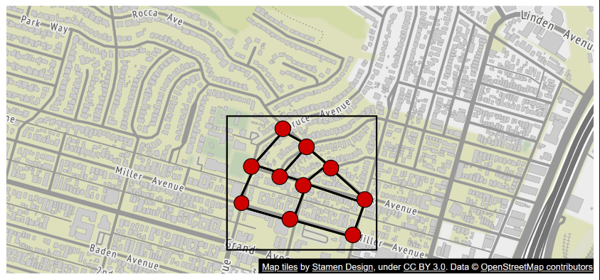

Most navigation algorithms use a modified version of Djikstra or A\* algorithms. <br>

Pathfinding performance is sensitive to the size of the graph. To work at scale, we can't represent the whole world as a graph and run the algorithm on it. <br>

Instead, we use a technique similar to tiling - we subdivide the world into smaller and smaller graphs. <br>

Routing tiles hold references to neighboring tiles and algorithms can stitch together a bigger road graph as it traverses interconnected tiles: <br>

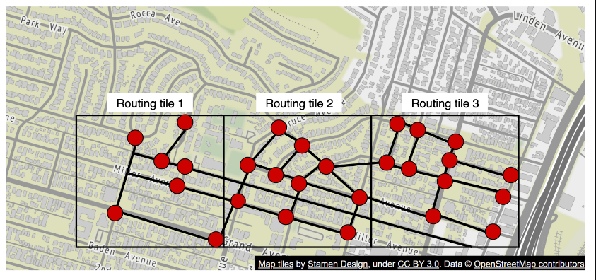

This technique enables us to significantly reduce memory bandwidth and only load the tiles we need for the given source/destination pair. <br>

However, for larger routes, stitching together small, detailed routing tiles would still be time/memory consuming. Instead, there are routing tiles with different level of detail and the algorithm uses the appropriately-detailed tiles, based on the destination we're headed for: <br>

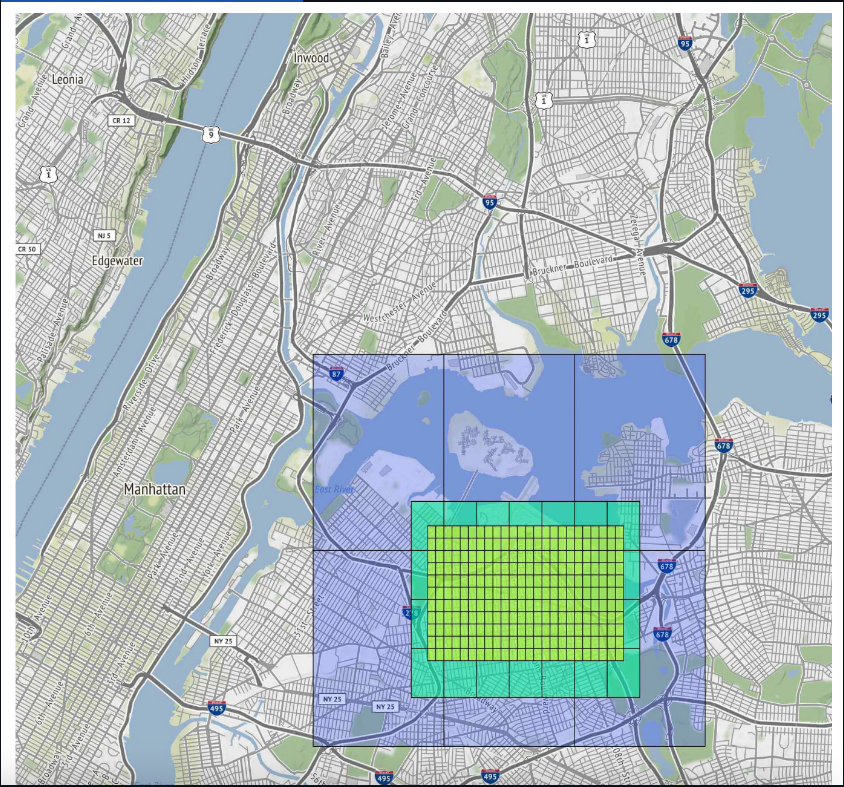

### Back-of-the-envelope estimation

For storage, we need to store: <br>

- map of the world - estimated as ~70pb based on all the tiles we need to store, but factoring in compression of very similar tiles (eg vast desert)
- metadata - negligible in size, so we can skip it from calculation
- Road info - stored as routing tiles <br>

Estimated QPS for navigation requests - 1bil DAU at 35min of usage per week -> 5bil minutes per day. Assuming gps update requests are batched, we arrive at 200k QPS and 1mil QPS at peak load

# Step 2 - Propose High-Level Design and Get Buy-In

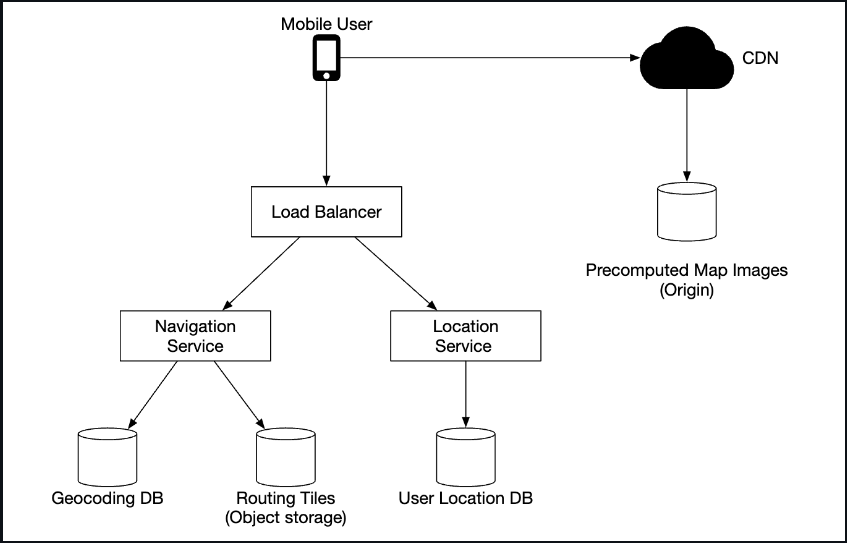

### Location service

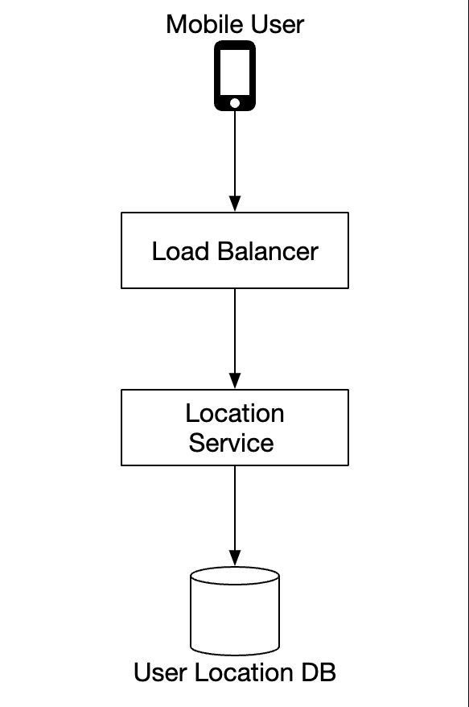

It is responsible for recording a user's location updates: <br>

- location updates are sent every t seconds
- location data streams can be used to improve the service over time, eg provide more accurate ETAs, monitor traffic data, detect closed roads, analyze user behavior, etc

Instead of sending location updates to the server all the time, we can batch the updates on the client-side and send batches instead: <br>
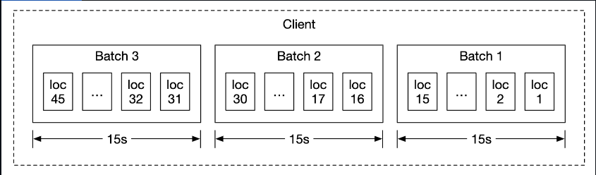

Despite this optimization, for a system of Google Maps scale, load will still be significant. Therefore, we can leverage a database, optimized for heavy writes such as Cassandra. <br>

We can also leverage Kafka for efficient stream processing of location updates, meant for further analysis. <br>

Example location update request payload: <br>

```
POST /v1/locations
Parameters
  locs: JSON encoded array of (latitude, longitude, timestamp) tuples.
```

### Navigation service

This component is responsible for finding fast routes between A and B in a reasonable time (a little bit of latency is okay). Route need not be the fastest, but accuracy is important. <br>

Example request payload: <br>

```
GET /v1/nav?origin=1355+market+street,SF&destination=Disneyland
```

Example response: <br>

```
{
  "distance": {"text":"0.2 mi", "value": 259},
  "duration": {"text": "1 min", "value": 83},
  "end_location": {"lat": 37.4038943, "Ing": -121.9410454},
  "html_instructions": "Head <b>northeast</b> on <b>Brandon St</b> toward <b>Lumin Way</b><div style=\"font-size:0.9em\">Restricted usage road</div>",
  "polyline": {"points": "_fhcFjbhgVuAwDsCal"},
  "start_location": {"lat": 37.4027165, "lng": -121.9435809},
  "geocoded_waypoints": [
    {
       "geocoder_status" : "OK",
       "partial_match" : true,
       "place_id" : "ChIJwZNMti1fawwRO2aVVVX2yKg",
       "types" : [ "locality", "political" ]
    },
    {
       "geocoder_status" : "OK",
       "partial_match" : true,
       "place_id" : "ChIJ3aPgQGtXawwRLYeiBMUi7bM",
       "types" : [ "locality", "political" ]
    }
  ],
  "travel_mode": "DRIVING"
}
```

Traffic changes and reroutes are not taken into consideration yet, those will be tackled in the deep dive section. <br>

### Map rendering

Holding the entire data set of mapping tiles on the client-side is not feasible as it's petabytes in size. <br>
They need to be fetched on-demand from the server, based on the client's location and zoom level. <br>
When should new tiles be fetched - while user is zooming in/out and during navigation, while they're going towards a new tile. <br>
How should the map tiles be served to the client? <br>

- They can be built dynamically, but that puts a huge load on the server and also makes caching hard
- Map tiles are served statically, based on their geohash, which a client can calculate. They can be statically stored & served from a CDN <br>

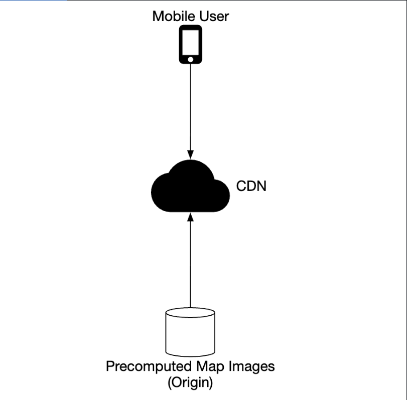

CDNs enable users to fetch map tiles from point-of-presence servers (POP) which are closest to users in order to minimize latency: <br>

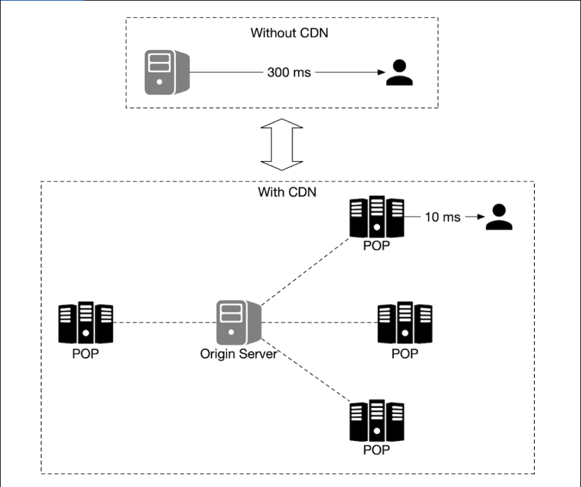

Options to consider for determining map tiles: <br>

- geohash for map tile can be calculated on the client-side. If that's the case, we should be careful that we commit to this type of map tile calculation for the long-term as forcing clients to update is hard
- alternatively, we can have simple API which calculates the map tile URLs on behalf of the clients at the cost of additional API call

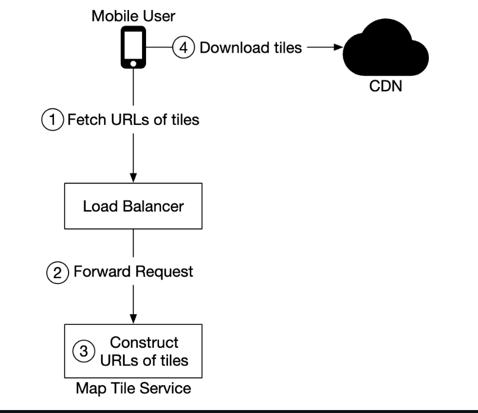

# Step 3 - Design Deep Dive

### Data model

Let's discuss how we store the different types of data we're dealing with. <br>

### Routing tiles

Initial road data set is obtained from different sources. It is improved over time based on location updates data. <br>
The road data is unstructured. We have a periodic offline processing pipeline, which transforms this raw data into the graph-based routing tiles our app needs. <br>
Instead of storing these tiles in a database as we don't need any database features. We can store them in S3 object storage, while caching them agressively. <br>
We can also leverage libraries to compress adjacency lists into binary files efficiently. <br>

### User location data

User location data is very useful for updaring traffic conditions and doing all sorts of other analysis. <br>

We can use Cassandra for storing this kind of data as its nature is to be write-heavy. <br>
Example row: <br>

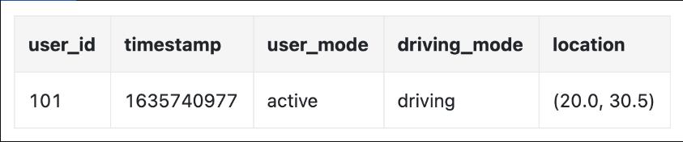

### Geocoding database

This database stores a key-value pair of lat/long pairs and places. <br>
We can use Redis for its fast read access speed, as we have frequent read and infrequent writes. <br>

### Precomputed images of the world map

As we discussed, we will precompute map tiling images and store them in CDN. <br>
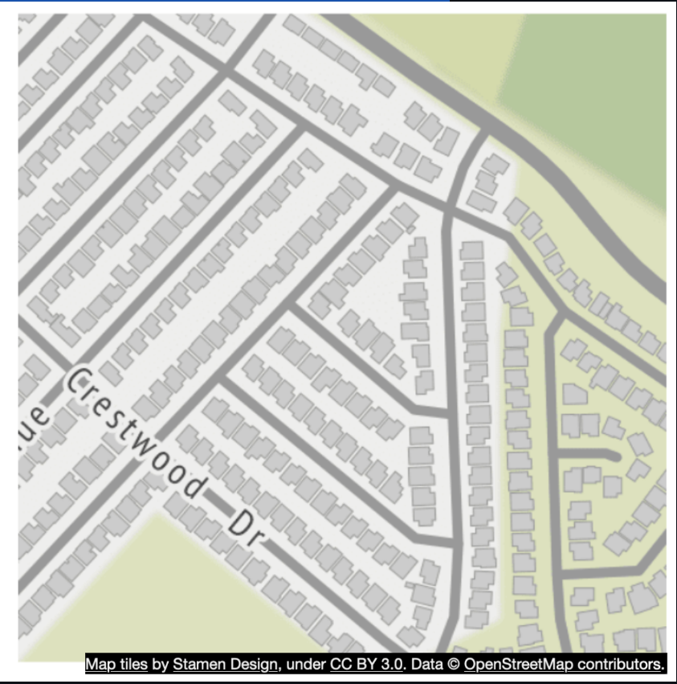

### Location service

Let's focus on the database design and how user location is stored in detail for this service. <br>
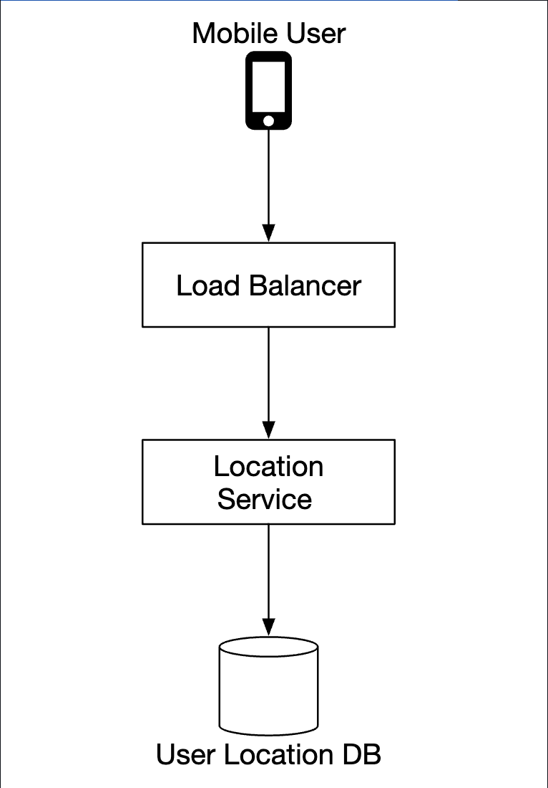

We can use a NoSQL database to facilitate the heavy write load we have on location updates. We prioritize availability over consistency as user location data often changes and becomes stale as new updates arrive. <br>
We'll choose Cassandra as our database choice as it nicely fits all our requirements. <br>

Example row we're going to store: <br>
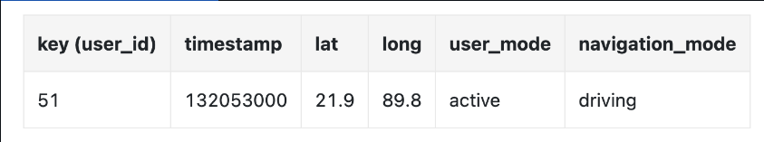

- `user_id` is the partition key in order to quickly access all location updates for a particular user
- `timestamp` is the clustering key in order to store the data sorted by the time a location update is received

We also leverage Kafka to stream location updates to various other service which need the location updates for various purposes: <br>

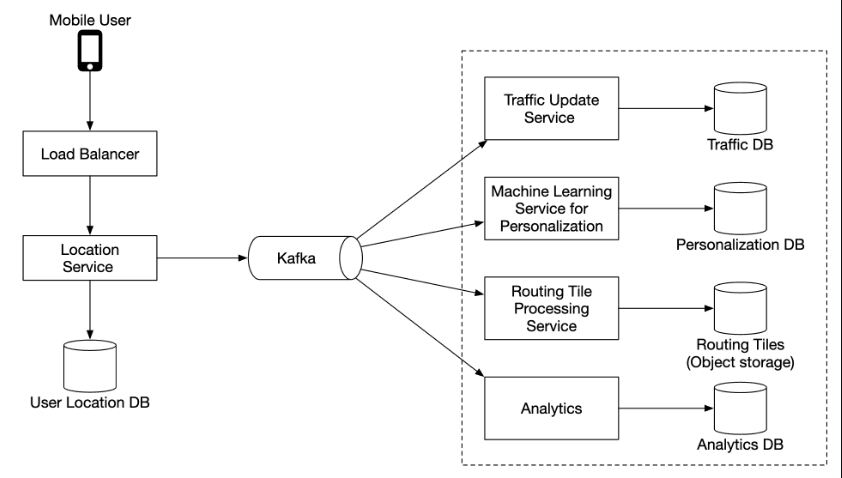

### Rendering map

Map tiles are stored at various zoom levels. At the lowest zoom level, the entire world is represented by a single 256x256 tile. <br>
As zoom levels increase, the number of map tiles quadruples: <br>
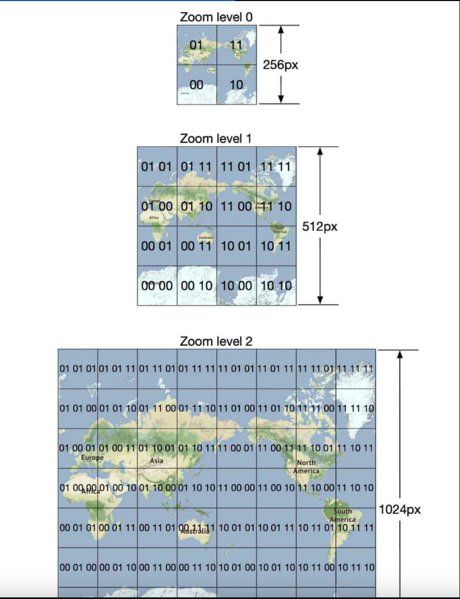

One optimization we can use is to not send the entire image information over the network, but instead represent tiles as vectors (paths & polygons) and let the client render the tiles dynamically. <br>

This will have substantial bandwidth savings. <br>

### Navigation service

This service is responsible for finding the fastest routes:
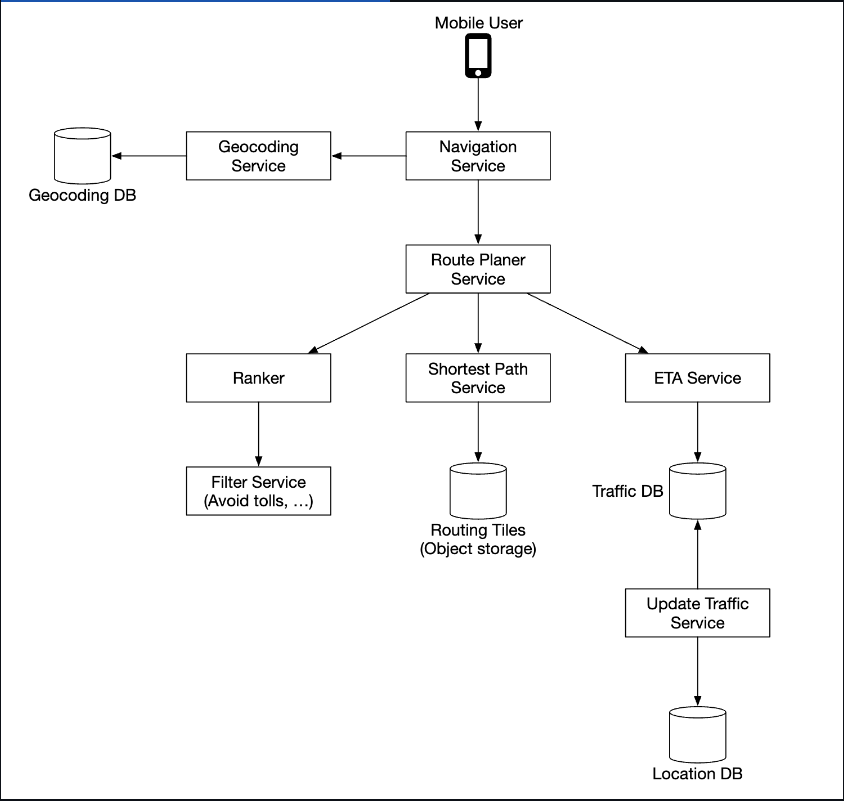

Let's go through each component in this sub-system. <br>

First, we have the geocoding service which resolves an address to a location of lat/long pair. <br>

Example request: <br>

```
https://maps.googleapis.com/maps/api/geocode/json?address=1600+Amphitheatre+Parkway,+Mountain+View,+CA
```

Example response: <br>

```
{
   "results" : [
      {
         "formatted_address" : "1600 Amphitheatre Parkway, Mountain View, CA 94043, USA",
         "geometry" : {
            "location" : {
               "lat" : 37.4224764,
               "lng" : -122.0842499
            },
            "location_type" : "ROOFTOP",
            "viewport" : {
               "northeast" : {
                  "lat" : 37.4238253802915,
                  "lng" : -122.0829009197085
               },
               "southwest" : {
                  "lat" : 37.4211274197085,
                  "lng" : -122.0855988802915
               }
            }
         },
         "place_id" : "ChIJ2eUgeAK6j4ARbn5u_wAGqWA",
         "plus_code": {
            "compound_code": "CWC8+W5 Mountain View, California, United States",
            "global_code": "849VCWC8+W5"
         },
         "types" : [ "street_address" ]
      }
   ],
   "status" : "OK"
}
```

The route planner service computes a suggested route, optimized for travel time according to current traffic conditions. <br>
The shortest-path service runs a variation of the A\* algorithm against the routing tiles in object storage to compute an optimal path: <br>

- It receives the source/destination pairs, converts them to lat/long pairs and derives the geohashes from those pairs to derive the routing tiles
- The algorithm starts from the initial routing tile and starts traversing it until a good enough path is found to the destination tile
  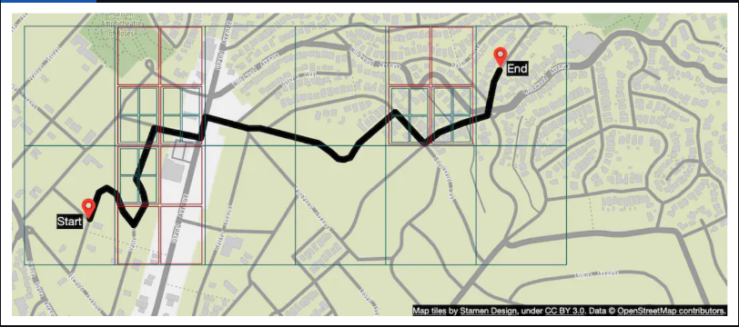

- The ETA service is called by the route planner to get estimated time based on machine learning algorithms, predicting ETA based on traffic data.

- The ranker service is responsible to rank different possible paths based on filters, passed by the user, ie flags to avoid toll roads or freeways.

- The updater service asynchronously update some of the important databases to keep them up-to-date

### Improvement - adaptive ETA and rerouting

One improvement we can do is to adaptively update in-flight routes based on newly available traffic data. <br>

One way to implement this is to store users who are currently navigating through a route in the database by storing all the tiles they're supposed to go through. <br>

Data might look like this: <br>

```
user_1: r_1, r_2, r_3, …, r_k
user_2: r_4, r_6, r_9, …, r_n
user_3: r_2, r_8, r_9, …, r_m
...
user_n: r_2, r_10, r21, ..., r_l
```

If a traffic accident happens on some tile, we can identify all users whose path goes through that tile and re-route them. <br>

To reduce the amount of tiles we store in the database, we can instead store the origin routing tile and several routing tiles in different resolution levels until the destination tile is also included: <br>

```
user_1, r_1, super(r_1), super(super(r_1)), ...
```

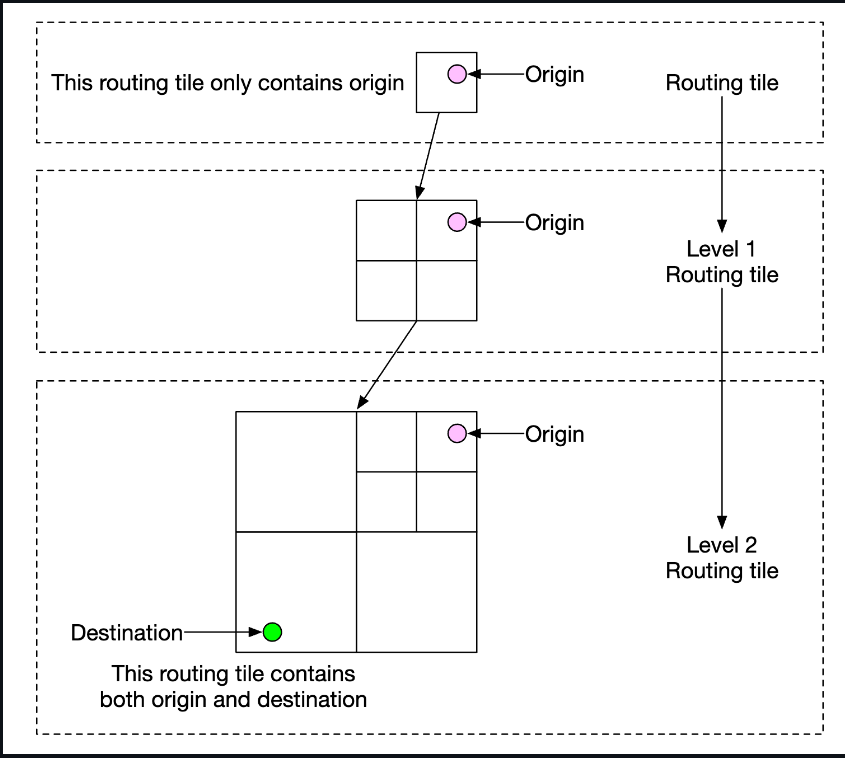

- Using this, we only need to check if the final tile of a user includes the traffic accident tile to see if user is impacted.

- We can also keep track of all possible routes for a navigating user and notify them if a faster re-route is available.

### Delivery protocols

We have several options, which enable us to proactively push data to clients from the server: <br>

- Mobile push notifications don't work because payload is limited and it's not available for web apps
- WebSocket is generally a better option than long-polling as it has less compute footprint on servers
- We can also use server-sent events (SSE) but lean towards web sockets as they support bi-directional communication which can come in handy for eg a last-mile delivery feature

# Step 4 - Wrap Up

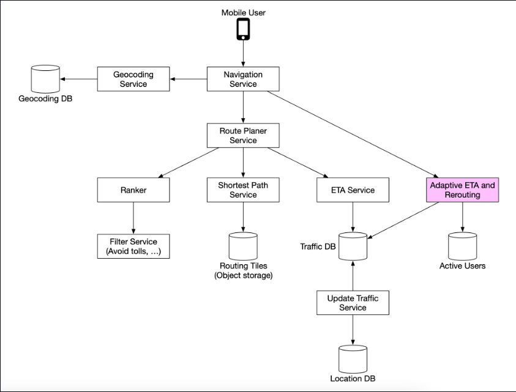
