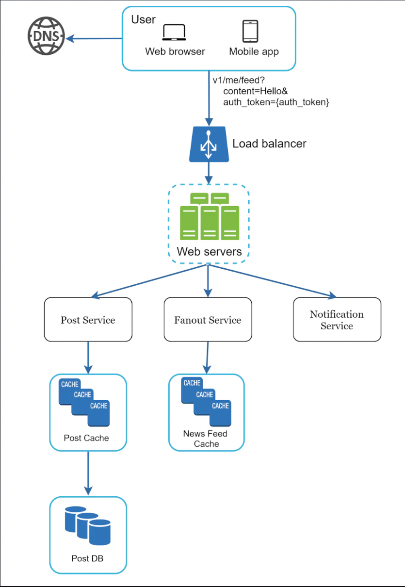
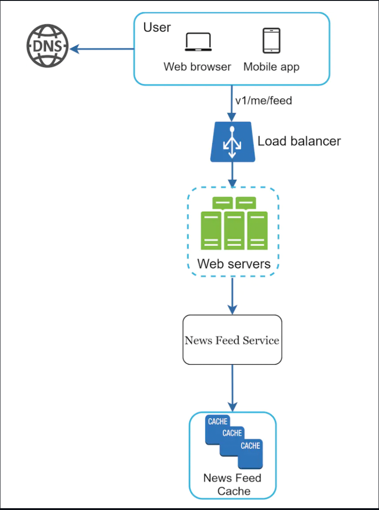
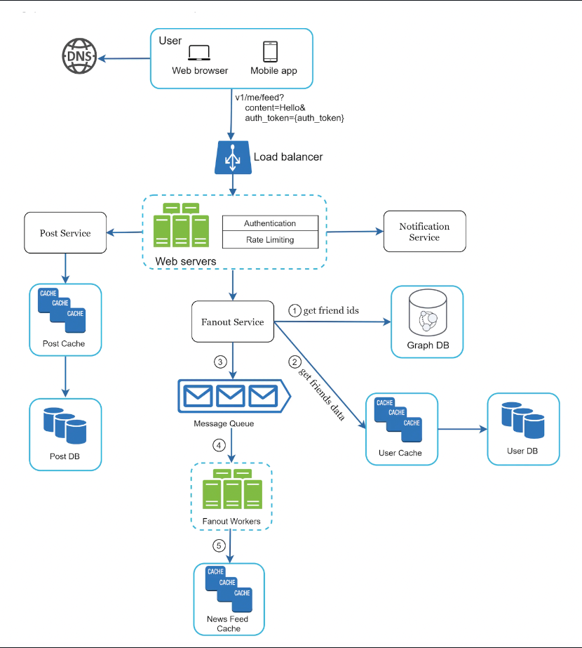
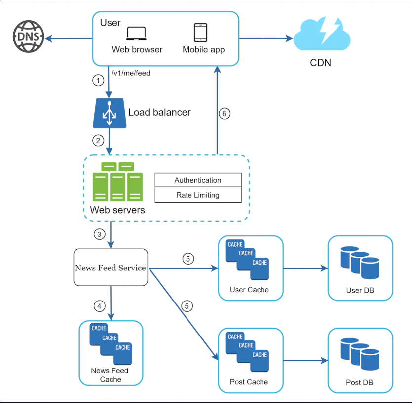
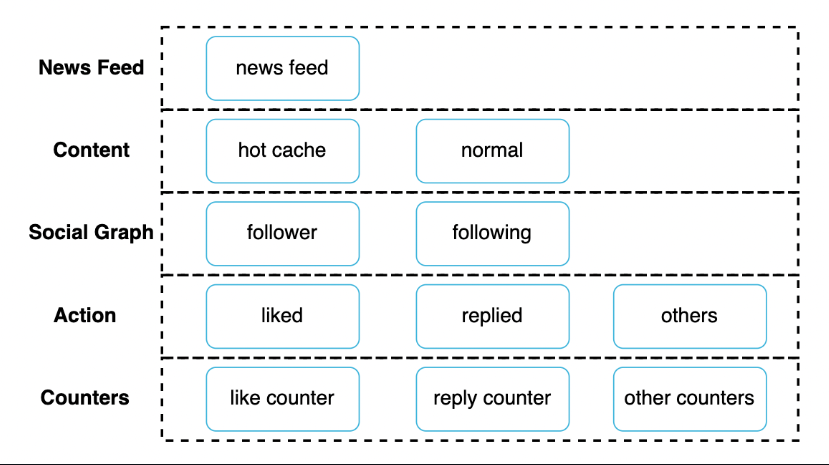

# Design a News Feed System

News feed == constantly updating list of stories on your home page.  
It includes status updates, photos, videos, links, etc.  
Similar interview questions - design facebook news feed, twitter timeline, instagram feed, etc.  

# Step 1 - Understand the problem and establish design scope

- C: Mobile, web app?
- I: Both
- C: What are the important features?
- I: User can publish posts and see friends' posts on news feed.
- C: Is news feed sorted in reverse chronological order or based on rank, eg best friends' posts first.
- I: To keep it simple, let's assume reverse chrono order
- C: Max number of friends?
- I: 5000
- C: Traffic volume?
- I: 10mil DAU
- C: Can the feed contain media?
- I: It can contain images and video

# Step 2 - Propose high-level design and get buy-in

There are two parts to the design:  

- Feed publishing - when user publishes a post, corresponding data is written to cache and DB. Post is populated to friends' news feed.
- Newsfeed building - built by aggregating friends' posts in news feed.

## Newsfeed API

The Newsfeed API is the primary gateway for users to the news feed services.  
Here's some of the main endpoints.  

- `POST /v1/me/feed` - publish a post. Payload includes `content + auth_token`.
- `GET /v1/me/feed` - retrieve news feed. Payload includes `auth_token`.

### Feed publishing

- User makes a new post via API.
- Load balancer - distributes traffic to web servers.
- Web servers - redirect traffic to internal services.
- Post service - persist post in database and cache.
- Fanout service - push posts to friends' news feeds.
- Notification service - inform new friends that content is available.

### Newsfeed building

- User sends request to retrieve news feed.
- Load balancer redirects traffic to web servers.
- Web servers - route requests to newsfeed service.
- Newsfeed service - fetch news feed from cache.
- Newsfeed cache - store pre-computed news feeds for fast retrieval.

# Step 3 - Design deep dive

### Feed publishing deep dive

### Web servers

besides a gateway to the internal services, these do authentication and apply rate limits, in order to prevent spam.

### Fanout service

This is the process of delivering posts to friends.  
There are two types of fanouts  

- fanout on write (push model)
- fanout on read (pull model).

#### Fanout on write (push model) - posts are pre-computed during post publishing.

Pros:  

- news feed is generated in real-time and can be delivered instantly to friends' news feed.
- fetching the news feed is fast as it's precomputed

Cons:  

- if a friend has many friends, generating the news feed takes a lot of time, which slows down post publishing speed. This is the hotkey problem.
- for inactive users, pre-computing the news feed is a waste.

#### Fanout on read (pull model) - news feed is generated during read time.

Pros:  

- Works better for inactive users, as news feeds are not generated for them.
- Data is not pushed to friends, hence, no hotkey problem.

Cons:  

- Fetching the news feed is slow as it's not pre-computed.

We'll adopt a hybrid approach - we'll pre-compute the news feed for people without many friends and use the pull model for celebrities and users with many friends/followers.  

- Fetch friend IDs from graph database. They're suited for managing friend relationships and recommendations.
- Get friends info from user cache. Filtering is applied here for eg muted/blocked friends.
- Send friends list and post ID to the message queue.
- Fanout workers fetch the messages and store the news feed data in a cache. They store a <post_id, user_id> mappings\*\* in it which can later be retrieved.

### News feed retrieval deep dive

- User sends request to retrieve news feed.
- Load balancer distributes request to a set of web servers.
- Web servers call news feed service.
- News feed service gets a list of post_id from the news feed cache.
- Then, the posts in the news feed are hydrated with usernames, content, media files, etc.
- Fully hydrated news feed is returned as a JSON to the user.
- Media files are also stored in CDN and fetched from there for better user experience.

### Cache architecture

Cache is very important for a news feed service. We divided it into 5 layers:  

- news feed - stores ids of news feeds
- content - stores every post data. Popular content is stored in hot cache.
- social graph - store user relationship data.
- action - store info about whether a user liked, replied or took actions on a post.
- counters - counters for replies, likes, followers, following, etc.

# Step 4 - wrap up

In this chapter, we designed a news feed system and we covered two main use-cases - feed publishing and feed retrieval.  

- vertical vs. horizontal database scaling
- SQL vs. NoSQL
- Master-slave replication
- Read replicas
- Consistency models
- Database sharding

Other talking points:  

- keep web tier stateless
- cache data as much as possible
- multiple data center setup
- Loose coupling components via message queues
- Monitoring key metrics - QPS and latency.
