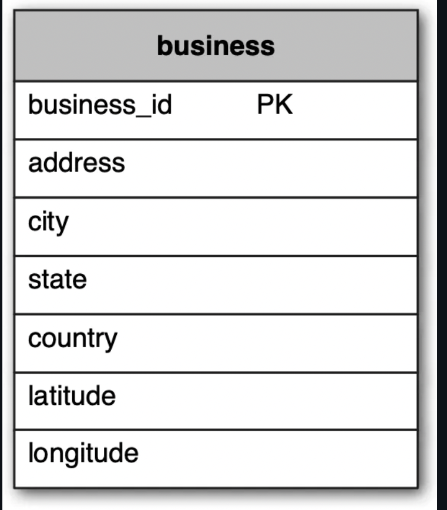
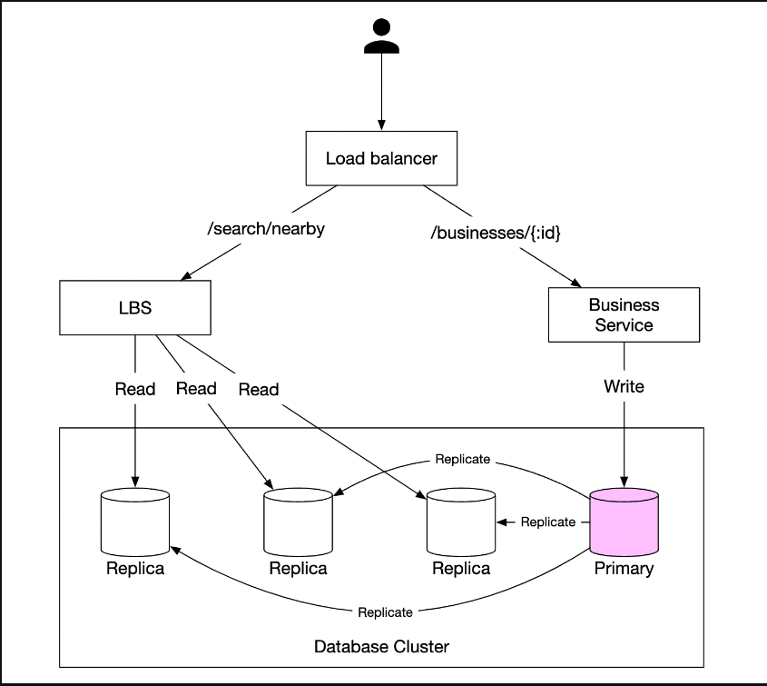

# Proximity Service

A proximity service enables you to discover nearby places such as restaurants, hotels, theatres, etc. <br>

# Step 1 - Understand the problem and establish design scope

- C: Can a user specify a search radius? What if there are not enough businesses within the search area?
- I: We only care about businesses within a certain area. If time permits, we can discuss enhancing the functionality.
- C: What's the max radius allowed? Can I assume it's 20km?
- I: Yes, that is a reasonable assumption
- C: Can a user change the search radius via the UI?
- I: Yes, let's say we have the options - 0.5km, 1km, 2km, 5km, 20km
- C: How is business information modified? Do we need to reflect changes in real-time?
- I: Business owners can add/delete/update a business. Assume changes are going to be propagated on the next day.
- C: How do we handle search results while the user is moving?
- I: Let's assume we don't need to constantly update the page since users are moving slowly.

## Functional requirements

- Return all businesses based on user's location
- Business owners can add/delete/update a business. Information is not reflected in real-time.
- Customers can view detailed information about a business

## Non-functional requirements

- ow latency - users should be able to see nearby businesses quickly
- Data privacy - Location info is sensitive data and we should take this into consideration in order to comply with regulations
- High availability and scalability requirements - We should ensure system can handle spike in traffic during peak hours in densely populated areas

## Back-of-the-envelope calculation

- Assuming 100mil daily active users and 200mil businesses
- Search QPS == 100mil \* 5 (average searches per day) / 10^5 (seconds in day) == 5000

# Step 2 - Propose High-Level Design and get Buy-In

## API Design

We'll use a RESTful API convention to design a simplified version of the APIs. <br>

```
GET /v1/search/nearby
```

This endpoint returns businesses based on search criteria, paginated. <br>
Example response: <br>

```
{
  "total": 10,
  "businesses":[{business object}]
}
```

The endpoint returns everything required to render a search results page, but a user might require additional details about a particular business, fetched via other endpoints. <br>

Here's some other business APIs we'll need: <br>

- `GET /v1/businesses/{:id}` - return business detailed info
- `POST /v1/businesses` - create a new business
- `PUT /v1/businesses/{:id}` - update business details
- `DELETE /v1/businesses/{:id}` - delete a business

## Data model

In this problem, the read volume is high because these features are commonly used: <br>

- Search for nearby businesses
- View the detailed information of a business

On the other hand, write volume is low because we rarely change business information. Hence for a read-heavy workflow, a relational database such as MySQL is ideal. <br>

In terms of schema, we'll need one main business table which holds information about a business: <br>


We'll also need a geo-index table so that we efficiently process spatial operations. This table will be discussed later when we introduce the concept of geohashes. <br>

## High-level design



- The load balancer automatically distributes incoming traffic across multiple services. A company typically provides a single DNS entry point and internally routes API calls to appropriate services based on URL paths.
- Location-based service (LBS) - read-heavy, stateless service, responsible for serving read requests for nearby businesses
- Business service - supports CRUD operations on businesses.
- Database cluster - stores business information and replicates it in order to scale reads. This leads to some inconsistency for LBS to read business information, which is not an issue for our use-case
- Scalability of business service and LBS - since both services are stateless, we can easily scale them horizontally

## Algorithms to fetch nearby businesses

In real life, one might use a `geospatial database`, such as `Geohash in Redis` or `Postgres with PostGIS extension`. <br>

Let's explore how these databases work and what other alternative algorithms there are for this type of problem. <br>
