# Design A Search Autocomplete System

Search autocomplete is the feature provided by many platforms such as Amazon, Google and others when you put your cursor in your search bar and start typing something you're looking for:  

# Step 1 - Understand the problem and establish design scope

- C: Is the matching only supported at the beginning of a search term or eg at the middle?
- I: Only at the beginning
- C: How many autocompletion suggestions should the system return?
- I: 5
- C: Which suggestions should the system choose?
- I: Determined by popularity based on historical query frequency
- C: Does system support spell check?
- I: Spell check or auto-correct is not supported.
- C: Are search queries in English?
- I: Yes, if time allows, we can discuss multi-language support
- C: Is capitalization and special characters supported?
- I: We assume all queries use lowercase characters
- C: How many users use the product?
- I: 10mil DAU

### Summary

- Fast response time. An article about facebook autocomplete reviews that suggestions should be returned with 100ms delay at most to avoid stuttering
- Relevant - autocomplete suggestions should be relevant to search term
- Sorted - suggestions should be sorted by popularity
- Scalable - system can handle high traffic volumes
- Highly available - system should be up even if parts of the system are unresponsive

## Back of the envelope estimation

- Assume we have 10mil DAU
- On average, person performs 10 searches per day
- 10mil \* 10 = 100mil searches per day = 100 000 000 / 86400 = 1200 searches. (QPS)
- given 4 works of 5 chars search on average -> 1200 \_ 20 = 24000 QPS. Peak QPS = 48000 QPS.
- 20% of daily queries are new -> 100mil \_ 0.2 = 20mil new searches \* 20 bytes = 400mb new data per day.

# Step 2 - Propose high-level design and get buy-in

At a high-level, the system has two components:  

- Data gathering service - gathers user input queries and aggregates them in real-time.
- Query service - given search query, return topmost 5 suggestions.

## Data gathering service

- This service is responsible for maintaining a frequency table:
  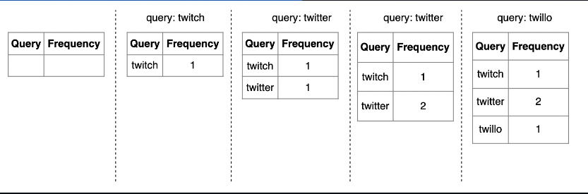

## Query service

Given a frequency table like the one above, this service is responsible for returning the top 5 suggestions based on the frequency column:
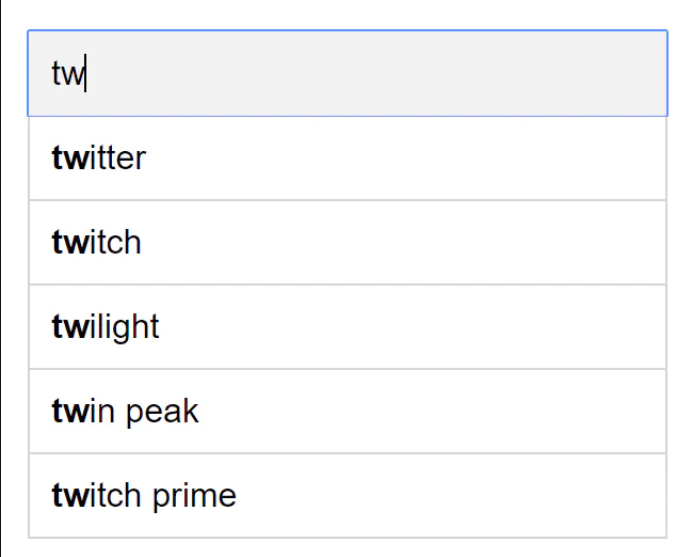
Querying the data set is a matter of running the following SQL query:  
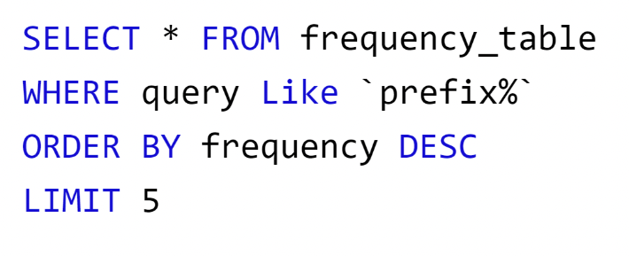
This is acceptable for small data sets but becomes impractical for large ones.  

# Step 3 - Design deep dive

We use relational databases in the high-level design, but to achieve a more optimal solution, we'll need to leverage a suitable data structure.  
We can use tries for fast string prefix retrieval.  

- It is a tree-like data structure
- The root represents the empty string
- Each node has 26 children, representing each of the next possible characters. To save space, we don't store empty links.
- Each node represents a single word or prefix
- For this problem, apart from storing the strings, we'll need to store the frequency against each leaf
  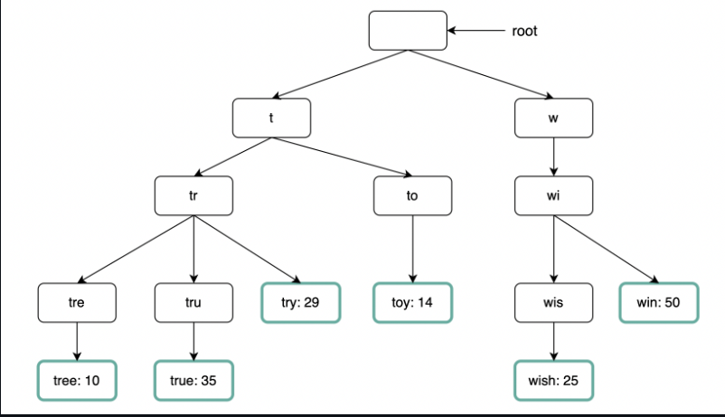

To implement the algorithm, we need to:  

- first find the node representing the prefix (time complexity O(p), where p = length of prefix)
- traverse subtree to find all leafs (time complexity O(c), where c = total children)
- sort retrieved children by their frequencies (time complexity O(clogc), where c = total children)
  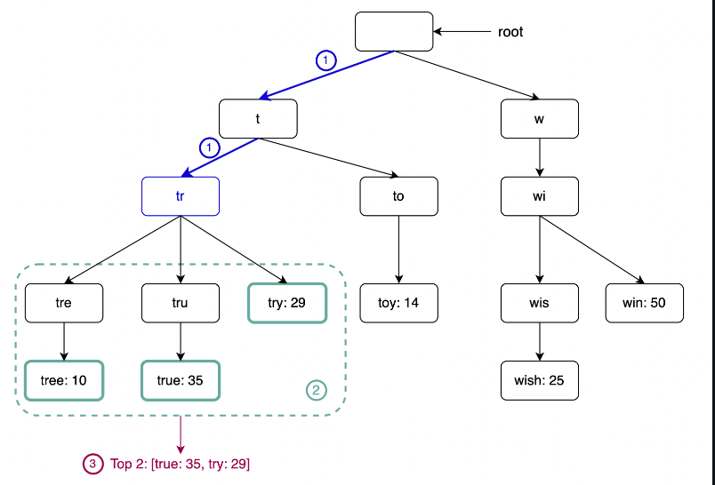

### Limit the max length of prefix

- We can leverage the fact that users rarely use a very long search term to limit max prefix to 50 chars.
- This reduces the time complexity from `O(p) + O(c) + O(clogc) -> O(1) + O(c) + O(clogc)`.

### Cache top search queries at each node

To avoid traversing the whole trie, we can cache the top k most frequently accessed works in each node:
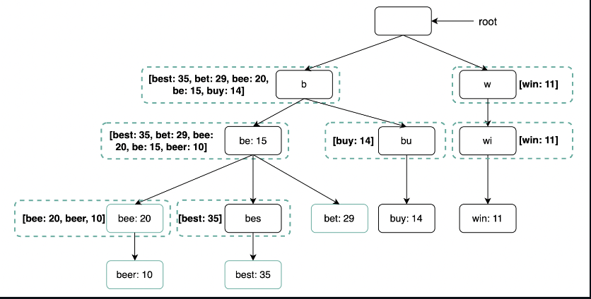
This reduces the time complexity to O(1) as top K search terms are already cached. The trade-off is that it takes much more space than a traditional trie.  

## Data gathering service

In previous design, when user types in search term, data is updated in real-time. This is not practical on a bigger scale due to:  

- billions of queries per day
- Top suggestions may not change much once trie is built
  Hence, we'll instead update the trie asynchronously based on analytics data:  
  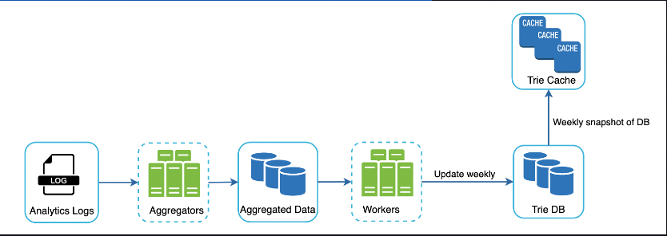
  The analytics logs contain raw rows of data related to search terms \w timestamps:  
  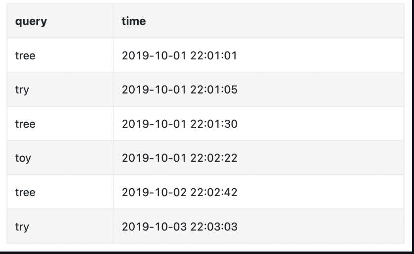  

The aggregators' responsibility is to map the analytics data into a suitable format and also aggregate it to lesser records.  
The cadence at which we aggregate depends on the use-case for our auto-complete functionality. If we need the data to be relatively fresh & updated real-time (eg twitter search), we can aggregate once every eg 30m. If, on the other hand, we don't need the data to be updated real-time (eg google search), we can aggregate once per week.  

Example weekly aggregated data:  
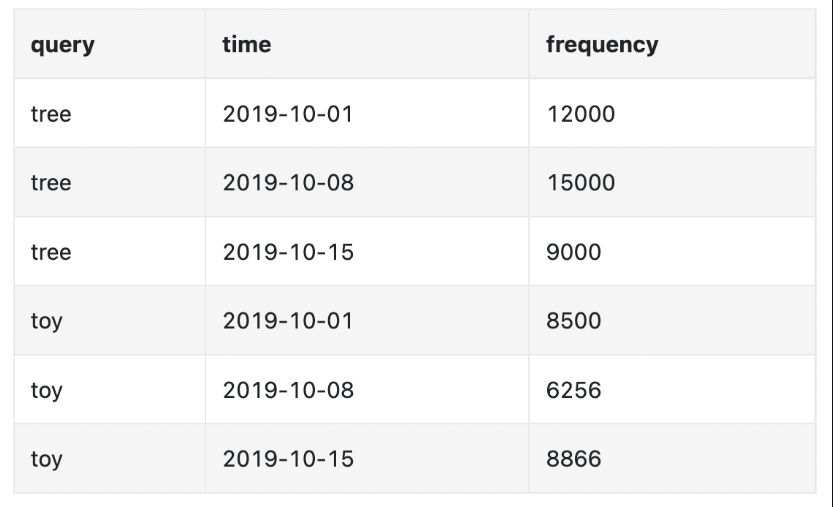

The workers are responsible for building the trie data structure, based on aggregated data, and storing it in DB.  
The trie cache keeps the trie loaded in-memory for fast read. It takes a weekly snapshot of the DB.  
The trie DB is the persistent storage. There are two options for this problem:  

- Document store (eg MongoDB) - we can periodically build the trie, serialize it and store it in the DB.
- Key-value store (eg DynamoDB) - we can also store the trie in hashmap format.
  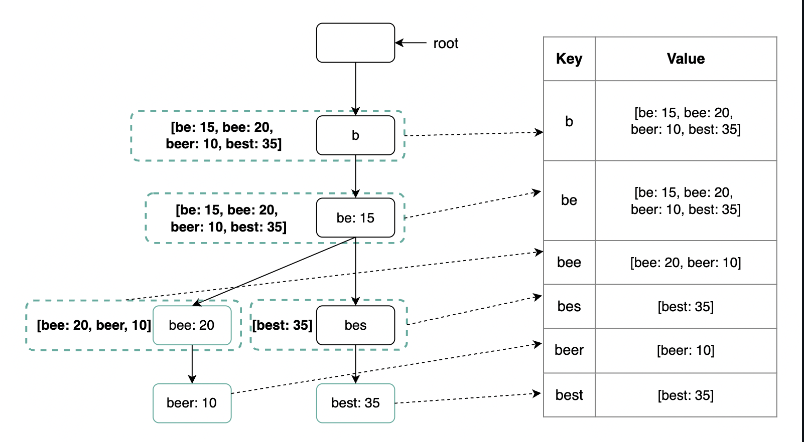

## Query service

The query service fetches top suggestions from Trie Cache or fallbacks to Trie DB on cache miss:  
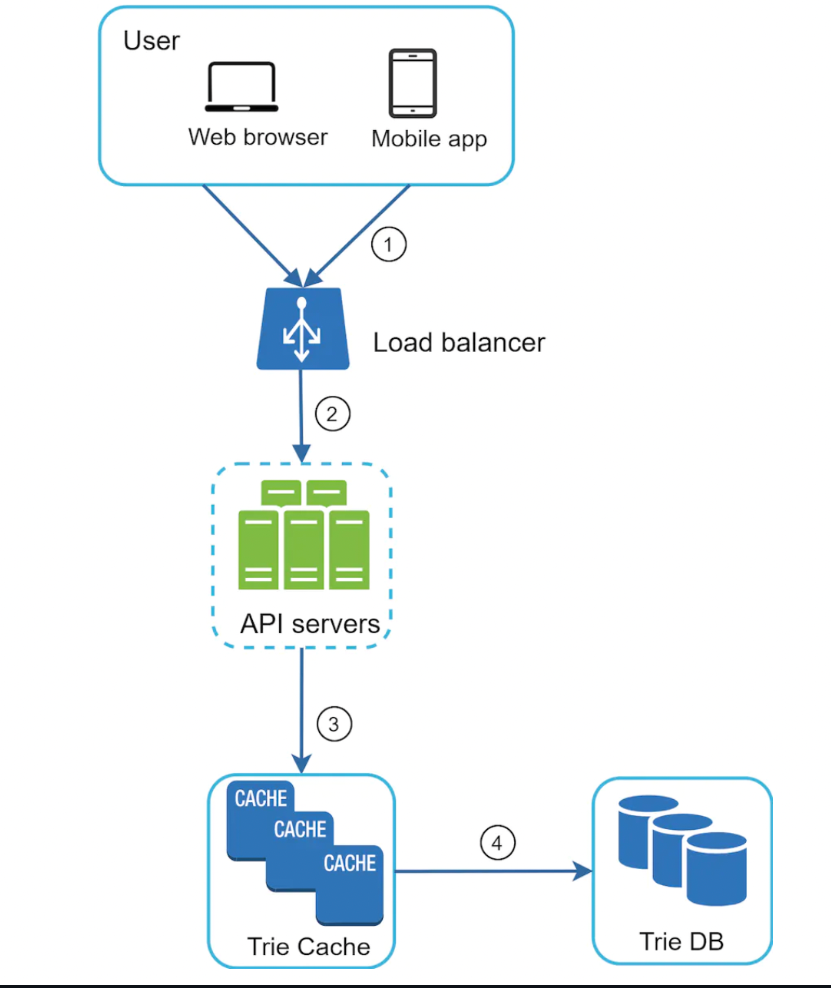

Some additional optimizations for the Query service:  

- Using AJAX requests on client-side - these prevent the browser from refreshing the page  
- Data sampling - instead of logging all requests, we can log a sample of them to avoid too many logs.
- Browser caching - since auto-complete suggestions don't change often, we can leverage the browser cache to avoid extra calls to backend

Example with Google search caching search results on the browser for 1h:  
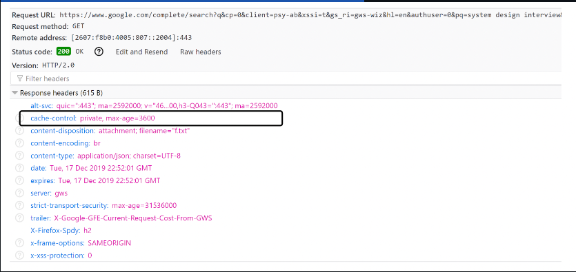

## Trie operations

Let's briefly describe common trie operations  

### Create

The trie is created by workers using aggregated data, collected via analytics logs.  

### Update

There are two options to handling updates:  

- Not updating the trie, but reconstructing it instead. This is acceptable if we don't need real-time suggestions.  
- Updating individual nodes directly - we prefer to avoid it as it's slow. Updating a single node required updating all parent nodes as well due to the cached suggestions:
  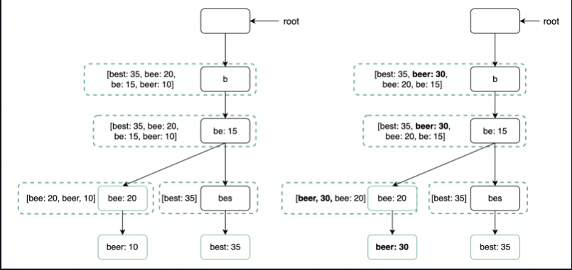

### Delete

To avoid showing suggestions including hateful content or any other content we don't want to show, we can add a filter between the trie cache and the API servers:  
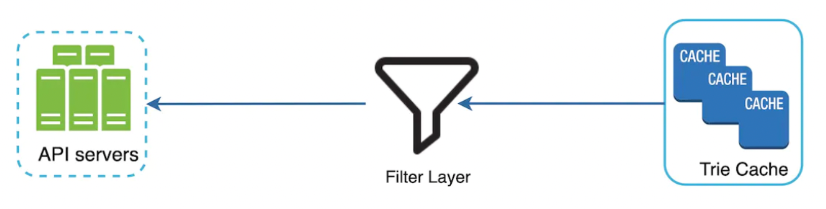

The database is asynchronously updated to remove hateful content.  

## Scale the storage

At some point, our trie won't be able to fit on a single server. We need to devise a sharding mechanism.  
One option to achieve this is to shard based on the letters of the `alphabet` - eg `a-m` goes on one shard, `n-z` on the other.  

This doesn't work well as data is unevenly distributed due to eg the letter a being much more frequent than x.  
To mitigate this, we can have a dedicated shard mapper, which is responsible for devising a smart sharding algorithm, which factors in the uneven distribution of search terms:  
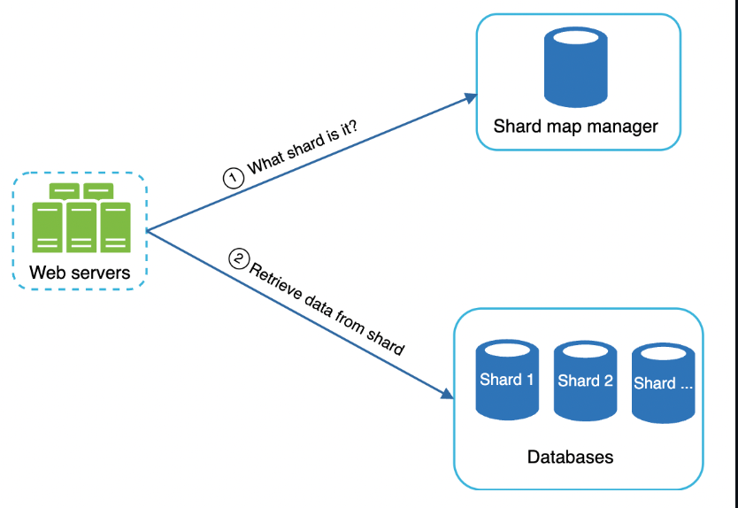

# Step 4 - Wrap up

- How to support multi-language - we store unicode characters in trie nodes, instead of ASCII.
- What if top search queries differ across countries - we can build different tries per country and leverage CDNs to improve response time.
- How can we support trending (real-time) search queries? - current design doesn't support this and improving it to support it is beyond the scope of the book. Some options:
  - Reduce working data set via sharding
  - Change ranking model to assign more weight to recent search queries
  - Data may come as streams which you filter upon and use map-reduce technologies to process it - Hadoop, Apache Spark, Apache Storm, Apache Kafka, etc
