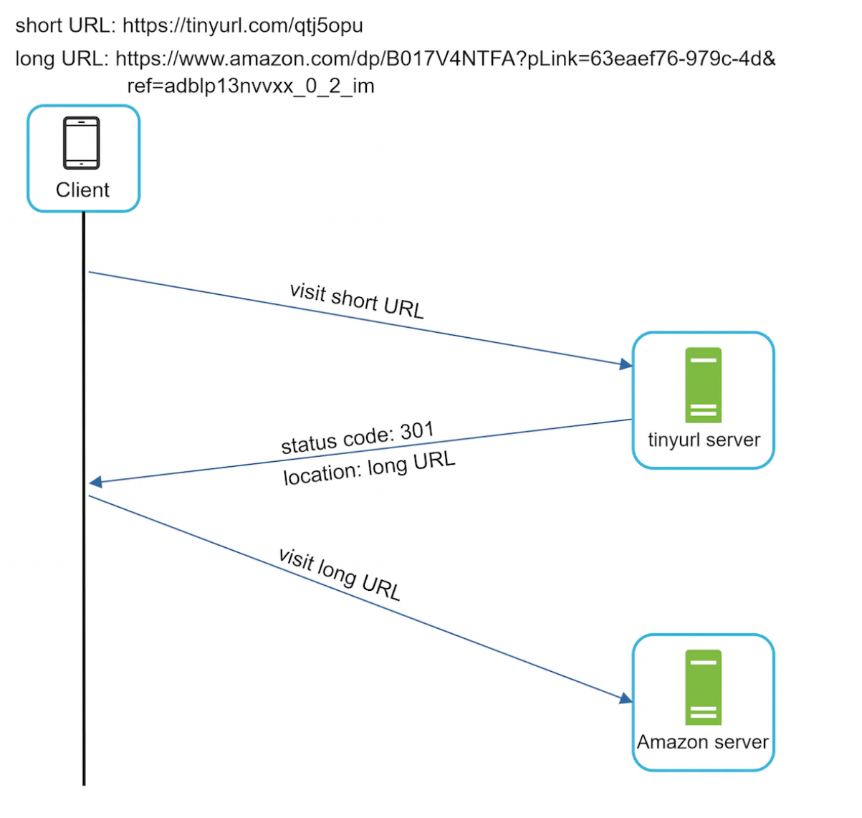
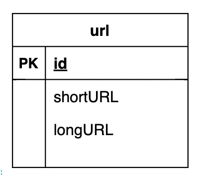
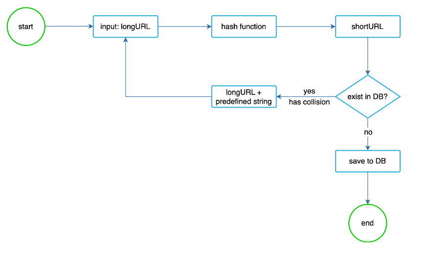
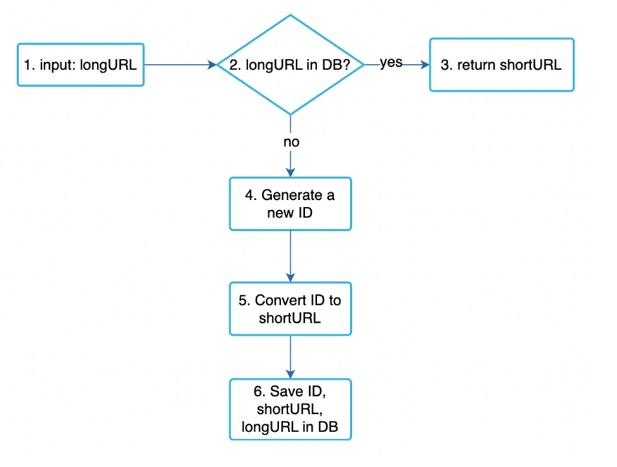
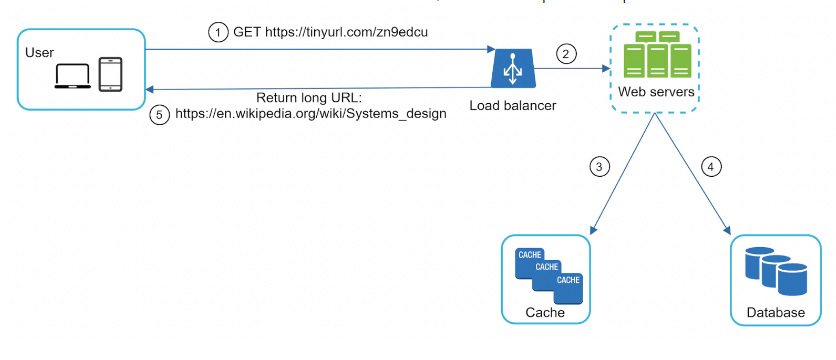

# Design a URL Shortener

# Step 1 - Understand the problem and establish design scope

- C: Can you give an example of how a URL shortening service works?
- I: Given URL https://www.systeminterview.com/q=chatsystem&c=loggedin&v=v3&l=long and alias https://tinyurl.com/y7keocwj. You open the alias and get to the original URL.
- C: What is the traffic volume?
- I: 100 million URLs are generated per day.
- C: How long is the shortened URL?
- I: As short as possible
- C: What characters are allowed?
- I: numbers and letters
- C: Can shortened URLs be updated or deleted?
- I: For simplicity, let's assume they can't. <br>

Other functional requirements - high availability, scalability, fault tolerance.

## Requirement

- QPS => 100 millions _ 24 _ 3600
- how long for url => as short as possible
- only contain numbers and letter
- cannot update and delete

# Back of the envelope calculation

### Traffic

- QPS : 100 millions per day / (24 \* 3600) => 1000 url per second
- assuming read to write ratio of 10:1 => 10000 read per second

### Storage

- assuming system running for 10 years, => it will store 100 mil per day _ 365 _ 10 => 3650 billions
- assuming each record with take 500 byte => 500 byte \* 3650 billions

### Memory

Following Pareto Principle, better known as the 80:20 rule for caching. (**80% requests are for 20% data**)

- Since we get 10000 read/redirection requests per second, we will be getting 700 million requests per day
- 10000/s \* 86400 seconds =~700 million
- To cache 20% of these requests, we will need ~70GB of memory => 0.2 \* 700 millions = 70 GB

# Step 2 - Propose high-level design and get buy-in

## API Endpoints

We'll make a REST API. <br>

- `POST api/v1/data/shorten` - accepts long url and returns a short one.
- `GET api/v1/shortURL` - return long URL for HTTP redirection.

## URL Redirecting

How it works: <br>

What's the difference between 301 and 302 statuses? <br>

- `301 (Permanently moved)` - indicates that the URL permanently points to the new URL. This instructs the browser to bypass the tinyurl service on subsequent calls.
- `302 (Temporarily moved)` - indicates that the URL is temporarily moved to the new URL. Browser will not bypass the tinyurl service on future calls. <br>

Choose 301 if you want to avoid extra server load. Choose 302 if tracking analytics is important. <br>
Easiest way to implement the URL redirection is to store the **<shortURL, longURL>** pair in an in-memory hash-table. <br>

# Step 3 - Design deep dive

## Data mode

In the simplified version, we're storing the URLs in a hash table. That is problematic as we'll run out of memory and also, in-memory doesn't persist across server reboot. <br>
 <br>
That is why wwe can use simple relational table instead: <br>

## Hash function

The hash value consists of characters [0-9a-zA-Z], which gives a max of 62 characters. <br>
To figure out the smallest hash value we can use, we need to calculate n in 62^n >= 365bil -> this results in n=7, which can support ~3.5 trillion URLs <br>
For the hash function itself, we can either use `base62 conversion or hash + collision` detection.

## Shortening Algorithm

- URL encoding (Though base62 or md5, sha 256, but only taking the first 7 characters. To resolve collisions, we can reiterate \w an some padding to input string until there is no collision:)
- Key Generation service

### URL encoding through base62

`Base 10 are digits [0–9], which we use in everyday life` and `base 62 are [0–9][a-z][A-Z]` <br>
Let’s do a back of the envelope calculation to find out how many characters shall we keep in our tiny url. <br>

```
URL with length 5, will give 62⁵ = ~916 Million URLs
URL with length 6, will give 62⁶ = ~56 Billion URLs
URL with length 7, will give 62⁷ = ~3500 Billion URLs
```

Since we required to produce 3650 billion URLs, with 8 characters in base62 we will get > 3500 Billion URLs. Hence each of tiny url generated will have 8 characters. <br>

### How to get unique ‘7 character’ long random URLs in base62

Once we have decided number of characters to use in Tiny URL (7 characters) and also the base to use (base 62 [0–9][a-z][A-Z] ), then the next challenge is how to generate unique URLs which are 7 characters long.

#### Technique 1 —Short url from random numbers:

We could just make a random choice for each character and check if this tiny url exists in DB or not. If it doesn’t exist return the tiny url else continue rolling/retrying.As more and more 7 characters short links are generated in Database, we would require 4 rolls before finding non-existing one short link which will slow down tiny url generation process.

#### Technique 2 — Short urls from base conversion:

```
const BASE62_CHARS = "0123456789abcdefghijklmnopqrstuvwxyzABCDEFGHIJKLMNOPQRSTUVWXYZ";

function encodeBase62(num: number): string {
    let encoded = '';
    while (num > 0) {
        encoded = BASE62_CHARS[num % 62] + encoded;
        num = Math.floor(num / 62);
    }
    return encoded || '0'; // Handle num = 0 case
}


function decodeBase62(shortUrl: string): number {
    let num = 0;
    for (let char of shortUrl) {
        num = num * 62 + BASE62_CHARS.indexOf(char);
    }
    return num;
}

```

#### Technique 3 — MD5 hash :

- We can compute a unique hash (e.g., MD5 or SHA256, etc.) of the given URL. The hash can then be encoded for display. This encoding could be base36 ([a-z ,0-9]) or base62 ([A-Z, a-z, 0-9]) and if we add ‘+’ and ‘/’ we can use Base64 encoding. A reasonable question would be, what should be the length of the short key? 6, 8, or 10 characters? <br>
- If we use the MD5 algorithm as our hash function, it will produce a 128-bit hash value. After base64 encoding, we’ll get a string having more than 21 characters (since each base64 character encodes 6 bits of the hash value). Now we only have space for 6 (or 8) characters per short key; how will we choose our key then? We can take the first 6 (or 8) letters for the key. This could result in key duplication; to resolve that, we can choose some other characters out of the encoding string or swap some characters <br>

What are the different issues with our solution? We have the following couple of problems with our encoding scheme<br>

```
1.If multiple users enter the same URL, they can get the same shortened URL, which is not acceptable.
2.What if parts of the URL are URL-encoded? e.g., http://www.designgurus.org/distributed.php?id=design, and http://www.designgurus.org/distributed.php%3Fid%3Ddesign are identical except for the URL encoding.
```

- **Workaround for the issues**: We can append an increasing sequence number to each input URL to make it unique and then generate its hash. We don’t need to store this sequence number in the databases, though. Possible problems with this approach could be an ever-increasing sequence number. Can it overflow? Appending an increasing sequence number will also impact the performance of the service. <br>

- Another solution could be to append the user id (which should be unique) to the input URL. However, if the user has not signed in, we would have to ask the user to choose a uniqueness key. Even after this, if we have a conflict, we have to keep generating a key until we get a unique one. <br>
  

- The problem with this method is that we have to query the database to detect collision. Bloom filters could help in this case.
- Alternatively, we can use base62 conversion, which can convert an arbitrary ID into a string consisting of the 62 characters we need to support.

#### Comparison between the two approaches:

| Hash + collision resolution                                                                  | Base 62 conversion                                                                                                                  |
| :------------------------------------------------------------------------------------------- | :---------------------------------------------------------------------------------------------------------------------------------- |
| Fixed short URL length.                                                                      | Short URL length is not fixed. It goes up with the ID.                                                                              |
| Does not need a unique ID generator.                                                         | This option depends on a unique ID generator.                                                                                       |
| Collision is possible and needs to be resolved.                                              | Collision is not possible because ID is unique.                                                                                     |
| t’s not possible to figure out the next available short URL because it doesn’t depend on ID. | It is easy to figure out what is the next available short URL if ID increments by 1 for a new entry. This can be a security concern |

# URL shortening deep dive

To keep our service simple, we'll use base62 encoding for the URL shortening. <br>
 <br>
To ensure our ID generator works in a distributed environment, we can use Twitter's snowflake algorithm.

# URL redirection deep dive

We've introduced a cache as there are more reads than writes, in order to improve read performance: <br>


- User clicks short URL
- Load balancer forwards the request to one of the service instances
- If shortURL is in cache, return the longURL directly
- Otherwise, fetch the longURL from the database and store in cache. If not found, then the short URL doesn't exist
