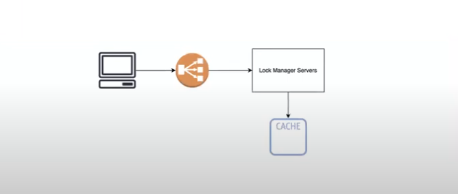
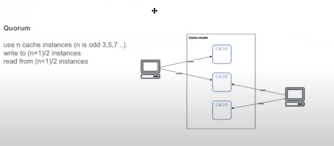
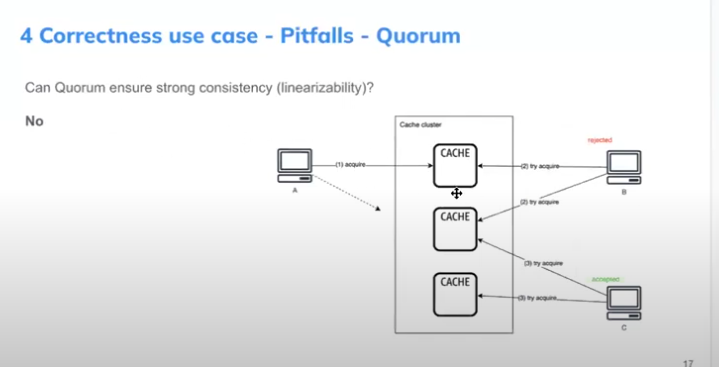
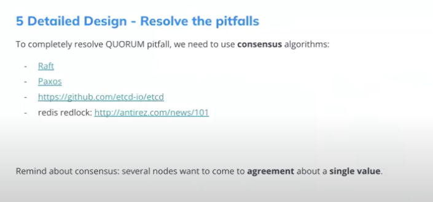
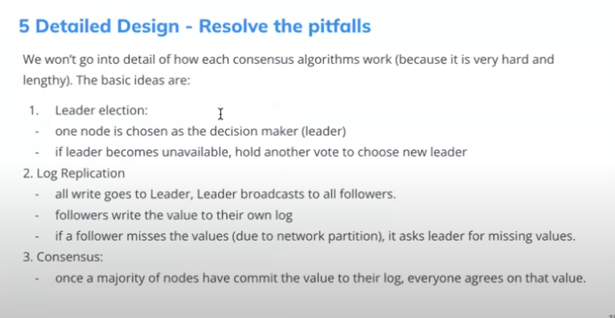
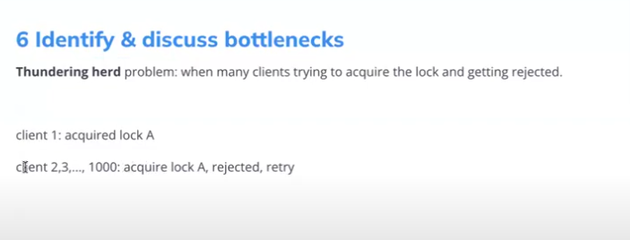
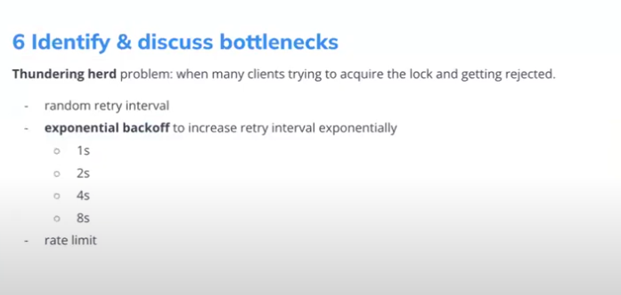
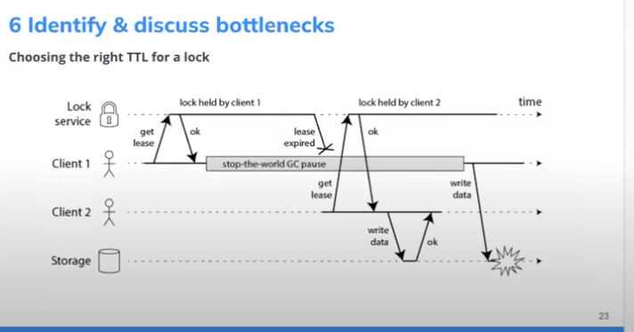
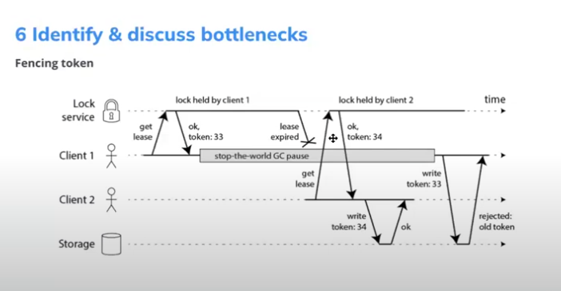

# Distribute Locking

## Requirement

### Clarify Requirement

- Q: What is the use-case?
- A: `Efficient` and `Correctness`
- Q: Number of concurrent user for a lock: `10000` (in normal, only 100 to 150 concurrent )

### Functional Requirement

- user can `acquire` and `release` a mutual exclusive lock (think mutex lock but for a distribute environment)
- use case
  - `Efficient`: acquire locks to avoid unnecessarily doing the same work twice.
  - `correctness`: acquire locks to prevents race condition of concurrent processes (prevent data loss, corrupted data)

### No-functional requirement

- Consistency
  - a lock can be acquired by 1 user at a time
- Availability
- Scalability

## API Design

`Acquire lock:`  

- acquire_lock (string lockPath) (client will generate lockPath)

`release lock:`  

- release_lock (string lockPath) (client will generate lockPath)

## Data model design

### Flow

### Concurrent users is 10000, What data storage should we use?

- Should use in Memory Storage

### Efficient use-case

### Flow

- User acquire a lock `lockPath`
- Lock manager check if `lockPath` key exist in Cache Cluster
  - if yes: reject
  - else: add `lockPath` to Cache Cluster, `set the TTL for the key`

 

- Cache sentinel has 1 primary instance and some replicas
- Automatic failover mechanism: If the sentinels detect that the primary instance has failed, the sentinel processes will look for the replica that has the latest data and will promote that replica to be the new primary

### Correctness use-case

- Fault tolerance: system continues to work correctly if a server or cache instance goes down
- Strong consistency: a lock can be acquired by one user at a time

### use Quorum

#### Can Quorum ensure strong consistency?

- NO:
  

### Resolve the pitfalls

 

#### Pros:

- ensure strong consistency

#### Cons

- Availability
- High latency

## Identify & Discuss bottlenecks

### Fencing token

