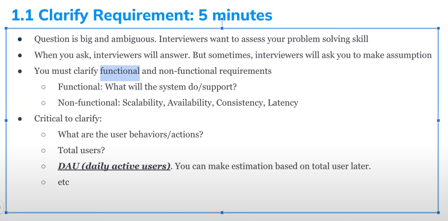
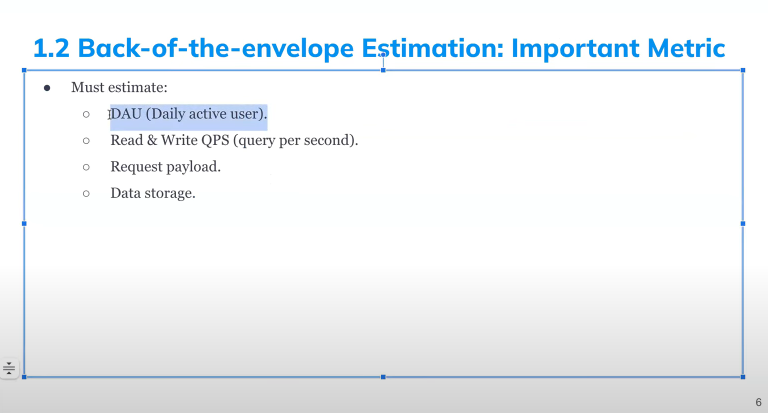
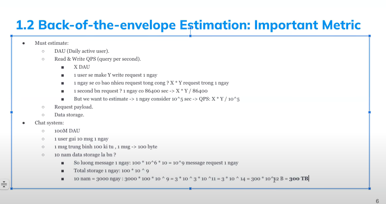
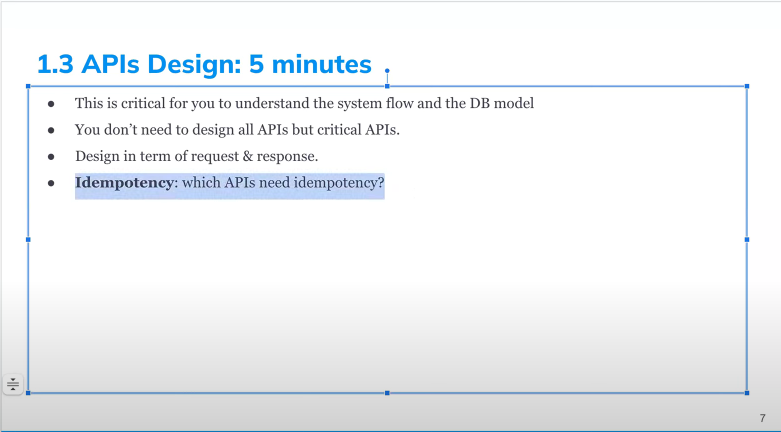
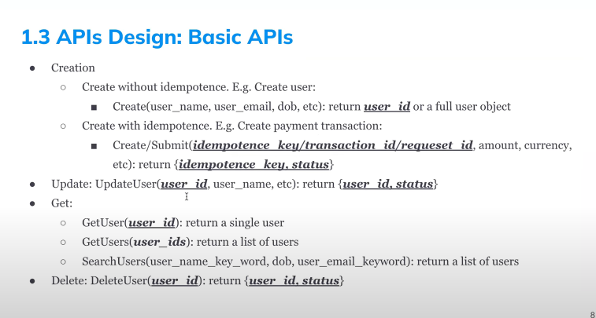
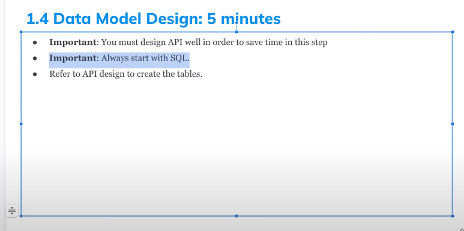
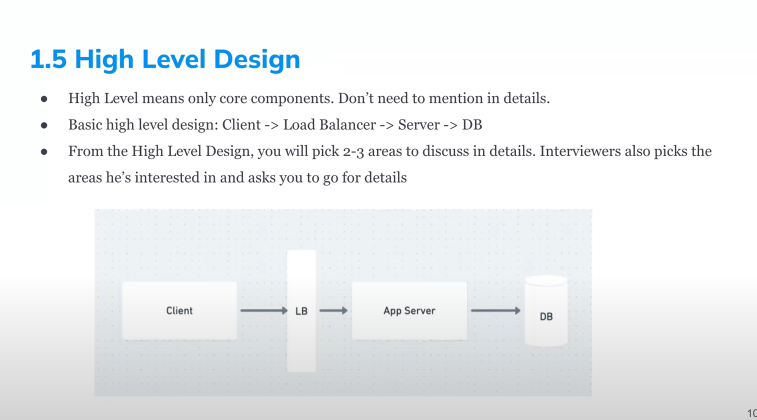
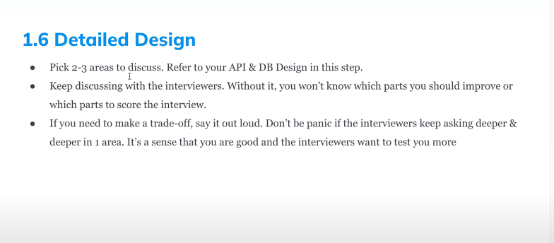
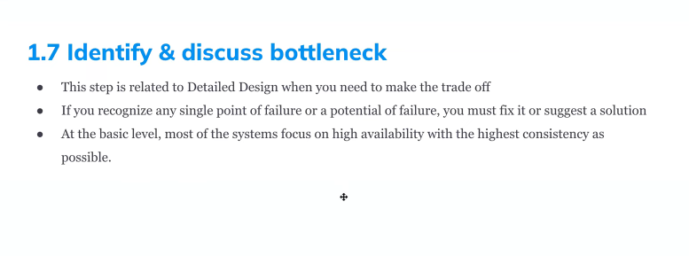

# Step for system design

1. Clarify Requirement
2. Back of the envelope Estimation
3. APIs Design
4. Data Model Design
5. High Level Design
6. Detailed Design
7. Identify & Discuss Bottlenecks

# Interview Time Allocation

45 minutes including introduction (Q&A -> Only 40 minute for real interview)  

- Clarify Requirement: 5m
- Estimate: 5m
- API Design: 5m
- DB model Design: 5m
- High level design + detail design + Bottleneck discussion: 20m

## Clarify Requirement (5m)

- focus on core function

  

## Estimation (5m )

- `no need to calculate correctness`
- `prefer use 10 to easy calculate`
- `example 1 day => 24 \* 3600 , but we will convert it to 10000 to easy calculate`
- `100 M DAU, 10 post message / Day -> 10^9 write per day -> 10^9 / 10^5  ~ 10^4 QPS`
- `10^6 DAU, 2 transaction -> 10^6 * 2 / 10^5 = 2 * 10^2 = 200 TPS `
- `Peak QPS => x2, x3, x4 QPS`

 

 

### Example

## Api Design (5m)

### Design API

## Data Model Design (5m)

## High Level Design

## Detail Design

## Identify & Discuss Bottleneck

