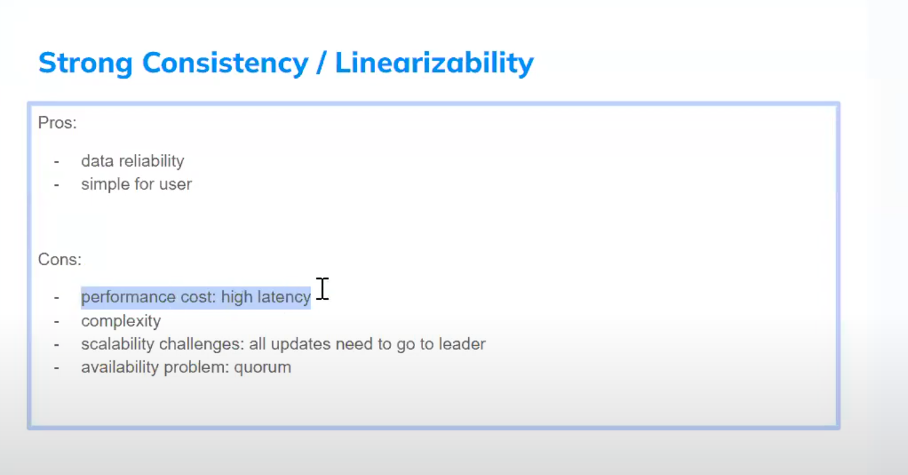
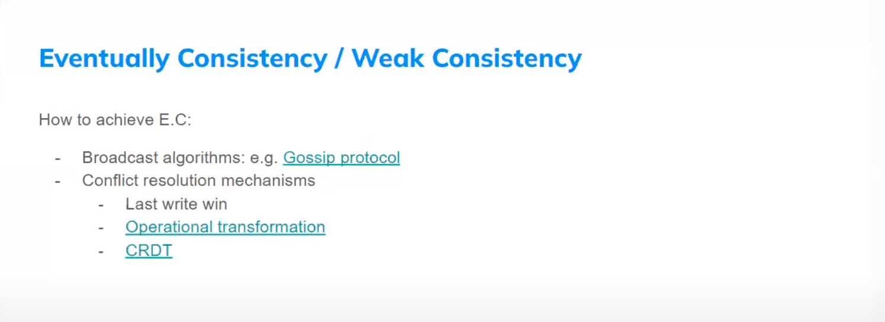

# Strong Consistency vs Linearizability

# Eventually Consistency vs Weak Consistency

=======================================================================================================  

# Latency vs Throughput

# ACID vs BASE

# Batching vs Streaming

# Load Balancer vs API Gateway

